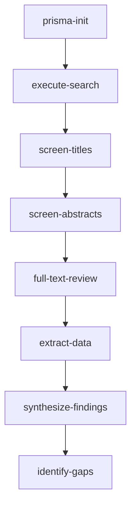

# 📚 Initialize PRISMA 2020 Systematic Literature Review

Sets up complete PRISMA 2020 systematic literature review protocol with search strategies, screening criteria, and data extraction forms for comprehensive literature gap analysis.

## Purpose

Part of **Pipeline A: Systematic Literature & Gap-Finding**, this command initializes a rigorous PRISMA-compliant literature review to identify research gaps and establish baselines. Required for evidence-based research planning.

## Usage

```bash
npx claude-flow@alpha command prisma-init --topic "<research-topic>" [options]
```

## Required Arguments

- `--topic <string>` - Research topic or question being investigated

## Optional Arguments

- `--output-dir <path>` - Output directory (default: `./prisma-reviews/`)
- `--databases <list>` - Databases to search (default: `arxiv,scholar,pubmed,ieee,acm`)
- `--timeframe <years>` - Search timeframe in years (default: `5`)
- `--min-papers <number>` - Minimum papers for inclusion (default: `50`)
- `--format <format>` - Output format: `markdown` (default), `latex`, `docx`, `pdf`
- `--interactive` - Launch interactive protocol builder
- `--auto-search` - Automatically execute search queries
- `--store-memory` - Store protocol in Memory MCP

## What This Command Does

1. **Creates PRISMA Protocol Document** with complete structure:
   - Title and research question (PICO format)
   - Protocol registration information
   - Eligibility criteria (inclusion/exclusion)
   - Information sources (databases, registries)
   - Search strategy (keywords, boolean operators)
   - Selection process (screening workflow)
   - Data collection process (extraction forms)
   - Data items (fields to extract)
   - Risk of bias assessment
   - Synthesis methods

2. **Generates Search Strategies** for each database:
   - **arXiv**: Boolean search with category filters
   - **Google Scholar**: Advanced search with date range
   - **PubMed**: MeSH terms and field tags
   - **IEEE Xplore**: Metadata search with filters
   - **ACM Digital Library**: Advanced search syntax

3. **Creates Screening Workflow** (3 stages):
   - **Stage 1**: Title screening (remove obviously irrelevant)
   - **Stage 2**: Abstract screening (apply inclusion criteria)
   - **Stage 3**: Full-text review (final inclusion decision)
   - Dual screening with conflict resolution protocol

4. **Generates Data Extraction Forms**:
   - Study metadata (authors, year, venue, DOI)
   - Research question and objectives
   - Methods (dataset, model, evaluation)
   - Results (metrics, baselines, ablations)
   - Limitations and future work
   - Risk of bias ratings

5. **Sets Up PRISMA Flow Diagram** template:
   - Identification (database search results)
   - Screening (duplicates removed, records screened)
   - Eligibility (full-text assessed)
   - Included (studies in synthesis)

6. **Configures Quality Assessment**:
   - Risk of bias tool selection (RoB 2, ROBINS-I, etc.)
   - Quality criteria checklist
   - Evidence grading (GRADE framework)

## Output Files

- `prisma-reviews/<topic>-protocol.md` - Main PRISMA protocol
- `prisma-reviews/<topic>-search-strategies.yaml` - Database search queries
- `prisma-reviews/<topic>-screening-form.md` - Screening criteria checklist
- `prisma-reviews/<topic>-extraction-form.md` - Data extraction template
- `prisma-reviews/<topic>-flow-diagram.dot` - Graphviz flow diagram
- `prisma-reviews/<topic>-timeline.md` - Review timeline and milestones

## Example

```bash
# Initialize PRISMA review for transformer architectures
npx claude-flow@alpha command prisma-init \
  --topic "Transformer Architectures for NLP" \
  --databases "arxiv,scholar,acm" \
  --timeframe 3 \
  --min-papers 100 \
  --auto-search \
  --store-memory

# Interactive protocol builder
npx claude-flow@alpha command prisma-init \
  --topic "Federated Learning Privacy" \
  --interactive

# Quick protocol for rapid review
npx claude-flow@alpha command prisma-init \
  --topic "Graph Neural Networks" \
  --format markdown \
  --timeframe 2 \
  --min-papers 30
```

## Search Strategy Example

The command generates structured search queries:

**arXiv Search Strategy**:
```
(("transformer" OR "attention mechanism" OR "self-attention")
AND ("natural language processing" OR "NLP" OR "language model"))
AND (cat:cs.CL OR cat:cs.LG OR cat:cs.AI)
AND (submittedDate:[2022-01-01 TO 2025-12-31])
```

**Inclusion Criteria**:
- Peer-reviewed publications or preprints
- Published in last 5 years (configurable)
- Focus on transformer architectures for NLP
- Empirical evaluation with quantitative results
- Available in English

**Exclusion Criteria**:
- Opinion pieces, editorials, commentaries
- Studies without empirical evaluation
- Duplicate publications of same work
- Non-English publications
- Studies outside date range

## PRISMA Checklist Integration

The protocol includes the 27-item PRISMA 2020 checklist:

**Title**: Identify report as systematic review
**Abstract**: Structured summary (objectives, methods, results, conclusions)
**Introduction**: Rationale and objectives
**Methods**: Protocol registration, eligibility criteria, search strategy, selection process, data collection, risk of bias, synthesis methods
**Results**: Study selection, characteristics, risk of bias, synthesis results
**Discussion**: Summary, limitations, conclusions

## Integration with Agents

- **systematic-reviewer**: Executes PRISMA protocol, manages review process
- **literature-screener**: Performs title/abstract screening, applies criteria
- **data-extractor**: Extracts data using generated forms
- **bias-auditor**: Assesses risk of bias using configured tools
- **archivist**: Archives protocol and results with version control

## Memory MCP Storage

When `--store-memory` is enabled:

```json
{
  "key": "sop/prisma/<topic-slug>",
  "value": {
    "topic": "Transformer Architectures for NLP",
    "protocol_path": "./prisma-reviews/transformer-nlp-protocol.md",
    "databases": ["arxiv", "scholar", "acm"],
    "search_executed": true,
    "papers_found": 247,
    "papers_screened": 0,
    "papers_included": 0,
    "status": "protocol_complete",
    "created_at": "2025-11-01T12:00:00Z"
  },
  "tags": ["SOP", "Pipeline-A", "PRISMA", "literature-review", "systematic-reviewer"]
}
```

## Pipeline A Workflow



## Related Commands

- `/execute-search` - Run database searches from protocol
- `/screen-papers` - Perform title/abstract screening
- `/extract-data` - Extract data from included studies
- `/synthesize-findings` - Synthesize results, create evidence tables
- `/identify-gaps` - Identify research gaps from synthesis
- `/update-protocol` - Update protocol with protocol amendments

## Automation Features

With `--auto-search` enabled:
- Automatically queries all configured databases
- Deduplicates results across databases
- Exports to reference manager format (BibTeX, RIS)
- Creates initial screening queue
- Generates summary statistics

## Quality Gates Integration

**Pipeline A Contribution to Gate 1**:
- Literature review establishes baseline methods
- Gap analysis justifies research direction
- Synthesis informs data requirements
- Prior work comparison planned

## References

- Page et al. (2021). "PRISMA 2020 statement". BMJ 372:n71
- Deep Research SOP Pipeline A: Systematic Literature & Gap-Finding
- PRISMA 2020 Checklist: http://www.prisma-statement.org/
- PROSPERO Protocol Registration: https://www.crd.york.ac.uk/prospero/

## Next Steps

After protocol initialization:
1. Execute database searches: `/execute-search --protocol <topic>`
2. Begin title screening: `/screen-papers --stage title --protocol <topic>`
3. Configure citation manager integration
4. Set up dual-reviewer workflow
5. Plan synthesis approach (meta-analysis, narrative, etc.)
