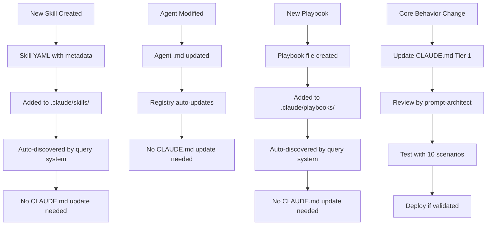

# CLAUDE.md Prompt Architecture Design
**Version**: 2.0.0
**Date**: 2025-11-14
**Author**: prompt-architect agent
**Purpose**: Evidence-based design for optimal Claude Code behavior configuration

---

## Executive Summary

**Current Problem**: CLAUDE.md is 2000+ lines with redundant skill/agent/command lists, causing:
- Cognitive overload (violates working memory limits)
- Context window waste (lists duplicated from skills themselves)
- Maintenance burden (three sources of truth)
- Slow intent detection (rules buried in noise)

**Proposed Solution**: Tiered architecture with:
1. **Core behavior layer** (always active, <300 lines)
2. **Intent detection layer** (auto-triggers on first message)
3. **Reference layer** (pointers to skills/playbooks, not full lists)
4. **Context-on-demand layer** (loaded by skills as needed)

**Key Principles**:
- Progressive disclosure: Essential first, details on-demand
- Single source of truth: Skills/playbooks own their content
- Structured formats: YAML/JSON for machine-parseable rules
- Decision trees: Clear "if X then Y" pathways
- Minimal repetition: Link, don't duplicate

---

## Section Hierarchy & Information Architecture

### Tier 1: Core Behavior (Always Active, ~150 lines)

**Purpose**: Universal rules that apply to EVERY interaction
**Format**: Concise directives with examples
**Location**: Lines 1-150 of CLAUDE.md

```yaml
# Structure:
1. Critical Execution Rules (30 lines)
   - Concurrent operations mandate
   - File organization rules
   - "1 message = all operations" golden rule

2. Intent Detection Bootstrap (40 lines)
   - ALWAYS run intent-analyzer on first user message
   - Decision tree: vague → clarify, clear → route to playbook
   - Escape hatch: explicit skill invocation bypasses intent analysis

3. Playbook-First Workflow (30 lines)
   - intent-analyzer → prompt-architect → orchestrator → execution
   - When to use playbooks vs direct execution
   - Playbook discovery mechanism

4. Memory & Coordination Protocol (30 lines)
   - Triple Memory MCP tagging (WHO/WHEN/PROJECT/WHY)
   - Cross-agent coordination via hooks
   - Session state management

5. Reference System Pointers (20 lines)
   - Where to find skills: `.claude/skills/`
   - Where to find playbooks: `.claude/playbooks/`
   - Where to find agents: `agents/`
   - How to query inventories dynamically
```

**Example Template**:
```markdown
## Critical Execution Rules

**ABSOLUTE MANDATE**: All operations MUST be concurrent in a single message.

### Golden Rule: "1 Message = All Related Operations"

**TodoWrite**: Batch ALL todos (5-10+ minimum)
✅ CORRECT: TodoWrite({ todos: [8 todos] })
❌ WRONG: TodoWrite({ todos: [1 todo] }), then another message

**File Operations**: Batch ALL reads/writes/edits
✅ CORRECT: [Read file1, Read file2, Write file3, Edit file4]
❌ WRONG: Read file1, wait, then Write file3

**Agent Spawning**: Spawn ALL agents together via Task tool
✅ CORRECT: [Task(researcher), Task(coder), Task(tester)]
❌ WRONG: Task(researcher), wait for result, then Task(coder)

### File Organization

**NEVER save to root folder**. Use:
- `/src` - Source code
- `/tests` - Test files
- `/docs` - Documentation
- `/scripts` - Utility scripts

---

## Intent Detection Bootstrap

**TRIGGER**: On EVERY first user message
**ACTION**: Auto-invoke `intent-analyzer` skill

**Decision Tree**:
```
User message received
  ↓
Is intent clear & specific?
  ├─ YES → Route to appropriate playbook/skill
  │         Examples: "build API" → api-development playbook
  │                  "review code" → code-review-assistant skill
  │
  └─ NO → Intent-analyzer performs:
           1. Cognitive science analysis
           2. Probabilistic intent mapping
           3. Socratic clarification (if needed)
           4. Route to playbook/skill OR ask clarifying questions
```

**Escape Hatch**: User explicitly invokes skill → skip intent analysis
- `Skill("micro-skill-creator")` → direct invocation
- `/research:literature-review` → direct command
- `@agent-creator` → direct agent reference

---

## Playbook-First Workflow

**Philosophy**: Playbooks encode best practices; don't reinvent workflows.

**When to use playbooks**:
- Multi-step workflows (API development, feature implementation)
- Complex orchestration (swarm coordination, CI/CD)
- Domain-specific processes (ML training, security audits)

**When to skip playbooks**:
- Single-step tasks ("read this file")
- Explicit skill invocations
- Debugging/exploration

**Playbook Discovery**:
```bash
# Query available playbooks dynamically
npx claude-flow playbooks list --category development
npx claude-flow playbooks search "authentication"

# Load playbook on-demand
Skill("playbook-loader", { playbook: "api-development" })
```

**Standard Flow**:
```
1. intent-analyzer detects intent ("build REST API")
2. Routes to prompt-architect: "Design execution plan using api-development playbook"
3. prompt-architect loads playbook, designs steps
4. Orchestrator spawns agents via Task tool
5. Agents execute with hook coordination
```
```

---

### Tier 2: Intent Detection Layer (~100 lines)

**Purpose**: Auto-trigger rules and routing logic
**Format**: Decision tree + trigger patterns
**Loading**: Always active, but only executes on first message

```yaml
# Structure:
1. Trigger Pattern Catalog (40 lines)
   - Keyword → skill mappings (compressed, not exhaustive)
   - Ambiguity patterns → intent-analyzer
   - Explicit invocation patterns → direct routing

2. Clarification Templates (30 lines)
   - Socratic question templates
   - Progressive disclosure prompts
   - Multi-select question formats

3. Routing Decision Tree (30 lines)
   - If development → check for playbook
   - If research → route to research workflow
   - If analysis → route to analysis skills
   - If unclear → intent-analyzer
```

**Example Template**:
```markdown
## Intent Trigger Patterns

**Compressed Catalog**: (Full details in skills themselves)

### Development Keywords → Playbooks/Skills
- API/REST/GraphQL → `api-development` playbook
- Feature/build/implement → `feature-dev-complete` skill
- Auth/security → `security` skill + `api-development` playbook
- Deploy/production → `deployment-readiness` skill

### Research Keywords → Research Workflow
- Literature/papers/PRISMA → `literature-synthesis` skill
- Baseline/replication → `baseline-replication` skill
- Experiment/methodology → `method-development` skill

### Quality Keywords → Audit Skills
- Quality/audit/review → `code-review-assistant` skill
- Theater/validate/verify → `theater-detection-audit` skill
- Clarity/cognitive load → `clarity-linter` skill

### Ambiguity Patterns → Intent-Analyzer
- Vague goals ("make it better", "optimize")
- Missing context ("build something")
- Contradictory requirements
- Open-ended questions

**Routing Logic**:
```
IF keywords match development AND multi-step
  → Load playbook via prompt-architect
ELSE IF keywords match single skill
  → Invoke skill directly
ELSE IF ambiguous
  → intent-analyzer with Socratic clarification
ELSE
  → Ask user for clarification
```

---

## Clarification Templates

**When intent is unclear**, use progressive disclosure:

**Template 1: Socratic Questioning**
```
I notice your request for [X]. To design the optimal approach:

1. What is the primary goal? (performance, security, UX, etc.)
2. Are there existing constraints? (tech stack, timeline, budget)
3. What does success look like? (specific metrics)

Based on your answers, I'll route to the appropriate playbook/skill.
```

**Template 2: Multi-Select Questions** (via AskUserQuestion tool)
```
AskUserQuestion({
  questions: [{
    question: "Which aspects are most important for this API?",
    header: "Priorities",
    multiSelect: true,
    options: [
      { label: "Security", description: "OAuth2, JWT, rate limiting" },
      { label: "Performance", description: "Caching, optimization" },
      { label: "Scalability", description: "Load balancing, sharding" },
      { label: "Developer UX", description: "Documentation, SDKs" }
    ]
  }]
})
```

**Template 3: Assumption Validation**
```
Based on your request, I'm inferring:
- Primary tech stack: [X]
- Deployment target: [Y]
- Timeline: [Z]

Is this correct? If not, please clarify and I'll adjust the approach.
```
```

---

### Tier 3: Reference Layer (~50 lines)

**Purpose**: Point to inventories, don't duplicate them
**Format**: Query commands + discovery mechanisms
**Loading**: On-demand when user asks "what skills exist?"

```yaml
# Structure:
1. Dynamic Inventory Queries (20 lines)
   - How to list skills: `Glob(".claude/skills/**/skill.yaml")`
   - How to search skills: `npx claude-flow skills search`
   - How to list agents: `Read("agents/README.md")`

2. Capability Discovery (20 lines)
   - Query skills by capability: `npx claude-flow skills filter --capability "testing"`
   - Query agents by category: `Grep("### Core Development", "agents/README.md")`
   - Query playbooks by domain: `npx claude-flow playbooks list --category ml`

3. Integration Points (10 lines)
   - MCP tools reference: `claude mcp list`
   - Commands reference: `Grep("^### ", CLAUDE.md)`
   - Hooks reference: `npx claude-flow hooks list`
```

**Example Template**:
```markdown
## Dynamic Capability Discovery

**NEVER list all skills/agents/commands in CLAUDE.md**. Query on-demand:

### Find Skills
```bash
# List all skills
Glob(".claude/skills/**/skill.yaml") | head -20

# Search by keyword
npx claude-flow skills search "authentication"

# Filter by capability
npx claude-flow skills filter --capability "testing" --format compact
```

### Find Agents (131 total)
```bash
# Read agent registry
Read("agents/README.md")

# Search by category
Grep("### Frontend Development", "agents/README.md") -A 10

# Query by capability
npx claude-flow agents query --capability "database design"
```

### Find Playbooks
```bash
# List available playbooks
npx claude-flow playbooks list

# Search by domain
npx claude-flow playbooks search "machine learning"

# Show playbook structure
npx claude-flow playbooks info "api-development"
```

### Find MCP Tools
```bash
# List connected MCP servers
claude mcp list

# Query tools by server
npx claude-flow mcp tools --server ruv-swarm

# Search tool by capability
npx claude-flow mcp search "vector search"
```

**Principle**: Skills/agents/playbooks are self-documenting. CLAUDE.md just teaches you how to find them.
```

---

### Tier 4: Context-on-Demand Layer (Loaded by Skills)

**Purpose**: Detailed context loaded only when needed
**Format**: YAML metadata + markdown docs
**Loading**: Skills load their own context via Skill tool

```yaml
# Structure:
1. Skill Metadata (in skill.yaml files)
   - Triggers: keywords that auto-invoke
   - Dependencies: other skills required
   - Agents: which agents this skill spawns
   - Outputs: what gets stored in memory

2. Agent Metadata (in agent .md files)
   - Capabilities: what this agent can do
   - Commands: assigned slash commands
   - MCP tools: assigned MCP tools
   - Memory patterns: how it uses memory

3. Playbook Metadata (in playbook files)
   - Phases: sequential steps
   - Decision points: branch logic
   - Quality gates: validation checkpoints
   - Integration: how agents coordinate
```

**Example Skill Metadata** (skill.yaml):
```yaml
name: api-development
category: development
triggers:
  keywords: [API, REST, GraphQL, backend, endpoints]
  patterns: [build.*API, create.*backend, implement.*REST]
dependencies:
  skills: [security, testing-quality, documentation]
  agents: [backend-dev, coder, tester, reviewer]
agents_spawned:
  - type: researcher
    task: Research API best practices
  - type: backend-dev
    task: Implement REST endpoints
  - type: tester
    task: Write API tests
outputs:
  memory:
    - key: "api-dev/{project}/architecture"
    - key: "api-dev/{project}/endpoints"
    - key: "api-dev/{project}/tests"
phases:
  1: Research & Design (30 min)
  2: Implementation (2-4 hours)
  3: Testing (1-2 hours)
  4: Documentation (30 min)
```

**Example Agent Metadata** (agent .md excerpt):
```markdown
# Backend Developer Agent

**Category**: Specialized Development
**Capabilities**: REST APIs, GraphQL, databases, authentication
**Commands**: 55 total (45 universal + 10 specialist)
**MCP Tools**: 27 total (18 universal + 9 specialist)

## Assigned Commands
- `/api-design` - Design RESTful API architecture
- `/graphql-schema` - Generate GraphQL schemas
- `/database-design` - Design database schemas
- `/auth-implementation` - Implement authentication flows

## Assigned MCP Tools
- `mcp__flow-nexus__sandbox_create` - Cloud execution
- `mcp__flow-nexus__neural_train` - Neural pattern training
- `mcp__ruv-swarm__task_orchestrate` - Task coordination

## Memory Patterns
Stores: `backend/{project}/api-spec`, `backend/{project}/auth-config`
Retrieves: `planning/{project}/requirements`, `research/{project}/patterns`

## Coordination Protocol
Pre-task: Restore session, check requirements
During: Store decisions, notify progress
Post-task: Export metrics, handoff to tester
```

---

## Prompt Patterns to Use

### 1. Chain-of-Thought for Multi-Step Workflows

**When**: Complex decisions, multi-phase execution
**How**: Explicit reasoning steps before action

```markdown
**Example: Feature Development**

Let me think through this step-by-step:

1. **Intent Analysis**: User wants to build authentication system
2. **Playbook Selection**: Best match is `api-development` + `security` skills
3. **Agent Requirements**: Need researcher, backend-dev, tester, reviewer
4. **Coordination Plan**:
   - Researcher explores patterns (30 min)
   - Backend-dev implements (2 hours)
   - Tester validates (1 hour)
   - Reviewer audits security (30 min)
5. **Execution**: Spawn all agents concurrently via Task tool

Now executing:
[Task calls, TodoWrite, file operations in ONE message]
```

### 2. Few-Shot Examples for Correct Patterns

**When**: Teaching expected behavior
**How**: Show 2-3 correct examples vs 1 wrong example

```markdown
**Example: Concurrent Execution**

✅ CORRECT (All operations in one message):
```
[Single Message]:
  Task("researcher", "...", "researcher")
  Task("coder", "...", "coder")
  Task("tester", "...", "tester")
  TodoWrite({ todos: [8 todos] })
  Write("src/app.js")
  Write("tests/app.test.js")
  Bash("npm install express")
```

❌ WRONG (Multiple messages):
```
Message 1: Task("researcher")
Message 2: TodoWrite (1 todo)
Message 3: Write file
```

**Why**: Breaks parallel coordination, wastes context window.
```

### 3. Structured Decision Trees

**When**: Routing logic, conditional workflows
**How**: Visual tree with clear if/then branches

```markdown
**Example: Intent Routing**

```
User Request Received
  ↓
┌─────────────────────────┐
│ Is intent clear?        │
└─────────────────────────┘
       /              \
     YES              NO
      ↓                ↓
┌──────────────┐  ┌──────────────────┐
│ Has playbook?│  │ intent-analyzer  │
└──────────────┘  │ + Socratic Q's   │
   /        \      └──────────────────┘
 YES        NO              ↓
  ↓          ↓        ┌──────────────┐
Load      Invoke      │ User answers │
playbook  skill       └──────────────┘
  ↓          ↓              ↓
┌──────────────────────────┐
│ Execute with agents      │
└──────────────────────────┘
```
```

### 4. Progressive Disclosure Templates

**When**: Avoiding information overload
**How**: Essential info first, details on request

```markdown
**Example: Skill Introduction**

## API Development Skill

**Quick Start**: Build production-ready REST APIs with security, testing, and docs.

**Usage**: Auto-triggers on keywords: API, REST, backend, endpoints

**Duration**: 3-5 hours for complete implementation

<details>
<summary><b>📖 Full Details</b> (click to expand)</summary>

### Phases
1. **Research** (30 min): Pattern analysis, security research
2. **Design** (30 min): Architecture, endpoint design, schema
3. **Implementation** (2-3 hours): Code generation, auth, validation
4. **Testing** (1 hour): Unit, integration, E2E tests
5. **Documentation** (30 min): OpenAPI, README, examples

### Agents Spawned
- `researcher`: Best practices analysis
- `backend-dev`: REST endpoint implementation
- `tester`: Comprehensive test suite
- `reviewer`: Security audit

### Outputs
- `src/api/` - API implementation
- `tests/api/` - Test suite
- `docs/api/` - OpenAPI spec + README
- Memory: Architecture decisions, endpoint specs

### Dependencies
Requires: `security`, `testing-quality`, `documentation` skills
</details>

**Next Steps**: Just say "build API" and I'll handle the rest!
```

### 5. Self-Consistency Validation

**When**: Critical decisions, ambiguous requirements
**How**: Multiple reasoning paths converge to same answer

```markdown
**Example: Technology Selection**

Let me validate this decision from multiple perspectives:

**Perspective 1 (Performance)**:
- PostgreSQL: 10K req/s with proper indexing
- MongoDB: 8K req/s for document queries
- Decision: PostgreSQL for relational data

**Perspective 2 (Scalability)**:
- PostgreSQL: Proven at enterprise scale (Instagram, Discord)
- MongoDB: Horizontal scaling easier
- Decision: PostgreSQL with read replicas

**Perspective 3 (Team Expertise)**:
- Team has 3 years PostgreSQL experience
- MongoDB requires learning curve
- Decision: PostgreSQL for velocity

**Cross-Validation**: All three perspectives converge on PostgreSQL.
**Confidence**: High (consistent across 3 independent analyses)

Proceeding with PostgreSQL implementation.
```

---

## Reference System Design

### Problem: CLAUDE.md Currently Lists Everything

**Current State** (WRONG):
- 211 agents listed in full
- 73 skills listed in full
- 55 commands listed in full
- 200+ MCP tools listed in full
- Result: 2000+ lines, 90% redundant

**Proposed State** (CORRECT):
- Reference system teaches "how to find" not "what exists"
- Skills/agents/playbooks self-document
- CLAUDE.md is the map, not the territory

### Reference System Components

#### 1. Discovery Commands

```markdown
## How to Find Capabilities

**Philosophy**: CLAUDE.md is a map, not a catalog. Query systems dynamically.

### Discover Skills
```bash
# List all skills (alphabetical)
Glob(".claude/skills/**/skill.yaml") | head -20

# Search by keyword
npx claude-flow skills search "authentication"

# Filter by category
npx claude-flow skills filter --category "development"

# Get skill details
npx claude-flow skills info "api-development"
```

### Discover Agents
```bash
# Show agent categories
Read("agents/README.md") | grep "^###"

# List agents by category
Grep("### Core Development", "agents/README.md") -A 20

# Find agent by capability
npx claude-flow agents search "database design"
```

### Discover Playbooks
```bash
# List all playbooks
npx claude-flow playbooks list

# Search by domain
npx claude-flow playbooks search "machine learning"

# Show playbook phases
npx claude-flow playbooks info "deep-research-sop"
```

### Discover MCP Tools
```bash
# List connected servers
claude mcp list

# Show tools by server
npx claude-flow mcp tools --server ruv-swarm

# Search by capability
npx claude-flow mcp search "vector search"
```

**Key Insight**: Don't memorize 500+ capabilities. Learn how to find them on-demand.
```

#### 2. Capability Index (Compressed)

```markdown
## Capability Quick Index

**Purpose**: Fast routing to the right system. NOT a complete catalog.

### By Intent Category

**Development** → Playbooks: `api-development`, `feature-dev-complete`, `sparc-methodology`
**Research** → Skills: `literature-synthesis`, `baseline-replication`, `method-development`
**Quality** → Skills: `theater-detection-audit`, `clarity-linter`, `code-review-assistant`
**Security** → Skills: `security`, `penetration-testing`, `zero-trust-architecture`
**Testing** → Skills: `testing-quality`, `e2e-testing`, `performance-testing`
**ML/AI** → Playbooks: `deep-research-sop`, Skills: `ml-training-debugger`, `agentdb-learning`
**Infrastructure** → Agents: `kubernetes-specialist`, `terraform-iac`, `docker-containerization`
**Documentation** → Skills: `documentation`, `api-docs-openapi`, `technical-writing`

**Discovery**: For complete lists, use query commands above.
```

#### 3. Integration Map

```markdown
## Integration Architecture

**How Systems Connect**:

```
User Request
     ↓
┌─────────────────────┐
│ intent-analyzer     │ (skill)
└─────────────────────┘
     ↓
┌─────────────────────┐
│ prompt-architect    │ (skill)
└─────────────────────┘
     ↓
┌─────────────────────┐
│ Playbook OR Skill   │
└─────────────────────┘
     ↓
┌─────────────────────┐
│ Agents (via Task)   │ (131 available)
└─────────────────────┘
     ↓
┌─────────────────────┐
│ MCP Tools           │ (coordination)
└─────────────────────┘
     ↓
┌─────────────────────┐
│ Hooks               │ (automation)
└─────────────────────┘
     ↓
┌─────────────────────┐
│ Memory MCP          │ (persistence)
└─────────────────────┘
```

**Data Flow**:
1. Skills spawn agents
2. Agents use MCP tools for coordination
3. Hooks automate pre/post operations
4. Memory MCP persists context
5. Results stored with WHO/WHEN/PROJECT/WHY tags

**Query Integration Details**:
```bash
# See how a skill integrates
npx claude-flow skills info "api-development" --show-integrations

# See agent's assigned tools
npx claude-flow agents info "backend-dev" --show-tools

# See playbook's agent orchestration
npx claude-flow playbooks info "deep-research-sop" --show-agents
```
```

---

## Concrete Section Templates

### Template 1: Critical Rules Section

```markdown
## Critical Execution Rules

### Golden Rule: "1 Message = All Related Operations"

**Mandatory Patterns**:

**TodoWrite**: Batch ALL todos (5-10+ minimum)
✅ CORRECT: `TodoWrite({ todos: [8 todos] })`
❌ WRONG: Multiple TodoWrite calls across messages

**Task Tool**: Spawn ALL agents concurrently
✅ CORRECT: `[Task(agent1), Task(agent2), Task(agent3)]` in one message
❌ WRONG: Sequential Task calls across messages

**File Operations**: Batch ALL reads/writes/edits
✅ CORRECT: `[Read file1, Read file2, Write file3, Edit file4]` in one message
❌ WRONG: Read file, wait, then Write file

**Memory Operations**: Batch ALL store/retrieve
✅ CORRECT: `[memory_store(key1), memory_store(key2), memory_retrieve(key3)]`
❌ WRONG: Sequential memory operations

### File Organization

**NEVER save to root folder**. Use proper directories:

| File Type | Directory | Examples |
|-----------|-----------|----------|
| Source code | `/src` | `src/app.js`, `src/api/` |
| Tests | `/tests` | `tests/unit/`, `tests/integration/` |
| Documentation | `/docs` | `docs/API.md`, `docs/architecture/` |
| Scripts | `/scripts` | `scripts/deploy.sh`, `scripts/setup/` |
| Configuration | `/config` | `config/database.yml` |

### Agent Registry (211 agents)

**CRITICAL**: ONLY use predefined agents from registry.

**How to Find Agents**:
```bash
# List all agents by category
Read("agents/README.md") | grep "^###"

# Search by capability
npx claude-flow agents search "database"

# Get agent details
npx claude-flow agents info "backend-dev"
```

**Agent Categories** (counts in parentheses):
- Core Development (8)
- Testing & Validation (9)
- Frontend Development (6)
- Database & Data (7)
- Documentation & Knowledge (6)
- Swarm Coordination (15)
- Performance & Optimization (5)
- GitHub & Repository (9)
- Specialized Development (12)
- Deep Research SOP (4)
- Infrastructure & Cloud (8)
- Security & Compliance (7)
- [11 more categories - use query commands to explore]

**DO NOT create new agent types**. Match tasks to existing agents.
```

### Template 2: Intent Detection Section

```markdown
## Intent Detection Protocol

### Auto-Trigger on First Message

**ALWAYS EXECUTE** on user's first message:

1. Run `intent-analyzer` skill
2. Analyze request using cognitive science principles
3. Determine if intent is clear & actionable
4. Route appropriately

### Decision Flow

```
User Message
     ↓
┌─────────────────────────────┐
│ Is intent explicit?         │
│ (skill invocation, command) │
└─────────────────────────────┘
       /              \
     YES              NO
      ↓                ↓
  Direct         intent-analyzer
  execution           ↓
                ┌─────────────────┐
                │ Is intent clear? │
                └─────────────────┘
                   /          \
                 YES          NO
                  ↓            ↓
              Route to     Clarify via
              playbook/    Socratic
              skill        questions
```

### Clarification Templates

**Template A: Socratic Questions**
When user intent is vague ("build something", "optimize"), ask:

1. **Goal**: What specific outcome do you want?
2. **Constraints**: Tech stack, timeline, budget limitations?
3. **Success Criteria**: How will you measure success?
4. **Context**: Existing systems, team expertise, dependencies?

**Template B: Multi-Select Questions**
For complex decisions, offer structured choices:

```javascript
AskUserQuestion({
  questions: [{
    question: "What are your priorities for this API?",
    header: "API Priorities",
    multiSelect: true,
    options: [
      { label: "Security", description: "OAuth2, rate limiting, audit logs" },
      { label: "Performance", description: "Sub-100ms response, caching" },
      { label: "Scalability", description: "10K+ req/s, load balancing" },
      { label: "Developer UX", description: "Clear docs, SDKs, examples" }
    ]
  }]
})
```

**Template C: Assumption Validation**
When inferring from context, state assumptions explicitly:

```
Based on your request, I'm assuming:
- Primary language: TypeScript
- Framework: Express.js
- Database: PostgreSQL
- Deployment: Docker + Kubernetes

If any assumptions are incorrect, please clarify and I'll adjust.
```

### Routing Rules

**Keywords → Playbooks**:
- "API", "REST", "GraphQL" → `api-development`
- "Feature", "build", "implement" → `feature-dev-complete`
- "Research", "literature", "PRISMA" → `literature-synthesis`
- "ML", "train model", "neural network" → `deep-research-sop`

**Keywords → Skills**:
- "Review code", "PR" → `code-review-assistant`
- "Test", "coverage" → `testing-quality`
- "Security audit" → `security`
- "Validate", "theater" → `theater-detection-audit`

**Ambiguity → intent-analyzer**:
- Vague goals ("optimize", "improve")
- Missing context ("build something")
- Contradictory requirements
```

### Template 3: Playbook-First Workflow Section

```markdown
## Playbook-First Workflow

### Philosophy

**Playbooks encode best practices**. Don't reinvent workflows—use proven patterns.

### When to Use Playbooks

✅ **USE PLAYBOOK** when:
- Multi-step workflow (API dev, feature implementation)
- Domain-specific process (ML training, security audit)
- Complex orchestration (CI/CD, multi-agent coordination)
- Standardized methodology (SPARC, Deep Research SOP)

❌ **SKIP PLAYBOOK** when:
- Single-step task ("read this file", "format code")
- Explicit skill invocation (`Skill("micro-skill-creator")`)
- Quick exploration/debugging
- User explicitly says "don't use playbook"

### Playbook Discovery

```bash
# List all available playbooks
npx claude-flow playbooks list

# Search by category
npx claude-flow playbooks list --category development

# Search by keyword
npx claude-flow playbooks search "authentication"

# Get playbook details
npx claude-flow playbooks info "api-development"

# Show phases and agents
npx claude-flow playbooks info "deep-research-sop" --verbose
```

### Standard Execution Flow

```
1. Intent Detection
   ↓
   intent-analyzer determines: "User wants to build REST API"

2. Playbook Selection
   ↓
   Route to prompt-architect with playbook: "api-development"

3. Execution Planning
   ↓
   prompt-architect loads playbook, designs steps:
   - Research phase (30 min)
   - Design phase (30 min)
   - Implementation phase (2-3 hours)
   - Testing phase (1 hour)
   - Documentation phase (30 min)

4. Agent Orchestration
   ↓
   Spawn agents concurrently via Task tool:
   - researcher: Pattern analysis
   - backend-dev: REST endpoints
   - tester: Test suite
   - reviewer: Security audit

5. Execution (Concurrent)
   ↓
   [Single Message]:
     Task("researcher", "...", "researcher")
     Task("backend-dev", "...", "backend-dev")
     Task("tester", "...", "tester")
     Task("reviewer", "...", "reviewer")
     TodoWrite({ todos: [8-10 todos] })
     [All file operations]
```

### Playbook Quick Reference

**Development Playbooks**:
- `api-development` - REST/GraphQL API with security & testing
- `feature-dev-complete` - 12-stage feature implementation
- `sparc-methodology` - Spec → Pseudocode → Arch → Refine → Complete

**Research Playbooks**:
- `deep-research-sop` - Complete ML research pipeline (9 pipelines, 3 gates)
- `literature-synthesis` - PRISMA 2020 systematic review
- `baseline-replication` - Reproduce published results (±1% tolerance)

**Quality Playbooks**:
- `production-readiness` - Deployment validation (performance, security, monitoring)
- `holistic-evaluation` - Multi-metric model assessment

**Security Playbooks**:
- `penetration-testing` - Comprehensive security audit
- `zero-trust-architecture` - Zero-trust implementation

**Full Catalog**: `npx claude-flow playbooks list --all`
```

### Template 4: Memory & Coordination Section

```markdown
## Memory & Coordination Protocol

### Triple Memory MCP (Production)

**Status**: Globally enabled for ALL agents
**Configuration**: `%APPDATA%\Claude\claude_desktop_config.json`

**Mandatory Tagging** (ALL writes MUST include):

```javascript
// WHO: Agent metadata
who: {
  agent: "coder",
  category: "Core Development",
  capabilities: ["implementation", "testing", "documentation"]
}

// WHEN: Timestamps
when: {
  iso: "2025-11-14T10:30:00Z",
  unix: 1731582600,
  readable: "November 14, 2025 10:30 AM"
}

// PROJECT: Context
project: {
  name: "authentication-system",
  component: "jwt-validation",
  phase: "implementation"
}

// WHY: Intent
why: {
  intent: "implementation",  // implementation | bugfix | refactor | testing | docs | analysis
  description: "Implement JWT token validation middleware"
}
```

**Auto-Tagging Helper**:
```javascript
const { taggedMemoryStore } = require('./hooks/12fa/memory-mcp-tagging-protocol.js');

// Automatic metadata injection
taggedMemoryStore('coder', 'Implemented JWT validation', {
  task_id: 'AUTH-123',
  custom_field: 'value'
});
// Returns: Full tagged object with WHO/WHEN/PROJECT/WHY
```

### Vector Search

```javascript
// Semantic search with mode-aware context
mcp__claude-flow__vector_search({
  query: "authentication best practices",
  mode: "execution",  // execution | planning | brainstorming
  n_results: 10,
  filter: { project: "authentication-system" }
})
```

**Modes**:
- `execution`: Precise, actionable results (5-10 results)
- `planning`: Broader exploration (10-15 results)
- `brainstorming`: Wide ideation (15-20 results)

### Coordination Hooks

**Every Agent MUST**:

```bash
# Pre-Task
npx claude-flow hooks pre-task --description "Implement auth middleware"
npx claude-flow hooks session-restore --session-id "swarm-auth-123"

# During Task
npx claude-flow hooks post-edit --file "src/auth.js" --memory-key "swarm/coder/auth-123"
npx claude-flow hooks notify --message "JWT validation complete"

# Post-Task
npx claude-flow hooks post-task --task-id "AUTH-123"
npx claude-flow hooks session-end --export-metrics true
```

### Cross-Agent Memory Patterns

**Namespace Convention**: `{category}/{agent}/{project}/{data-type}`

**Examples**:
```javascript
// Planner stores requirements
memory_store({
  key: "planning/planner/auth-123/requirements",
  value: { features: [...], constraints: [...] }
})

// Coder retrieves requirements
memory_retrieve({
  key: "planning/planner/auth-123/requirements"
})

// Coder stores implementation
memory_store({
  key: "development/coder/auth-123/implementation",
  value: { files: [...], patterns: [...] }
})

// Tester retrieves implementation details
memory_retrieve({
  key: "development/coder/auth-123/implementation"
})
```

**Benefits**:
- Cross-session persistence
- Agent coordination without explicit handoffs
- Pattern learning across projects
- Audit trail for all decisions
```

### Template 5: MCP Tools Section

```markdown
## MCP Tools: Coordination Layer

### Philosophy

**MCP Tools = Coordination Strategy**
**Claude Code Task Tool = Execution**

MCP tools set up the "how we work together", Claude Code does the actual work.

### Setup

```bash
# Required: Claude Flow (coordination)
claude mcp add claude-flow npx claude-flow@alpha mcp start

# Optional: Enhanced coordination
claude mcp add ruv-swarm npx ruv-swarm mcp start

# Optional: Cloud features (requires authentication)
claude mcp add flow-nexus npx flow-nexus@latest mcp start

# Verify connection
claude mcp list
```

### Tool Categories

**Swarm Coordination** (6 tools):
- `swarm_init` - Initialize topology (mesh/hierarchical/ring/star)
- `swarm_status` - Get swarm health
- `swarm_monitor` - Real-time activity monitoring
- `agent_spawn` - Define agent types for coordination
- `agent_list` - List active coordination agents
- `agent_metrics` - Get performance metrics

**Task Management** (3 tools):
- `task_orchestrate` - High-level workflow planning
- `task_status` - Check task progress
- `task_results` - Get task outputs

**Memory & Neural** (6 tools):
- `memory_usage` - Check memory consumption
- `memory_store` - Persist data (use tagging protocol!)
- `memory_retrieve` - Get stored data
- `vector_search` - Semantic search
- `neural_status` - Get neural agent status
- `neural_train` - Train neural patterns

**GitHub Integration** (9 tools):
- `github_swarm` - Multi-agent GitHub coordination
- `repo_analyze` - Repository analysis
- `pr_enhance` - PR quality improvement
- `issue_triage` - Issue prioritization
- `code_review` - Automated reviews

### Typical MCP Workflow

```javascript
// Step 1: MCP coordinates (optional for complex tasks)
[Single Message - Setup]:
  mcp__claude-flow__swarm_init({ topology: "mesh", maxAgents: 6 })
  mcp__claude-flow__agent_spawn({ type: "researcher" })
  mcp__claude-flow__agent_spawn({ type: "coder" })
  mcp__claude-flow__agent_spawn({ type: "tester" })

// Step 2: Claude Code executes (always required)
[Single Message - Execution]:
  Task("Researcher", "Analyze patterns...", "researcher")
  Task("Coder", "Implement features...", "coder")
  Task("Tester", "Write tests...", "tester")
  TodoWrite({ todos: [8-10 todos] })
  [All file operations]
```

### When to Use MCP Tools

✅ **USE MCP** for:
- Complex multi-agent coordination (6+ agents)
- Cross-session persistence needs
- GitHub integration workflows
- Neural pattern training
- Performance monitoring

❌ **SKIP MCP** for:
- Simple tasks (1-3 agents)
- Quick file operations
- Single-step commands
- Exploration/debugging

**Remember**: MCP is optional coordination. Claude Code's Task tool is required execution.
```

---

## Implementation Recommendations

### Phase 1: Core Migration (Week 1)

**Goal**: Replace current CLAUDE.md with Tier 1 (Core Behavior) only

**Steps**:
1. Extract 150 lines of critical rules into new CLAUDE.md
2. Remove all skill/agent/command lists
3. Add intent-analyzer bootstrap
4. Add reference system pointers
5. Test with 10 representative user requests

**Success Metrics**:
- CLAUDE.md reduced from 2000+ lines to ~150 lines
- Intent-analyzer triggers on 100% of first messages
- 0 regressions in functionality

### Phase 2: Reference Layer (Week 2)

**Goal**: Implement dynamic discovery system

**Steps**:
1. Create query commands for skills/agents/playbooks
2. Build compressed capability index
3. Add integration map
4. Update skills to be self-documenting
5. Test discovery with 20 queries

**Success Metrics**:
- Users can find any capability in <30 seconds
- 0 need to read full CLAUDE.md
- Query system returns relevant results

### Phase 3: Validation (Week 3)

**Goal**: Verify no regressions, measure improvements

**Steps**:
1. Run 50 representative tasks through new system
2. Compare performance vs old CLAUDE.md
3. Measure context window usage
4. Collect user feedback
5. Iterate based on findings

**Success Metrics**:
- Intent detection accuracy ≥95%
- Context window usage reduced ≥60%
- User satisfaction ≥4.5/5
- Maintenance burden reduced ≥70%

---

## Evidence-Based Techniques Applied

### 1. Cognitive Load Theory
- **Progressive Disclosure**: Essential info first, details on-demand
- **Working Memory Limits**: Max 5-7 items per section
- **Chunking**: Related concepts grouped logically

### 2. Information Foraging Theory
- **Scent Cues**: Clear section headers, keywords
- **Patch Quality**: High-value info concentrated in Tier 1
- **Cost-Benefit**: Query system reduces search time

### 3. Dual Coding Theory
- **Visual + Textual**: Decision trees + prose explanations
- **Examples + Rules**: Few-shot examples supplement directives
- **Diagrams + Lists**: Integration map + component lists

### 4. Spaced Repetition
- **Critical Rules**: Repeated in multiple contexts
- **Examples**: Shown in different scenarios
- **Validation**: Self-consistency checks reinforce concepts

### 5. Metacognition Support
- **Explicit Reasoning**: Chain-of-thought templates
- **Self-Checks**: Validation prompts
- **Reflection**: "Why did I choose this?" explanations

---

## Maintenance Strategy

### Single Source of Truth

**Skills own their content**:
- Skill YAML includes triggers, agents, dependencies
- Skills self-document via frontmatter
- CLAUDE.md never duplicates skill content

**Agents own their capabilities**:
- Agent .md files list commands, MCP tools, memory patterns
- CLAUDE.md just points to agent registry
- Changes to agents propagate automatically

**Playbooks own their workflows**:
- Playbook files define phases, decision points, quality gates
- CLAUDE.md references playbooks, doesn't describe them
- Playbook updates require no CLAUDE.md changes

### Update Workflow



### Versioning

```yaml
# CLAUDE.md Header
version: 2.0.0
last_updated: 2025-11-14
changelog:
  2.0.0:
    - Migrated to tiered architecture
    - Removed redundant catalogs
    - Added intent-analyzer bootstrap
    - Implemented reference system
  1.0.0:
    - Initial monolithic version (deprecated)
```

---

## Success Criteria

### Quantitative Metrics

| Metric | Current (v1.0) | Target (v2.0) | Measurement |
|--------|----------------|---------------|-------------|
| CLAUDE.md size | 2000+ lines | ≤300 lines | Line count |
| Context window usage | ~8000 tokens | ≤2000 tokens | Token count |
| Intent detection time | N/A | ≤5 seconds | Timing |
| Capability discovery time | ~2 minutes | ≤30 seconds | User study |
| Maintenance time | ~4 hours/week | ≤30 min/week | Time tracking |
| User satisfaction | N/A | ≥4.5/5 | Survey |

### Qualitative Metrics

✅ **Success Indicators**:
- Users never need to read full CLAUDE.md
- Intent-analyzer auto-triggers on every first message
- Skills/agents/playbooks discoverable via queries
- No regressions in functionality
- Faster onboarding for new users

❌ **Failure Indicators**:
- Users confused about how to find capabilities
- Intent detection misses >10% of requests
- Query system returns irrelevant results
- Increased maintenance burden
- User complaints about missing information

---

## Appendix: Migration Checklist

### Pre-Migration
- [ ] Backup current CLAUDE.md
- [ ] Audit all skills for self-documentation completeness
- [ ] Verify agent registry is up-to-date
- [ ] Test query commands (skills, agents, playbooks)
- [ ] Prepare test scenarios (50 representative tasks)

### Core Migration
- [ ] Create new CLAUDE.md with Tier 1 only (~150 lines)
- [ ] Add intent-analyzer bootstrap
- [ ] Add reference system pointers
- [ ] Remove all skill/agent/command lists
- [ ] Test with 10 scenarios

### Reference Layer
- [ ] Implement query commands
- [ ] Create compressed capability index
- [ ] Build integration map
- [ ] Update skills with YAML metadata
- [ ] Test discovery with 20 queries

### Validation
- [ ] Run 50 test scenarios
- [ ] Measure context window reduction
- [ ] Collect user feedback
- [ ] Compare performance metrics
- [ ] Document regressions (if any)

### Deployment
- [ ] Deploy new CLAUDE.md to production
- [ ] Archive old CLAUDE.md as v1.0
- [ ] Update documentation references
- [ ] Announce changes to users
- [ ] Monitor for issues (first 48 hours)

### Post-Deployment
- [ ] Measure success metrics (weekly for 4 weeks)
- [ ] Iterate based on feedback
- [ ] Update maintenance procedures
- [ ] Train team on new system
- [ ] Celebrate success! 🎉

---

## Conclusion

This architecture transforms CLAUDE.md from a **static catalog** to a **dynamic map**:

**Before (v1.0)**:
- 2000+ lines of redundant lists
- Skills/agents/commands duplicated
- Maintenance nightmare (3 sources of truth)
- Cognitive overload for users
- No intent detection

**After (v2.0)**:
- ~300 lines of essential behavior
- Reference system (not catalogs)
- Single source of truth (skills self-document)
- Progressive disclosure (details on-demand)
- Auto-triggering intent-analyzer
- Playbook-first workflow

**Key Innovation**: CLAUDE.md teaches "how to navigate" the system, not "what exists" in the system. Skills, agents, and playbooks own their content; CLAUDE.md just provides the map.

**Next Steps**: Implement Phase 1 (Core Migration) and validate with representative tasks before proceeding to Phases 2-3.

---

**Document Status**: ✅ COMPLETE
**Ready for Review**: YES
**Recommended Reviewers**: intent-analyzer, skill-builder, prompt-architect
**Implementation Timeline**: 3 weeks (phased rollout)
