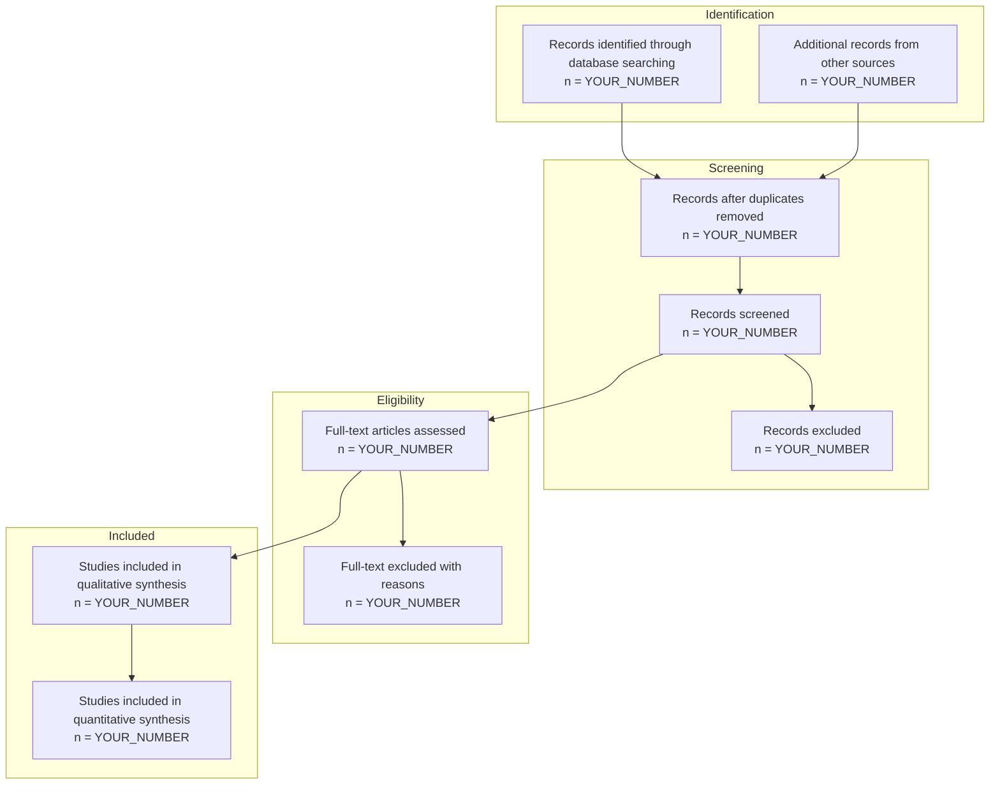
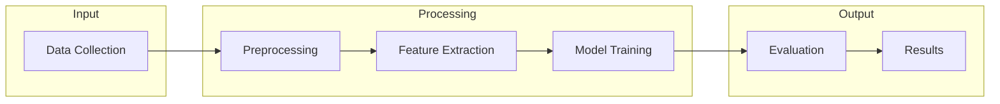
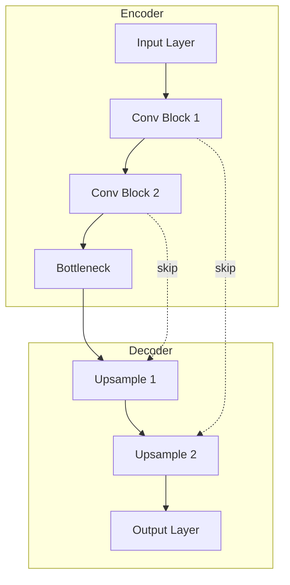
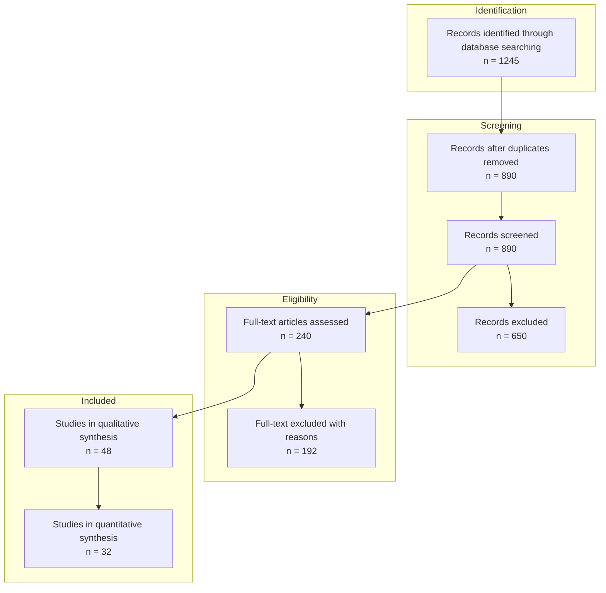

name: visual-asset-generator
description: Automatically generate research diagrams, charts, tables, and visualizations
  from data or descriptions. Creates publication-ready visual assets including PRISMA
  flow diagrams, methodology flowcharts, results charts, comparison tables, and architecture
  diagrams. Use when preparing manuscripts, presentations, or documentation that requires
  professional visual elements.
version: 1.0.0
category: research
tags:
- research
- visualization
- diagrams
- charts
- tables
- publication
author: ruv
mcp_servers:
  required: [memory-mcp]
  optional: []
  auto_enable: true
---

# Visual Asset Generator

## Purpose

Automatically generate publication-ready visual assets (diagrams, charts, tables) from data or descriptions in seconds, filling the gap between text-based research and visual communication.

## When to Use This Skill

Activate this skill when:
- Preparing figures for a research manuscript
- Creating methodology flowcharts
- Generating PRISMA flow diagrams for systematic reviews
- Building comparison tables from research data
- Designing architecture diagrams for systems/methods
- Creating presentation slides with data visualizations
- Documenting experimental pipelines

**DO NOT** use this skill for:
- Fabricating data (this is unethical - we only visualize real data)
- Complex statistical analysis (use appropriate analysis tools first)
- Interactive dashboards (use dedicated BI tools)

## Critical Design Principle

**This skill NEVER fabricates data.**

This skill only visualizes:
1. Data explicitly provided by the user
2. Placeholder templates clearly marked as "[YOUR DATA HERE]"
3. Structural diagrams (flowcharts, architectures) without data

## Supported Visual Asset Types

### 1. Research Diagrams
- PRISMA flow diagrams
- Methodology flowcharts
- Experimental pipeline diagrams
- System architecture diagrams
- Conceptual framework diagrams
- Decision trees

### 2. Data Visualizations
- Bar charts (comparison)
- Line charts (trends)
- Scatter plots (correlations)
- Box plots (distributions)
- Heatmaps (matrices)
- Confusion matrices

### 3. Tables
- Comparison tables (methods, results)
- Summary statistics tables
- Feature matrices
- Literature summary tables
- Hyperparameter tables

### 4. Specialized Research Figures
- Model architecture diagrams
- Ablation study visualizations
- Training curves
- ROC/PR curves (from data)
- Attention visualizations

## Input Contract

```yaml
input:
  asset_type: enum[diagram, chart, table, specialized] (required)

  subtype: string (required)
    # For diagrams: "prisma", "methodology", "pipeline", "architecture", "conceptual"
    # For charts: "bar", "line", "scatter", "box", "heatmap"
    # For tables: "comparison", "summary", "feature_matrix", "literature"
    # For specialized: "model_architecture", "ablation", "training_curves"

  data: object | array | null
    # Actual data to visualize (required for charts)
    # NULL for structural diagrams (will generate template)

  description: string (required for diagrams)
    # Natural language description of what to visualize

  style:
    format: enum[svg, mermaid, graphviz, ascii, markdown] (default: mermaid)
    color_scheme: enum[default, publication, presentation, minimal]
    size: enum[small, medium, large, full_page]

  output_preferences:
    include_caption: boolean (default: true)
    include_source_note: boolean (default: true)
    latex_compatible: boolean (default: false)
```

## Output Contract

```yaml
output:
  visual_asset:
    type: string
    subtype: string
    format: string
    content: string  # The actual diagram/chart/table code

  rendering:
    code: string  # Mermaid/GraphViz/Markdown code
    preview_instructions: string
    export_commands: array[string]

  caption:
    short: string
    long: string

  metadata:
    data_source: string  # "user_provided" | "template_placeholder"
    generation_time: number
    warnings: array[string]
```

## SOP Phase 1: Asset Type Classification

Determine the appropriate visualization for the request:

```markdown
## Asset Classification

**Request Analysis**:
- Type: [diagram | chart | table | specialized]
- Subtype: [specific type]
- Data Available: [yes | no | partial]
- Format: [mermaid | graphviz | markdown | ascii]

**Validation**:
- [ ] Data provided for data-dependent visualizations
- [ ] Description provided for structural diagrams
- [ ] Format supported for asset type
```

## SOP Phase 2: Template Selection

### PRISMA Flow Diagram Template



### Methodology Flowchart Template



### Comparison Table Template

```markdown
| Method | Accuracy | Precision | Recall | F1-Score | Parameters |
|--------|----------|-----------|--------|----------|------------|
| Baseline | [YOUR_DATA] | [YOUR_DATA] | [YOUR_DATA] | [YOUR_DATA] | [YOUR_DATA] |
| Proposed | [YOUR_DATA] | [YOUR_DATA] | [YOUR_DATA] | [YOUR_DATA] | [YOUR_DATA] |
| SOTA | [YOUR_DATA] | [YOUR_DATA] | [YOUR_DATA] | [YOUR_DATA] | [YOUR_DATA] |

*Table X: Performance comparison on [DATASET]. Best results in **bold**.*
```

### Model Architecture Diagram Template



## SOP Phase 3: Data Integration

For data-dependent visualizations:

```markdown
## Data Integration

**Data Validation**:
- [ ] Data format matches visualization requirements
- [ ] No missing critical values
- [ ] Data types appropriate (numeric for charts)

**Data Transformation**:
1. Parse provided data
2. Validate data integrity
3. Transform to visualization format
4. Generate appropriate labels

**If Data Missing**:
- Generate template with [YOUR_DATA] placeholders
- Add warning: "Template generated - replace placeholders with actual data"
```

## SOP Phase 4: Code Generation

Generate the visualization code:

### Mermaid (Default for Diagrams)

```javascript
// Mermaid diagram generation
const generateMermaid = (type, data, description) => {
  // Select template based on type
  // Populate with data or placeholders
  // Return mermaid code
};
```

### GraphViz (Complex Diagrams)

```dot
digraph G {
    rankdir=TB;
    node [shape=box, style=filled, fillcolor=lightblue];

    // Generated nodes and edges
}
```

### Markdown Tables

```markdown
| Column 1 | Column 2 | Column 3 |
|----------|----------|----------|
| Data 1   | Data 2   | Data 3   |
```

### ASCII Art (Terminal-friendly)

```
+----------------+     +----------------+
|    Input       | --> |   Processing   |
+----------------+     +----------------+
                              |
                              v
                       +----------------+
                       |    Output      |
                       +----------------+
```

## SOP Phase 5: Caption Generation

Generate publication-ready captions:

```markdown
## Caption Generation

**Short Caption** (for list of figures):
"Figure X: [Concise description of visualization]"

**Long Caption** (for figure):
"Figure X: [Detailed description including key findings,
methodology notes, and data sources].
[Specific observations].
Source: [Data attribution if applicable]."
```

## Example Executions

### Example 1: PRISMA Diagram

**Input**:
```yaml
asset_type: diagram
subtype: prisma
data:
  identified: 1245
  duplicates_removed: 890
  screened: 890
  excluded_screening: 650
  full_text_assessed: 240
  excluded_full_text: 192
  qualitative: 48
  quantitative: 32
```

**Output**:


### Example 2: Comparison Table

**Input**:
```yaml
asset_type: table
subtype: comparison
data:
  methods:
    - name: "Baseline CNN"
      accuracy: 0.823
      f1: 0.814
      params: "2.3M"
    - name: "Proposed Method"
      accuracy: 0.891
      f1: 0.887
      params: "1.8M"
    - name: "ResNet-50"
      accuracy: 0.876
      f1: 0.869
      params: "25.6M"
```

**Output**:
```markdown
| Method | Accuracy | F1-Score | Parameters |
|--------|----------|----------|------------|
| Baseline CNN | 0.823 | 0.814 | 2.3M |
| **Proposed Method** | **0.891** | **0.887** | **1.8M** |
| ResNet-50 | 0.876 | 0.869 | 25.6M |

*Table 1: Performance comparison on test dataset.
Best results highlighted in **bold**.
Proposed method achieves highest accuracy with fewest parameters.*
```

## Integration Points

### Feeds Into
- **rapid-manuscript-drafter**: Embed figures in drafts
- **research-publication**: Publication-ready figures

### Receives From
- **literature-synthesis**: Data for PRISMA diagrams
- **holistic-evaluation**: Metrics for comparison tables
- **baseline-replication**: Results for visualization

## Rendering Instructions

### Mermaid (Web/Markdown)
```bash
# Preview in VS Code with Mermaid extension
# Or use: https://mermaid.live/

# Export to SVG:
mmdc -i diagram.mmd -o diagram.svg
```

### GraphViz
```bash
# Render to PNG:
dot -Tpng diagram.dot -o diagram.png

# Render to SVG:
dot -Tsvg diagram.dot -o diagram.svg
```

### LaTeX Tables
```latex
\begin{table}[h]
\centering
\caption{Performance Comparison}
\begin{tabular}{lccc}
\toprule
Method & Accuracy & F1 & Params \\
\midrule
Baseline & 0.823 & 0.814 & 2.3M \\
Proposed & \textbf{0.891} & \textbf{0.887} & \textbf{1.8M} \\
\bottomrule
\end{tabular}
\end{table}
```

## Success Criteria

- [ ] Visualization matches requested type
- [ ] Data accurately represented (no fabrication)
- [ ] Template placeholders clearly marked if data missing
- [ ] Caption generated (short + long)
- [ ] Rendering instructions provided
- [ ] Format exportable to publication standards

## Ethical Guidelines

1. **NEVER fabricate data** - Only visualize user-provided data
2. **Mark templates clearly** - Use [YOUR_DATA] placeholders
3. **Attribute sources** - Include data source in captions
4. **Warn about limitations** - Note when data is incomplete

---

**Version**: 1.0.0
**Category**: Research / Visualization
**Formats**: Mermaid, GraphViz, Markdown, ASCII, LaTeX
**Design**: Ethical visualization with placeholder-based data insertion

---

## Core Principles

### 1. Publication-Ready Quality By Default
Research visualizations must meet journal and conference standards without manual refinement. This skill generates assets that are immediately suitable for submission, saving researchers from formatting iterations.

**In practice:**
- Use vector formats (SVG, PDF) for infinite scaling without quality loss
- Apply colorblind-friendly palettes (viridis, cividis) for accessibility compliance
- Generate publication-standard captions with both short (figure list) and long (in-text) formats
- Include source data files (CSV, JSON) for reproducibility requirements
- Export at 300+ DPI resolution for print publication standards

### 2. Template-Based Generation With Data Integrity
Visualization automation must never cross into data fabrication. This skill provides structural templates while requiring explicit user data insertion.

**In practice:**
- Generate diagram structures (PRISMA flow, methodology flowcharts) without requiring data
- Use [YOUR_DATA] placeholders in charts/tables that need numerical values
- Add metadata tags indicating "user_provided" vs "template_placeholder" for all visualizations
- Include warnings when templates contain unfilled placeholders ("REPLACE BEFORE SUBMISSION")
- Validate data types when user provides values (numeric for charts, proper date formats for timelines)

### 3. Multi-Format Export For Maximum Compatibility
Different research contexts require different visualization formats. This skill generates assets optimized for each target medium.

**In practice:**
- Mermaid for markdown documents, GitHub READMEs, and web-based presentations
- GraphViz for complex dependency diagrams and architecture visualizations
- LaTeX tables for journal manuscripts with precise formatting control
- ASCII art for terminal-based documentation and code comments
- SVG/PDF for high-resolution publication figures

---

## Anti-Patterns

| Anti-Pattern | Problem | Solution |
|--------------|---------|----------|
| Using raster formats (PNG, JPG) for diagrams | Images become pixelated when scaled for different display sizes; journals often require vector formats; editing requires regeneration rather than modification | Generate SVG or PDF by default. Only use PNG for screenshots or photographs (pixel-based by nature). Provide export commands for converting vector to raster if needed. |
| Default matplotlib/seaborn color schemes | Rainbow colormap is not perceptually uniform and fails colorblind accessibility tests; reduces figure inclusivity and violates some journal guidelines | ALWAYS use colorblind-friendly palettes (viridis, plasma, cividis, colorbrewer). Test with colorblind simulators (Coblis, Color Oracle). Document palette choice in caption or methods. |
| Missing or inadequate captions | Readers cannot understand figures without context; violates publication standards requiring standalone interpretability; reduces citation potential of figure | Auto-generate both short caption (for list of figures) and long caption (detailed description including methodology notes, key findings, data sources). Include all necessary context for standalone interpretation. |

---

## Conclusion

Visual asset generation automates one of the most time-consuming aspects of research communication - the creation of publication-quality diagrams, charts, and tables. By providing templates for common research visualizations (PRISMA diagrams, methodology flowcharts, comparison tables), this skill accelerates manuscript preparation from days to minutes while maintaining the highest standards of quality and integrity.

The ethical foundation of this skill ensures that automation enhances rather than replaces human judgment. Unlike tools that generate plausible-looking data visualizations from thin air, this skill creates honest structural scaffolds that researchers populate with their actual findings. The clear distinction between template structures and required data insertion prevents the most dangerous failure mode of research automation - the inadvertent fabrication of results.

As research publication demands increase while quality standards remain stringent, tools that accelerate legitimate visualization become essential infrastructure. The visual asset generator demonstrates that speed and integrity are compatible goals - when properly designed, automation can enhance both the efficiency and the quality of research communication. By reducing the mechanical burden of figure creation, this skill allows researchers to focus on what matters most: clearly communicating genuine scientific insights.