## MCP Requirements

This skill operates using Claude Code's built-in tools only. No additional MCP servers required.

The hooks system (pre-task, post-task, post-edit, session management) is built into Claude Flow and requires no external MCPs. Memory coordination uses Memory MCP which is globally available to all skills.

## Trigger Conditions

Use this skill when:
- User requests automated workflow orchestration
- Git integration needed for commits and operations
- Pre/post task hooks required for coordination
- Session state management and persistence needed
- Neural pattern training from development operations
- Code formatting and quality checks automation
- Memory coordination across multi-agent workflows
- Cross-session context restoration required

## Skill Overview

This skill implements comprehensive hooks automation using Claude Flow's hooks system. It provides pre-operation setup (agent assignment, validation, resource preparation), post-operation automation (formatting, memory updates, neural training), and session management (state persistence, metrics tracking, context restoration).

## 7-Phase Skill-Forge Methodology

### Phase 1: Hooks System Initialization

**Objective**: Set up hooks infrastructure and configuration

**Agent**: `system-architect`

**Activities**:
- Configure Claude Flow hooks system
- Define hook triggers and automation rules
- Set up memory coordination patterns
- Configure Git integration for commits
- Establish quality thresholds
- Define neural training parameters
- Store hooks configuration in memory

**Memory Keys**:
- `swarm/hooks/automation-rules/pre-task-hooks`
- `swarm/hooks/automation-rules/post-task-hooks`
- `swarm/hooks/automation-rules/session-hooks`
- `swarm/hooks/automation-rules/git-integration`
- `swarm/hooks/automation-rules/neural-config`

**Script**:
```bash
npx claude-flow@alpha hooks pre-task --description "Hooks system initialization"
# Configure hooks
cat > .claude-flow-hooks.json << 'EOF'
{
  "preTask": {
    "enabled": true,
    "autoAssignAgents": true,
    "validateCommands": true,
    "prepareResources": true
  },
  "postTask": {
    "enabled": true,
    "autoFormat": true,
    "trainNeural": true,
    "updateMemory": true
  },
  "session": {
    "persistState": true,
    "trackMetrics": true,
    "exportSummary": true
  },
  "git": {
    "autoCommit": false,
    "commitMessageTemplate": true,
    "branchStrategy": "feature"
  }
}
EOF
npx claude-flow@alpha memory store "swarm/hooks/automation-rules/pre-task-hooks" "$(cat .claude-flow-hooks.json)"
npx claude-flow@alpha hooks notify --message "Hooks system initialized"
```

### Phase 2: Pre-Task Hook Automation

**Objective**: Automate operations before each task execution

**Agent**: `coder`

**Activities**:
- Auto-assign agents by file type and task complexity
- Validate commands for safety and correctness
- Prepare required resources (dependencies, env vars)
- Optimize topology based on task complexity
- Cache frequent searches and queries
- Load session context from memory
- Store pre-task state for rollback

**Memory Keys**:
- `swarm/hooks/pre-task-state/agent-assignments`
- `swarm/hooks/pre-task-state/resources-prepared`
- `swarm/hooks/pre-task-state/validation-results`
- `swarm/hooks/pre-task-state/session-context`

**Script**:
```bash
#!/bin/bash
# Pre-task hook automation

pre_task_hook() {
  local task_description="$1"
  local task_type="$2"

  echo "🔧 Pre-task automation: $task_description"

  # 1. Auto-assign agent by task type
  case "$task_type" in
    "frontend")
      ASSIGNED_AGENT="coder"
      ;;
    "backend")
      ASSIGNED_AGENT="backend-dev"
      ;;
    "test")
      ASSIGNED_AGENT="tester"
      ;;
    "review")
      ASSIGNED_AGENT="reviewer"
      ;;
    *)
      ASSIGNED_AGENT="coder"
      ;;
  esac

  npx claude-flow@alpha memory store "swarm/hooks/pre-task-state/agent-assignments" "$ASSIGNED_AGENT"

  # 2. Validate task safety
  if [[ "$task_description" =~ "rm -rf /" ]] || [[ "$task_description" =~ "drop database" ]]; then
    echo "❌ Dangerous command detected, task blocked"
    exit 1
  fi

  # 3. Prepare resources
  if [[ ! -d "node_modules" ]] && [[ -f "package.json" ]]; then
    echo "📦 Installing dependencies..."
    npm install
  fi

  # 4. Load session context
  SESSION_ID=$(npx claude-flow@alpha memory retrieve "swarm/hooks/session-state/current-session-id")
  if [[ -n "$SESSION_ID" ]]; then
    npx claude-flow@alpha hooks session-restore --session-id "$SESSION_ID"
  fi

  # 5. Store pre-task snapshot
  npx claude-flow@alpha memory store "swarm/hooks/pre-task-state/timestamp" "$(date -Iseconds)"

  echo "✅ Pre-task automation complete"
}

# Register hook
npx claude-flow@alpha hooks pre-task --description "$TASK_DESCRIPTION"
pre_task_hook "$TASK_DESCRIPTION" "$TASK_TYPE"
```

### Phase 3: Post-Task Hook Automation

**Objective**: Automate operations after each task completion

**Agent**: `reviewer`

**Activities**:
- Auto-format code (Prettier, ESLint)
- Train neural patterns from task execution
- Update shared memory with results
- Analyze performance and metrics
- Track token usage and costs
- Generate task summary
- Store post-task results

**Memory Keys**:
- `swarm/hooks/post-task-results/formatted-files`
- `swarm/hooks/post-task-results/neural-training`
- `swarm/hooks/post-task-results/memory-updates`
- `swarm/hooks/post-task-results/metrics`

**Script**:
```bash
#!/bin/bash
# Post-task hook automation

post_task_hook() {
  local task_id="$1"
  local changed_files="$2"

  echo "🎯 Post-task automation: $task_id"

  # 1. Auto-format changed files
  if [[ -n "$changed_files" ]]; then
    echo "✨ Formatting code..."
    npx prettier --write $changed_files
    npx eslint --fix $changed_files
    npx claude-flow@alpha memory store "swarm/hooks/post-task-results/formatted-files" "$changed_files"
  fi

  # 2. Train neural patterns
  echo "🧠 Training neural patterns..."
  npx claude-flow@alpha neural train --task-id "$task_id" --success true

  # 3. Update memory with results
  TASK_OUTPUT=$(git diff --cached)
  npx claude-flow@alpha memory store "swarm/hooks/post-task-results/task-output-$task_id" "$TASK_OUTPUT"

  # 4. Analyze performance
  TASK_DURATION=$SECONDS
  npx claude-flow@alpha memory store "swarm/hooks/post-task-results/duration-$task_id" "$TASK_DURATION"

  # 5. Track metrics
  npx claude-flow@alpha hooks post-task --task-id "$task_id"

  # 6. Generate summary
  echo "📊 Task $task_id completed in ${TASK_DURATION}s"
  echo "📁 Files changed: $changed_files"

  echo "✅ Post-task automation complete"
}

# Register hook
post_task_hook "$TASK_ID" "$CHANGED_FILES"
```

### Phase 4: Post-Edit Hook Automation

**Objective**: Automate operations after file edits

**Agent**: `coder`

**Activities**:
- Store file changes in memory with context
- Run linting and formatting on edited file
- Update neural patterns with edit context
- Trigger related file updates if needed
- Generate edit summary
- Notify coordinating agents

**Memory Keys**:
- `swarm/hooks/post-edit/file-changes`
- `swarm/hooks/post-edit/lint-results`
- `swarm/hooks/post-edit/related-updates`

**Script**:
```bash
#!/bin/bash
# Post-edit hook automation

post_edit_hook() {
  local file_path="$1"
  local memory_key="$2"

  echo "📝 Post-edit automation: $file_path"

  # 1. Store in memory
  FILE_CONTENT=$(cat "$file_path")
  npx claude-flow@alpha hooks post-edit --file "$file_path" --memory-key "$memory_key"

  # 2. Auto-format
  case "$file_path" in
    *.js|*.ts|*.jsx|*.tsx)
      npx prettier --write "$file_path"
      npx eslint --fix "$file_path"
      ;;
    *.py)
      black "$file_path"
      ;;
    *.go)
      gofmt -w "$file_path"
      ;;
  esac

  # 3. Update related files
  if [[ "$file_path" =~ "types.ts" ]]; then
    echo "🔄 Types updated, checking related files..."
    npx tsc --noEmit
  fi

  # 4. Train neural pattern
  npx claude-flow@alpha neural train --file "$file_path" --edit-type "modification"

  echo "✅ Post-edit automation complete"
}

# Usage in code
npx claude-flow@alpha hooks post-edit --file "$FILE" --memory-key "swarm/feature/implementation"
post_edit_hook "$FILE" "swarm/feature/implementation"
```

### Phase 5: Session Management Hooks

**Objective**: Manage session state, persistence, and restoration

**Agent**: `swarm-memory-manager`

**Activities**:
- Generate session summaries
- Persist session state to disk
- Track comprehensive metrics
- Restore context from previous sessions
- Export workflows and patterns
- Coordinate cross-session memory
- Store session data

**Memory Keys**:
- `swarm/hooks/session-metrics/total-tasks`
- `swarm/hooks/session-metrics/duration`
- `swarm/hooks/session-metrics/agents-used`
- `swarm/hooks/session-state/summary`
- `swarm/hooks/session-state/exported-data`

**Script**:
```bash
#!/bin/bash
# Session management hooks

session_start_hook() {
  local session_id="$1"

  echo "🚀 Session start: $session_id"

  # Store session ID
  npx claude-flow@alpha memory store "swarm/hooks/session-state/current-session-id" "$session_id"

  # Initialize metrics
  npx claude-flow@alpha memory store "swarm/hooks/session-metrics/start-time" "$(date -Iseconds)"
  npx claude-flow@alpha memory store "swarm/hooks/session-metrics/total-tasks" "0"

  # Check for restorable session
  if [[ -f ".claude-flow-session.json" ]]; then
    echo "🔄 Restoring previous session..."
    npx claude-flow@alpha hooks session-restore --session-id "$session_id"
  fi
}

session_end_hook() {
  local session_id="$1"

  echo "🏁 Session end: $session_id"

  # Calculate metrics
  START_TIME=$(npx claude-flow@alpha memory retrieve "swarm/hooks/session-metrics/start-time")
  END_TIME=$(date -Iseconds)
  DURATION=$(($(date -d "$END_TIME" +%s) - $(date -d "$START_TIME" +%s)))

  # Generate summary
  SUMMARY=$(cat <<EOF
Session Summary: $session_id
Duration: ${DURATION}s
Tasks completed: $(npx claude-flow@alpha memory retrieve "swarm/hooks/session-metrics/total-tasks")
Agents used: $(npx claude-flow@alpha agent list --filter active | wc -l)
EOF
)

  npx claude-flow@alpha memory store "swarm/hooks/session-state/summary" "$SUMMARY"

  # Export metrics
  npx claude-flow@alpha hooks session-end --export-metrics true

  # Persist state
  npx claude-flow@alpha memory export --file ".claude-flow-session.json"

  echo "✅ Session end complete"
  echo "$SUMMARY"
}

# Register hooks
session_start_hook "${SESSION_ID:-$(uuidgen)}"
trap "session_end_hook $SESSION_ID" EXIT
```

### Phase 6: Git Integration Hooks

**Objective**: Automate Git operations and commit coordination

**Agent**: `coder`

**Activities**:
- Auto-generate commit messages from changes
- Stage files intelligently
- Coordinate commits across agents
- Branch management automation
- Pre-commit hooks for quality checks
- Post-commit memory updates
- Store Git operations

**Memory Keys**:
- `swarm/hooks/git-integration/commit-messages`
- `swarm/hooks/git-integration/staged-files`
- `swarm/hooks/git-integration/branch-strategy`

**Script**:
```bash
#!/bin/bash
# Git integration hooks

pre_commit_hook() {
  echo "🔍 Pre-commit checks..."

  # 1. Lint staged files
  STAGED_FILES=$(git diff --cached --name-only --diff-filter=ACM)
  for file in $STAGED_FILES; do
    case "$file" in
      *.js|*.ts|*.jsx|*.tsx)
        npx eslint "$file" || exit 1
        npx prettier --check "$file" || exit 1
        ;;
    esac
  done

  # 2. Run tests
  npm test || exit 1

  # 3. Type check
  if [[ -f "tsconfig.json" ]]; then
    npx tsc --noEmit || exit 1
  fi

  echo "✅ Pre-commit checks passed"
}

generate_commit_message() {
  local changed_files="$1"

  # Analyze changes
  DIFF=$(git diff --cached)

  # Determine commit type
  if echo "$DIFF" | grep -q "test"; then
    COMMIT_TYPE="test"
  elif echo "$DIFF" | grep -q "fix"; then
    COMMIT_TYPE="fix"
  elif echo "$DIFF" | grep -q "feat"; then
    COMMIT_TYPE="feat"
  else
    COMMIT_TYPE="chore"
  fi

  # Generate message
  COMMIT_MSG="$COMMIT_TYPE: $(echo $changed_files | head -n1 | xargs basename | sed 's/\..*//')"

  echo "$COMMIT_MSG"
}

auto_commit() {
  local description="$1"

  echo "📝 Auto-commit: $description"

  # Stage changed files
  git add .

  # Pre-commit checks
  pre_commit_hook

  # Generate commit message
  COMMIT_MSG=$(generate_commit_message "$(git diff --cached --name-only)")

  # Add Claude Code signature
  FULL_MSG="$COMMIT_MSG

$description

🤖 Generated with Claude Code
Co-Authored-By: Claude <noreply@anthropic.com>"

  # Commit
  git commit -m "$FULL_MSG"

  # Store in memory
  npx claude-flow@alpha memory store "swarm/hooks/git-integration/last-commit" "$FULL_MSG"

  echo "✅ Commit created: $COMMIT_MSG"
}

# Usage
# auto_commit "Implemented user authentication feature"
```

### Phase 7: Neural Pattern Training

**Objective**: Learn from operations to improve future performance

**Agent**: `smart-agent`

**Activities**:
- Capture successful patterns from tasks
- Train neural models on operation outcomes
- Store learned patterns in memory
- Optimize agent selection based on patterns
- Predict optimal strategies for tasks
- Coordinate neural learning across agents

**Memory Keys**:
- `swarm/hooks/neural-patterns/successful-patterns`
- `swarm/hooks/neural-patterns/training-data`
- `swarm/hooks/neural-patterns/optimizations`

**Script**:
```bash
#!/bin/bash
# Neural pattern training

train_from_task() {
  local task_id="$1"
  local success="$2"
  local task_type="$3"

  echo "🧠 Training neural patterns from task $task_id"

  # Gather training data
  TASK_DESCRIPTION=$(npx claude-flow@alpha memory retrieve "swarm/hooks/pre-task-state/description-$task_id")
  AGENT_USED=$(npx claude-flow@alpha memory retrieve "swarm/hooks/pre-task-state/agent-assignments")
  DURATION=$(npx claude-flow@alpha memory retrieve "swarm/hooks/post-task-results/duration-$task_id")

  # Create training data
  TRAINING_DATA=$(cat <<EOF
{
  "task_type": "$task_type",
  "description": "$TASK_DESCRIPTION",
  "agent": "$AGENT_USED",
  "duration": $DURATION,
  "success": $success
}
EOF
)

  # Train neural model
  npx claude-flow@alpha neural train --data "$TRAINING_DATA"

  # Store pattern
  if [[ "$success" == "true" ]]; then
    npx claude-flow@alpha memory store "swarm/hooks/neural-patterns/successful-patterns/$task_type" "$TRAINING_DATA"
  fi

  echo "✅ Neural training complete"
}

predict_optimal_agent() {
  local task_description="$1"

  echo "🔮 Predicting optimal agent..."

  # Query neural model
  PREDICTION=$(npx claude-flow@alpha neural predict --input "$task_description")

  echo "Recommended agent: $PREDICTION"
  echo "$PREDICTION"
}

# Usage after task completion
# train_from_task "$TASK_ID" "true" "feature-implementation"
```

## Complete Workflow Orchestration

### Execution Pattern (Single Message)

```javascript
// Initialize adaptive coordination
mcp__claude-flow__swarm_init { topology: "adaptive", maxAgents: 5, strategy: "adaptive" }

// Spawn automation agents
Task("Hooks Architect", `
  1. Initialize hooks system with configuration
  2. Set up pre/post task automation rules
  3. Configure Git integration hooks
  4. Define neural training parameters
  5. Store config: swarm/hooks/automation-rules/*
  6. Enable hooks for all operations
`, "system-architect")

Task("Automation Coder", `
  1. Implement pre-task hook automation
  2. Auto-assign agents by file/task type
  3. Validate commands for safety
  4. Prepare resources automatically
  5. Cache frequent operations
  6. Run hooks before every task
`, "coder")

Task("Quality Reviewer", `
  1. Implement post-task automation
  2. Auto-format code after changes
  3. Run linting and quality checks
  4. Store results in memory
  5. Generate task summaries
  6. Run hooks after every task
`, "reviewer")

Task("Memory Manager", `
  1. Implement session management hooks
  2. Persist session state across runs
  3. Track metrics and performance
  4. Generate session summaries
  5. Export workflows and patterns
  6. Restore context from previous sessions
`, "swarm-memory-manager")

Task("Neural Trainer", `
  1. Capture patterns from successful operations
  2. Train neural models on outcomes
  3. Optimize agent selection strategies
  4. Predict optimal approaches for tasks
  5. Store learned patterns in memory
  6. Coordinate learning across agents
`, "smart-agent")

// Batch todos
TodoWrite { todos: [
  {content: "Initialize hooks system configuration", status: "in_progress", activeForm: "Initializing hooks"},
  {content: "Set up pre-task automation (agent assignment, validation)", status: "pending", activeForm: "Setting up pre-task hooks"},
  {content: "Configure post-task automation (formatting, training)", status: "pending", activeForm: "Configuring post-task hooks"},
  {content: "Implement post-edit hooks for file changes", status: "pending", activeForm: "Implementing post-edit hooks"},
  {content: "Set up session management and persistence", status: "pending", activeForm: "Setting up session hooks"},
  {content: "Configure Git integration hooks", status: "pending", activeForm: "Configuring Git hooks"},
  {content: "Implement neural pattern training", status: "pending", activeForm: "Implementing neural training"},
  {content: "Test hooks across full workflow", status: "pending", activeForm: "Testing hooks"},
  {content: "Generate hooks documentation", status: "pending", activeForm: "Generating documentation"}
]}
```

## Success Criteria

- [ ] Hooks system configured and active
- [ ] Pre-task hooks running automatically
- [ ] Post-task hooks executing successfully
- [ ] Post-edit hooks updating memory correctly
- [ ] Session state persisting and restorable
- [ ] Git integration working with auto-commits
- [ ] Neural patterns training from operations
- [ ] Code auto-formatting on every change
- [ ] Metrics tracked across all operations
- [ ] Cross-session context restoration working

## Memory Coordination Patterns

```
Pre-Task → Task Execution → Post-Task
    ↓            ↓              ↓
    ↓→ shared memory hooks ←↓
    ↓            ↓              ↓
Validation → Execution → Training
```

### Memory Keys Structure

```
swarm/hooks/
├── automation-rules/
│   ├── pre-task-hooks
│   ├── post-task-hooks
│   ├── session-hooks
│   ├── git-integration
│   └── neural-config
├── pre-task-state/
│   ├── agent-assignments
│   ├── resources-prepared
│   ├── validation-results
│   └── session-context
├── post-task-results/
│   ├── formatted-files
│   ├── neural-training
│   ├── memory-updates
│   └── metrics
├── post-edit/
│   ├── file-changes
│   ├── lint-results
│   └── related-updates
├── session-metrics/
│   ├── total-tasks
│   ├── duration
│   ├── agents-used
│   └── token-usage
├── session-state/
│   ├── current-session-id
│   ├── summary
│   └── exported-data
├── git-integration/
│   ├── commit-messages
│   ├── staged-files
│   └── branch-strategy
└── neural-patterns/
    ├── successful-patterns
    ├── training-data
    └── optimizations
```

## Process Flow Diagram

```graphviz
digraph hooks_automation {
    rankdir=LR;
    node [shape=box, style="rounded,filled", fillcolor=lightblue];

    task_start [label="Task Start", shape=ellipse, fillcolor=lightgreen];
    pre_hook [label="Pre-Task Hooks\n• Agent assignment\n• Validation\n• Resource prep"];
    execution [label="Task Execution"];
    post_hook [label="Post-Task Hooks\n• Format code\n• Train neural\n• Update memory"];
    edit [label="File Edit"];
    post_edit [label="Post-Edit Hooks\n• Store changes\n• Lint\n• Notify"];
    session_end [label="Session End"];
    session_hook [label="Session Hooks\n• Summary\n• Persist state\n• Export"];
    task_end [label="Task Complete", shape=ellipse, fillcolor=lightgreen];

    memory [label="Shared Memory\nHooks Coordination", shape=cylinder, fillcolor=lightyellow];
    neural [label="Neural Training", shape=box, fillcolor=lightpink];
    git [label="Git Integration", shape=box, fillcolor=lightcyan];

    task_start -> pre_hook;
    pre_hook -> execution;
    execution -> post_hook;
    execution -> edit [style=dashed];
    edit -> post_edit;
    post_edit -> execution [style=dashed];
    post_hook -> task_end;
    task_end -> session_end [style=dotted];
    session_end -> session_hook;

    pre_hook -> memory [style=dashed, label="validate"];
    post_hook -> memory [style=dashed, label="update"];
    post_edit -> memory [style=dashed, label="store"];
    session_hook -> memory [style=dashed, label="persist"];

    post_hook -> neural [style=dashed, label="train"];
    post_hook -> git [style=dashed, label="commit"];
}
```



## Configuration File

`.claude-flow-hooks.json`:
```json
{
  "preTask": {
    "enabled": true,
    "autoAssignAgents": true,
    "agentMapping": {
      "*.tsx": "coder",
      "*.test.ts": "tester",
      "*.md": "api-docs"
    },
    "validateCommands": true,
    "dangerousPatterns": ["rm -rf", "drop database", "format c:"],
    "prepareResources": true,
    "cacheSearches": true
  },
  "postTask": {
    "enabled": true,
    "autoFormat": true,
    "formatters": {
      "javascript": "prettier",
      "typescript": "prettier",
      "python": "black",
      "go": "gofmt"
    },
    "trainNeural": true,
    "neuralConfig": {
      "model": "adaptive",
      "learningRate": 0.001
    },
    "updateMemory": true,
    "trackMetrics": true
  },
  "postEdit": {
    "enabled": true,
    "storeInMemory": true,
    "runLinting": true,
    "notifyAgents": true
  },
  "session": {
    "persistState": true,
    "stateFile": ".claude-flow-session.json",
    "trackMetrics": true,
    "exportSummary": true,
    "summaryFormat": "markdown"
  },
  "git": {
    "autoCommit": false,
    "preCommitChecks": true,
    "commitMessageTemplate": "{{type}}: {{description}}\\n\\n🤖 Generated with Claude Code\\nCo-Authored-By: Claude <noreply@anthropic.com>",
    "branchStrategy": "feature",
    "autoStage": true
  },
  "neural": {
    "trainOnSuccess": true,
    "trainOnFailure": false,
    "optimizeAgentSelection": true,
    "predictOptimalStrategy": true
  }
}
```

## Usage Examples

### Example 1: Automated Feature Development

```bash
# With hooks automation
npx claude-flow sparc tdd "user authentication"

# Hooks automatically:
# 1. Pre-task: Assign agents (coder, tester, reviewer)
# 2. Pre-task: Validate commands, prepare dependencies
# 3. Execution: Implement feature
# 4. Post-edit: Format code, store in memory
# 5. Post-task: Train neural patterns, update memory
# 6. Git: Auto-generate commit message
# 7. Session: Track metrics, persist state
```

### Example 2: Cross-Session Development

```bash
# Day 1: Start feature
npx claude-flow sparc run coder "implement user service"
# Session state automatically saved

# Day 2: Continue feature (context restored)
npx claude-flow hooks session-restore --session-id "previous-session"
# Memory and context automatically restored
npx claude-flow sparc run tester "test user service"
# Hooks coordinate between days seamlessly
```

## Best Practices

1. **Always enable hooks** - Maximum automation benefit
2. **Configure validation** - Prevent dangerous operations
3. **Persist session state** - Enable cross-session work
4. **Train neural patterns** - Improve over time
5. **Use memory coordination** - Share context across agents
6. **Git integration** - Auto-generate meaningful commits
7. **Track metrics** - Monitor performance and costs
8. **Export summaries** - Document workflows

---

*This skill provides comprehensive workflow automation through intelligent hooks, enabling seamless coordination, persistence, and continuous improvement.*

---

## !! SKILL COMPLETION VERIFICATION (MANDATORY) !!

**After invoking this skill, you MUST complete ALL items below before proceeding:**

### Completion Checklist

- [ ] **Agent Spawning**: Did you spawn at least 1 agent via Task()?
  - Example: `Task("Agent Name", "Task description", "agent-type-from-registry")`

- [ ] **Agent Registry Validation**: Is your agent from the registry?
  - Registry location: `claude-code-plugins/ruv-sparc-three-loop-system/agents/`
  - Valid categories: delivery, foundry, operations, orchestration, platforms, quality, research, security, specialists, tooling
  - NOT valid: Made-up agent names

- [ ] **TodoWrite Called**: Did you call TodoWrite with 5+ todos?
  - Example: `TodoWrite({ todos: [8-10 items covering all work] })`

- [ ] **Work Delegation**: Did you delegate to agents (not do work yourself)?
  - CORRECT: Agents do the implementation via Task()
  - WRONG: You write the code directly after reading skill

### Correct Pattern After Skill Invocation

```javascript
// After Skill("<skill-name>") is invoked:
[Single Message - ALL in parallel]:
  Task("Agent 1", "Description of task 1...", "agent-type-1")
  Task("Agent 2", "Description of task 2...", "agent-type-2")
  Task("Agent 3", "Description of task 3...", "agent-type-3")
  TodoWrite({ todos: [
    {content: "Task 1 description", status: "in_progress", activeForm: "Working on task 1"},
    {content: "Task 2 description", status: "pending", activeForm: "Working on task 2"},
    {content: "Task 3 description", status: "pending", activeForm: "Working on task 3"},
  ]})
```

### Wrong Pattern (DO NOT DO THIS)

```javascript
// WRONG - Reading skill and then doing work yourself:
Skill("<skill-name>")
// Then you write all the code yourself without Task() calls
// This defeats the purpose of the skill system!
```

**The skill is NOT complete until all checklist items are checked.**

---

**Remember the pattern: Skill() -> Task() -> TodoWrite() - ALWAYS**