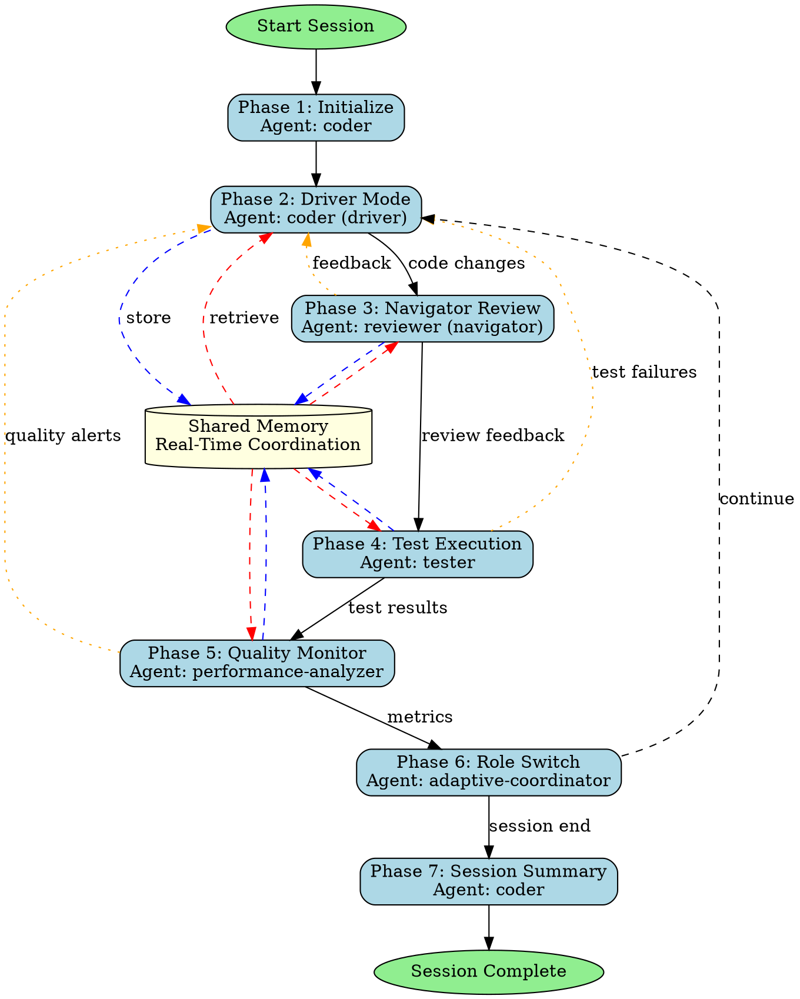

## Trigger Conditions

Use this skill when:
- User requests pair programming session
- Real-time collaborative coding needed
- Code review required during development
- TDD workflow with immediate feedback desired
- Learning/mentoring session for coding practices
- Debugging complex issues with second perspective
- Refactoring with continuous quality checks

## Skill Overview

This skill provides AI-assisted pair programming with three distinct modes: Driver/Navigator (traditional pairing), Switch Mode (role reversal), and TDD Mode (test-first development). Real-time quality monitoring, security scanning, and performance optimization ensure high-quality code output.

## 7-Phase Skill-Forge Methodology

### Phase 1: Session Initialization

**Objective**: Set up pair programming environment and establish session parameters

**Agent**: `coder` (session lead)

**Activities**:
- Initialize pair programming session
- Determine programming mode (driver/navigator/switch/tdd)
- Set up shared workspace and memory
- Configure quality thresholds and monitoring
- Establish coding standards and conventions
- Define session goals and success criteria

**Memory Keys**:
- `swarm/pair-programming/session-state/mode`
- `swarm/pair-programming/session-state/goals`
- `swarm/pair-programming/session-state/standards`
- `swarm/pair-programming/session-state/thresholds`

**Script**:
```bash
npx claude-flow@alpha hooks pre-task --description "Pair programming session init"
npx claude-flow@alpha hooks session-restore --session-id "pair-prog-${SESSION_ID}"
# Initialize session
npx claude-flow@alpha memory store "swarm/pair-programming/session-state/mode" "$SELECTED_MODE"
npx claude-flow@alpha memory store "swarm/pair-programming/session-state/goals" "$SESSION_GOALS"
npx claude-flow@alpha hooks notify --message "Pair programming session started: $SELECTED_MODE mode"
```

### Phase 2: Driver Mode (Code Implementation)

**Objective**: Write code with real-time navigator feedback

**Agent**: `coder` (driver)

**Activities**:
- Implement code changes based on task requirements
- Explain approach and reasoning to navigator
- Write code incrementally with frequent commits
- Respond to navigator feedback and suggestions
- Store code changes in memory for review

**Memory Keys**:
- `swarm/pair-programming/code-changes/current-file`
- `swarm/pair-programming/code-changes/diff`
- `swarm/pair-programming/code-changes/explanation`
- `swarm/pair-programming/code-changes/timestamp`

**Script**:
```bash
npx claude-flow@alpha hooks pre-task --description "Driver: implementing ${FEATURE}"
STANDARDS=$(npx claude-flow@alpha memory retrieve "swarm/pair-programming/session-state/standards")
# Write code
npx claude-flow@alpha hooks post-edit --file "$FILE_PATH" --memory-key "swarm/pair-programming/code-changes/current-file"
npx claude-flow@alpha memory store "swarm/pair-programming/code-changes/explanation" "$REASONING"
npx claude-flow@alpha hooks notify --message "Driver: code change ready for review"
```

### Phase 3: Navigator Mode (Real-Time Review)

**Objective**: Provide real-time feedback, catch issues, and suggest improvements

**Agent**: `reviewer` (navigator)

**Activities**:
- Monitor driver's code changes in real-time
- Review code for quality, patterns, and best practices
- Identify potential bugs, security issues, performance problems
- Suggest improvements and alternative approaches
- Provide strategic direction and high-level guidance
- Store review feedback in memory

**Memory Keys**:
- `swarm/pair-programming/review-feedback/suggestions`
- `swarm/pair-programming/review-feedback/issues-found`
- `swarm/pair-programming/review-feedback/severity`
- `swarm/pair-programming/review-feedback/approved`

**Script**:
```bash
npx claude-flow@alpha hooks pre-task --description "Navigator: reviewing code changes"
CODE_CHANGES=$(npx claude-flow@alpha memory retrieve "swarm/pair-programming/code-changes/current-file")
STANDARDS=$(npx claude-flow@alpha memory retrieve "swarm/pair-programming/session-state/standards")
# Review code
npx claude-flow@alpha memory store "swarm/pair-programming/review-feedback/suggestions" "$FEEDBACK"
npx claude-flow@alpha memory store "swarm/pair-programming/review-feedback/issues-found" "$ISSUES"
npx claude-flow@alpha hooks notify --message "Navigator: review feedback ready"
```

### Phase 4: Test Execution & Verification

**Objective**: Verify code changes with comprehensive testing

**Agent**: `tester`

**Activities**:
- Retrieve code changes from memory
- Run existing test suite
- Write new tests for new functionality (TDD mode)
- Execute unit, integration, and regression tests
- Measure code coverage
- Store test results in memory
- Alert team of test failures

**Memory Keys**:
- `swarm/pair-programming/test-results/status`
- `swarm/pair-programming/test-results/coverage`
- `swarm/pair-programming/test-results/failures`
- `swarm/pair-programming/test-results/timestamp`

**Script**:
```bash
npx claude-flow@alpha hooks pre-task --description "Running test suite"
CODE_CHANGES=$(npx claude-flow@alpha memory retrieve "swarm/pair-programming/code-changes/current-file")
# Run tests
npm test -- --coverage
npx claude-flow@alpha memory store "swarm/pair-programming/test-results/status" "$TEST_STATUS"
npx claude-flow@alpha memory store "swarm/pair-programming/test-results/coverage" "$COVERAGE_PERCENT"
npx claude-flow@alpha hooks notify --message "Tests completed: $TEST_STATUS"
```

### Phase 5: Quality & Performance Monitoring

**Objective**: Continuous quality metrics and performance analysis

**Agent**: `performance-analyzer`

**Activities**:
- Monitor code quality metrics (complexity, duplication)
- Analyze performance impact of changes
- Track technical debt accumulation
- Security vulnerability scanning
- Generate quality reports
- Alert on threshold violations

**Memory Keys**:
- `swarm/pair-programming/metrics/quality-score`
- `swarm/pair-programming/metrics/performance-impact`
- `swarm/pair-programming/metrics/security-issues`
- `swarm/pair-programming/metrics/tech-debt`

**Script**:
```bash
npx claude-flow@alpha hooks pre-task --description "Quality and performance analysis"
CODE_CHANGES=$(npx claude-flow@alpha memory retrieve "swarm/pair-programming/code-changes/current-file")
THRESHOLDS=$(npx claude-flow@alpha memory retrieve "swarm/pair-programming/session-state/thresholds")
# Analyze quality
npx eslint --format json "$FILE_PATH" > quality-report.json
# Performance analysis
npx clinic doctor -- node "$FILE_PATH"
npx claude-flow@alpha memory store "swarm/pair-programming/metrics/quality-score" "$QUALITY_SCORE"
npx claude-flow@alpha hooks notify --message "Quality analysis: $QUALITY_SCORE/100"
```

### Phase 6: Role Switch & Iteration

**Objective**: Switch roles and continue iterative development

**Agent**: `adaptive-coordinator`

**Activities**:
- Coordinate role switching between driver/navigator
- Manage session state transitions
- Ensure smooth handoff of context
- Update memory with new role assignments
- Facilitate continuous learning and knowledge sharing

**Memory Keys**:
- `swarm/pair-programming/session-state/current-driver`
- `swarm/pair-programming/session-state/current-navigator`
- `swarm/pair-programming/session-state/iteration-count`
- `swarm/pair-programming/session-state/handoff-context`

**Script**:
```bash
npx claude-flow@alpha hooks pre-task --description "Role switch coordination"
CURRENT_STATE=$(npx claude-flow@alpha memory retrieve "swarm/pair-programming/session-state/mode")
# Switch roles
npx claude-flow@alpha memory store "swarm/pair-programming/session-state/current-driver" "$NEW_DRIVER"
npx claude-flow@alpha memory store "swarm/pair-programming/session-state/current-navigator" "$NEW_NAVIGATOR"
npx claude-flow@alpha hooks notify --message "Roles switched: $NEW_DRIVER now driving"
```

### Phase 7: Session Completion & Summary

**Objective**: Wrap up session and generate comprehensive summary

**Agent**: `coder` (session lead)

**Activities**:
- Generate session summary report
- Document code changes and rationale
- Export metrics and quality reports
- Save session state for future reference
- Create learning notes and insights
- Generate commit messages and documentation

**Memory Keys**:
- `swarm/pair-programming/session-state/summary`
- `swarm/pair-programming/session-state/learnings`
- `swarm/pair-programming/session-state/completed`

**Script**:
```bash
npx claude-flow@alpha hooks pre-task --description "Session completion"
METRICS=$(npx claude-flow@alpha memory retrieve "swarm/pair-programming/metrics/*")
TEST_RESULTS=$(npx claude-flow@alpha memory retrieve "swarm/pair-programming/test-results/*")
# Generate summary
npx claude-flow@alpha memory store "swarm/pair-programming/session-state/summary" "$SESSION_SUMMARY"
npx claude-flow@alpha hooks session-end --export-metrics true
npx claude-flow@alpha hooks notify --message "Pair programming session completed"
```

## Programming Modes

### 1. Driver/Navigator Mode (Traditional)

**Driver (Coder)**:
- Writes code and implements functionality
- Explains approach while coding
- Focuses on tactical implementation details

**Navigator (Reviewer)**:
- Reviews code in real-time
- Thinks strategically about architecture
- Catches mistakes and suggests improvements
- Asks clarifying questions

### 2. Switch Mode (Role Reversal)

- Roles switch after each feature/task completion
- Promotes shared understanding and knowledge transfer
- Prevents driver fatigue and tunnel vision
- Ensures both agents experience both perspectives

### 3. TDD Mode (Test-First)

**Navigator writes tests first**:
- Define expected behavior through tests
- Set clear success criteria

**Driver implements to pass tests**:
- Write minimal code to pass tests
- Refactor once tests pass

### 4. Debugging Mode

**Driver investigates issue**:
- Reproduce bug
- Add logging and debugging
- Propose hypothesis

**Navigator**:
- Review hypothesis
- Suggest alternative approaches
- Verify fix doesn't introduce regressions

### 5. Refactoring Mode

**Driver refactors code**:
- Improve structure and readability
- Apply design patterns
- Remove duplication

**Navigator ensures**:
- Tests still pass
- Behavior unchanged
- Quality improved

## Complete Workflow Orchestration

### Execution Pattern (Single Message)

```javascript
// Initialize adaptive swarm
mcp__claude-flow__swarm_init { topology: "mesh", maxAgents: 4, strategy: "adaptive" }

// Spawn all agents concurrently
Task("Driver Coder", `
  1. Initialize pair programming session: ${SESSION_MODE}
  2. Implement feature: ${FEATURE_DESCRIPTION}
  3. Write code incrementally with frequent memory updates
  4. Store code changes: swarm/pair-programming/code-changes/*
  5. Respond to navigator feedback from memory
  6. Run hooks after each significant change
  7. Switch roles when coordinator signals
`, "coder")

Task("Navigator Reviewer", `
  1. Monitor driver's code changes from memory
  2. Review for quality, security, performance
  3. Provide real-time feedback and suggestions
  4. Store review findings: swarm/pair-programming/review-feedback/*
  5. Strategic thinking and architectural guidance
  6. Catch issues before they become problems
`, "reviewer")

Task("Test Engineer", `
  1. Monitor code changes from memory
  2. Run test suite after each change
  3. Write new tests for new functionality (TDD mode)
  4. Measure code coverage and test quality
  5. Store results: swarm/pair-programming/test-results/*
  6. Alert team of test failures immediately
`, "tester")

Task("Performance Analyzer", `
  1. Monitor code changes continuously
  2. Analyze quality metrics and complexity
  3. Check performance impact
  4. Security vulnerability scanning
  5. Store metrics: swarm/pair-programming/metrics/*
  6. Alert on threshold violations
`, "performance-analyzer")

// Batch todos
TodoWrite { todos: [
  {content: "Initialize pair programming session", status: "in_progress", activeForm: "Initializing session"},
  {content: "Set up quality thresholds and monitoring", status: "in_progress", activeForm: "Setting up monitoring"},
  {content: "Driver implements feature incrementally", status: "pending", activeForm: "Implementing feature"},
  {content: "Navigator provides real-time code review", status: "pending", activeForm: "Reviewing code"},
  {content: "Run test suite and verify coverage", status: "pending", activeForm: "Running tests"},
  {content: "Analyze quality and performance metrics", status: "pending", activeForm: "Analyzing metrics"},
  {content: "Switch roles for next iteration", status: "pending", activeForm: "Switching roles"},
  {content: "Generate session summary and learnings", status: "pending", activeForm: "Generating summary"}
]}
```

## Success Criteria

- [ ] Session initialized with clear goals and standards
- [ ] Code changes reviewed in real-time by navigator
- [ ] All tests passing after each iteration
- [ ] Code quality score above threshold (≥80/100)
- [ ] Code coverage maintained or improved (≥90%)
- [ ] No critical security vulnerabilities introduced
- [ ] Performance metrics within acceptable range
- [ ] Knowledge shared between driver and navigator
- [ ] Session summary generated with insights

## Memory Coordination Patterns

### Real-Time Collaboration Flow

```
coder (driver) ←→ reviewer (navigator)
     ↓                    ↓
     ↓→ shared memory ←↓
     ↓                    ↓
tester ←→ performance-analyzer
```

### Memory Keys Structure

```
swarm/pair-programming/
├── session-state/
│   ├── mode (driver/navigator/switch/tdd)
│   ├── goals
│   ├── standards
│   ├── thresholds
│   ├── current-driver
│   ├── current-navigator
│   ├── iteration-count
│   ├── handoff-context
│   ├── summary
│   ├── learnings
│   └── completed
├── code-changes/
│   ├── current-file
│   ├── diff
│   ├── explanation
│   └── timestamp
├── review-feedback/
│   ├── suggestions
│   ├── issues-found
│   ├── severity
│   └── approved
├── test-results/
│   ├── status
│   ├── coverage
│   ├── failures
│   └── timestamp
└── metrics/
    ├── quality-score
    ├── performance-impact
    ├── security-issues
    └── tech-debt
```

## Process Flow Diagram



## Usage Examples

### Example 1: Implementing New Feature with TDD

```bash
# User request
"Pair program with me to implement a caching layer with Redis. Use TDD approach."

# Workflow:
# 1. Initialize session in TDD mode
# 2. Navigator writes test specifications first
# 3. Driver implements Redis cache to pass tests
# 4. Navigator reviews implementation real-time
# 5. Tester runs test suite continuously
# 6. Performance analyzer checks Redis connection pool
# 7. Switch roles for next iteration
# 8. Generate session summary with learnings
```

### Example 2: Debugging Production Issue

```bash
# User request
"Help me debug why our API is returning 500 errors intermittently"

# Workflow:
# 1. Initialize session in debugging mode
# 2. Driver reproduces issue with logging
# 3. Navigator reviews error patterns and suggests hypothesis
# 4. Driver implements fix with additional error handling
# 5. Tester runs regression tests
# 6. Performance analyzer checks impact on latency
# 7. Session summary documents root cause and fix
```

### Example 3: Refactoring Legacy Code

```bash
# User request
"Refactor our monolithic user service into microservices with me"

# Workflow:
# 1. Initialize session in refactoring mode
# 2. Driver extracts user authentication logic
# 3. Navigator ensures API contracts maintained
# 4. Tester verifies all existing tests still pass
# 5. Performance analyzer checks for performance regression
# 6. Switch roles for next microservice extraction
# 7. Document architectural changes in summary
```

## Best Practices

1. **Communicate constantly** - Driver explains thinking, navigator asks questions
2. **Small iterations** - Commit frequently, review often
3. **Trust verification** - Run tests after every significant change
4. **Quality gates** - Don't proceed if quality score drops below threshold
5. **Switch regularly** - Prevent fatigue, share knowledge
6. **Memory coordination** - Use shared memory for context
7. **Learn together** - Document insights and patterns
8. **Respect roles** - Driver focuses on implementation, navigator on strategy

## Quality Thresholds

- **Code Quality Score**: ≥ 80/100
- **Test Coverage**: ≥ 90%
- **Complexity Score**: ≤ 10 per function
- **Duplication**: ≤ 5%
- **Security Issues**: 0 critical, 0 high
- **Performance Regression**: ≤ 10% increase

## Troubleshooting

**Navigator feedback not being incorporated**:
- Check memory coordination working correctly
- Ensure driver retrieving feedback from memory
- Verify communication flow in logs

**Tests failing after changes**:
- Driver should revert or fix immediately
- Navigator reviews test failures with driver
- Tester provides detailed failure analysis

**Quality score dropping**:
- Performance analyzer alerts immediately
- Navigator and driver review quality metrics together
- Consider refactoring before proceeding

---

*This skill provides comprehensive pair programming support with real-time collaboration, continuous quality monitoring, and adaptive role switching for optimal code quality and learning.*

---

## !! SKILL COMPLETION VERIFICATION (MANDATORY) !!

**After invoking this skill, you MUST complete ALL items below before proceeding:**

### Completion Checklist

- [ ] **Agent Spawning**: Did you spawn at least 1 agent via Task()?
  - Example: `Task("Agent Name", "Task description", "agent-type-from-registry")`

- [ ] **Agent Registry Validation**: Is your agent from the registry?
  - Registry location: `claude-code-plugins/ruv-sparc-three-loop-system/agents/`
  - Valid categories: delivery, foundry, operations, orchestration, platforms, quality, research, security, specialists, tooling
  - NOT valid: Made-up agent names

- [ ] **TodoWrite Called**: Did you call TodoWrite with 5+ todos?
  - Example: `TodoWrite({ todos: [8-10 items covering all work] })`

- [ ] **Work Delegation**: Did you delegate to agents (not do work yourself)?
  - CORRECT: Agents do the implementation via Task()
  - WRONG: You write the code directly after reading skill

### Correct Pattern After Skill Invocation

```javascript
// After Skill("<skill-name>") is invoked:
[Single Message - ALL in parallel]:
  Task("Agent 1", "Description of task 1...", "agent-type-1")
  Task("Agent 2", "Description of task 2...", "agent-type-2")
  Task("Agent 3", "Description of task 3...", "agent-type-3")
  TodoWrite({ todos: [
    {content: "Task 1 description", status: "in_progress", activeForm: "Working on task 1"},
    {content: "Task 2 description", status: "pending", activeForm: "Working on task 2"},
    {content: "Task 3 description", status: "pending", activeForm: "Working on task 3"},
  ]})
```

### Wrong Pattern (DO NOT DO THIS)

```javascript
// WRONG - Reading skill and then doing work yourself:
Skill("<skill-name>")
// Then you write all the code yourself without Task() calls
// This defeats the purpose of the skill system!
```

**The skill is NOT complete until all checklist items are checked.**

---

**Remember the pattern: Skill() -> Task() -> TodoWrite() - ALWAYS**