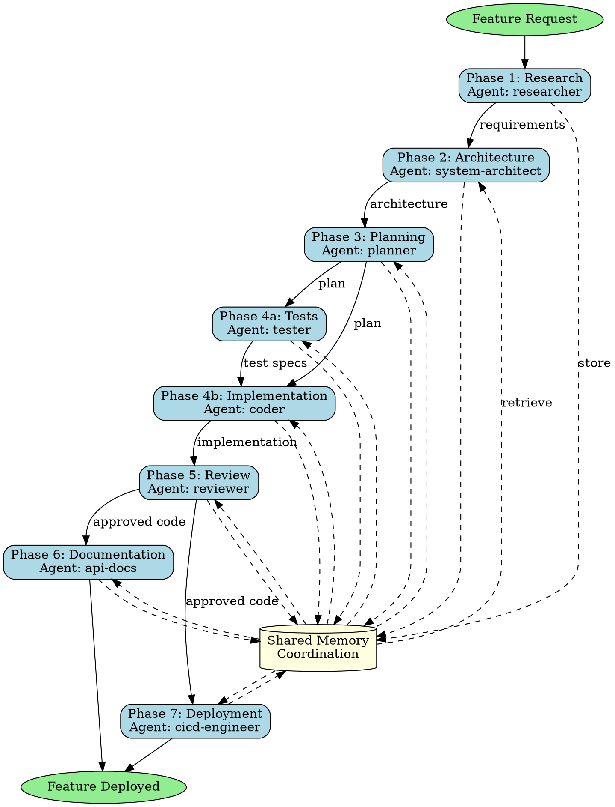

## Assigned Agents

### Primary Agent
- **researcher** - Best match for Phase 1 (requirements analysis). Handles feature requirement gathering, best practice research, constraint identification, and success criteria definition. Coordinates initial research phase and sets foundation for all downstream work.

### Secondary Agents
- **system-architect** - Phase 2: Architecture design and API contract definition
- **planner** - Phase 3: Implementation planning and task breakdown
- **coder** - Phase 4b: Feature implementation following TDD approach
- **tester** - Phase 4a: Test specification and validation (TDD first)
- **reviewer** - Phase 5: Code review, security scanning, and quality assurance
- **api-docs** - Phase 6: API documentation and user guide generation
- **cicd-engineer** - Phase 7: CI/CD pipeline configuration and deployment setup

### Fallback Agents
- **sparc-coord** - Alternative coordinator if hierarchical-coordinator unavailable
- **sparc-coder** - Alternative implementation if coder unavailable
- **production-validator** - Alternative validation if reviewer unavailable

### Coordination Pattern
**Pattern**: Hierarchical Multi-Phase Workflow (7 phases)
**Topology**: Hierarchical coordination with sequential phases and memory-based handoffs
**Memory Namespace**: `swarm/feature-dev/*` (requirements, architecture, planning, implementation, review, docs, deployment)

**Agent Collaboration**:
1. **Sequential Dependencies**: Each phase waits for previous phase completion via memory
2. **Parallel Execution**: Phase 4 has tester + coder working concurrently (TDD)
3. **Quality Gates**: Phase 5 review must approve before Phase 6/7 proceed
4. **Hooks Integration**: All agents use pre-task/post-task/notify hooks for coordination
5. **Session Management**: Complete workflow tracked with session-id for restore/export

**Utilization**: This is a high-coordination skill using 7 specialized agents across the complete development lifecycle. Demonstrates full SPARC methodology integration.

---

## Trigger Conditions

Use this skill when:
- User requests a new feature from conception to production
- Complete feature lifecycle needed (research → deploy)
- Multi-phase development with quality gates required
- Cross-functional coordination between multiple specialists
- Comprehensive documentation and testing needed
- Production-ready deployment required

## Skill Overview

This skill orchestrates a complete feature development lifecycle using a 12-stage workflow with specialized agents coordinating through hierarchical topology and shared memory patterns.

## 7-Phase Skill-Forge Methodology

### Phase 1: Intent Analysis

**Objective**: Understand feature requirements and establish development goals

**Agent**: `researcher`

**Activities**:
- Analyze user feature request and extract requirements
- Research best practices and existing implementations
- Identify technical constraints and dependencies
- Define success criteria and acceptance tests
- Document requirements specification

**Memory Keys**:
- `swarm/feature-dev/requirements/raw-request`
- `swarm/feature-dev/requirements/analyzed-specs`
- `swarm/feature-dev/requirements/constraints`
- `swarm/feature-dev/requirements/success-criteria`

**Script**:
```bash
npx claude-flow@alpha hooks pre-task --description "Feature requirements analysis"
npx claude-flow@alpha memory store "swarm/feature-dev/requirements/raw-request" "$USER_REQUEST"
# Research and analysis work
npx claude-flow@alpha memory store "swarm/feature-dev/requirements/analyzed-specs" "$REQUIREMENTS_DOC"
npx claude-flow@alpha hooks post-task --task-id "phase-1-intent"
```

### Phase 2: Architecture Design

**Objective**: Design system architecture and technical approach

**Agent**: `system-architect`

**Activities**:
- Retrieve requirements from memory
- Design system architecture and components
- Define API contracts and data models
- Create architectural diagrams
- Establish coding patterns and conventions
- Document architectural decisions

**Memory Keys**:
- `swarm/feature-dev/architecture/design-doc`
- `swarm/feature-dev/architecture/api-contracts`
- `swarm/feature-dev/architecture/data-models`
- `swarm/feature-dev/architecture/decisions`

**Script**:
```bash
npx claude-flow@alpha hooks pre-task --description "Architecture design"
REQUIREMENTS=$(npx claude-flow@alpha memory retrieve "swarm/feature-dev/requirements/analyzed-specs")
# Architecture design work
npx claude-flow@alpha memory store "swarm/feature-dev/architecture/design-doc" "$ARCHITECTURE"
npx claude-flow@alpha hooks post-task --task-id "phase-2-architecture"
```

### Phase 3: Implementation Planning

**Objective**: Create detailed implementation plan with task breakdown

**Agent**: `planner`

**Activities**:
- Retrieve architecture design from memory
- Break down feature into implementable tasks
- Define development sequence and dependencies
- Estimate complexity and effort
- Create implementation checklist
- Coordinate with coder for execution plan

**Memory Keys**:
- `swarm/feature-dev/planning/task-breakdown`
- `swarm/feature-dev/planning/dependencies`
- `swarm/feature-dev/planning/sequence`

**Script**:
```bash
npx claude-flow@alpha hooks pre-task --description "Implementation planning"
ARCHITECTURE=$(npx claude-flow@alpha memory retrieve "swarm/feature-dev/architecture/design-doc")
# Planning work
npx claude-flow@alpha memory store "swarm/feature-dev/planning/task-breakdown" "$TASKS"
npx claude-flow@alpha hooks post-task --task-id "phase-3-planning"
```

### Phase 4: Test-Driven Development

**Objective**: Implement feature using TDD approach with concurrent test creation

**Agents**: `coder`, `tester`

**Activities**:
- **Tester**: Write test specifications and test cases first
- **Coder**: Implement feature code to pass tests
- Both agents coordinate via memory for API contracts
- Iterative red-green-refactor cycles
- Achieve 90%+ code coverage
- Integration test creation

**Memory Keys**:
- `swarm/feature-dev/implementation/test-specs`
- `swarm/feature-dev/implementation/source-code`
- `swarm/feature-dev/implementation/test-results`
- `swarm/feature-dev/implementation/coverage-report`

**Scripts**:

Tester:
```bash
npx claude-flow@alpha hooks pre-task --description "Test creation"
API_CONTRACT=$(npx claude-flow@alpha memory retrieve "swarm/feature-dev/architecture/api-contracts")
# Write tests
npx claude-flow@alpha memory store "swarm/feature-dev/implementation/test-specs" "$TESTS"
npx claude-flow@alpha hooks notify --message "Tests ready for implementation"
```

Coder:
```bash
npx claude-flow@alpha hooks pre-task --description "Feature implementation"
TESTS=$(npx claude-flow@alpha memory retrieve "swarm/feature-dev/implementation/test-specs")
ARCHITECTURE=$(npx claude-flow@alpha memory retrieve "swarm/feature-dev/architecture/design-doc")
# Implement feature
npx claude-flow@alpha hooks post-edit --file "$SOURCE_FILE" --memory-key "swarm/feature-dev/implementation/source-code"
npm test
npx claude-flow@alpha memory store "swarm/feature-dev/implementation/test-results" "$TEST_OUTPUT"
```

### Phase 5: Code Review & Quality Assurance

**Objective**: Ensure code quality, security, and adherence to standards

**Agent**: `reviewer`

**Activities**:
- Retrieve implementation from memory
- Perform comprehensive code review
- Security vulnerability scanning
- Performance analysis
- Best practices validation
- Generate review report with findings
- Coordinate fixes with coder if needed

**Memory Keys**:
- `swarm/feature-dev/review-findings/quality-report`
- `swarm/feature-dev/review-findings/security-scan`
- `swarm/feature-dev/review-findings/recommendations`
- `swarm/feature-dev/review-findings/approved`

**Script**:
```bash
npx claude-flow@alpha hooks pre-task --description "Code review"
SOURCE=$(npx claude-flow@alpha memory retrieve "swarm/feature-dev/implementation/source-code")
TESTS=$(npx claude-flow@alpha memory retrieve "swarm/feature-dev/implementation/test-results")
# Perform review
npx claude-flow@alpha memory store "swarm/feature-dev/review-findings/quality-report" "$REVIEW"
npx claude-flow@alpha hooks post-task --task-id "phase-5-review"
```

### Phase 6: Documentation Generation

**Objective**: Create comprehensive feature documentation

**Agent**: `api-docs`

**Activities**:
- Retrieve architecture and implementation from memory
- Generate API documentation
- Create usage guides and examples
- Write integration instructions
- Document configuration options
- Generate changelog entries

**Memory Keys**:
- `swarm/feature-dev/documentation/api-docs`
- `swarm/feature-dev/documentation/user-guide`
- `swarm/feature-dev/documentation/examples`
- `swarm/feature-dev/documentation/changelog`

**Script**:
```bash
npx claude-flow@alpha hooks pre-task --description "Documentation generation"
ARCHITECTURE=$(npx claude-flow@alpha memory retrieve "swarm/feature-dev/architecture/api-contracts")
SOURCE=$(npx claude-flow@alpha memory retrieve "swarm/feature-dev/implementation/source-code")
# Generate docs
npx claude-flow@alpha memory store "swarm/feature-dev/documentation/api-docs" "$API_DOCS"
npx claude-flow@alpha hooks post-task --task-id "phase-6-docs"
```

### Phase 7: Deployment Pipeline Setup

**Objective**: Configure CI/CD and deployment infrastructure

**Agent**: `cicd-engineer`

**Activities**:
- Retrieve implementation and tests from memory
- Configure CI/CD pipelines (GitHub Actions, GitLab CI)
- Set up automated testing workflows
- Configure deployment scripts
- Set up monitoring and logging
- Create deployment documentation

**Memory Keys**:
- `swarm/feature-dev/deployment/pipeline-config`
- `swarm/feature-dev/deployment/scripts`
- `swarm/feature-dev/deployment/monitoring`
- `swarm/feature-dev/deployment/ready`

**Script**:
```bash
npx claude-flow@alpha hooks pre-task --description "Deployment setup"
TESTS=$(npx claude-flow@alpha memory retrieve "swarm/feature-dev/implementation/test-specs")
# Configure CI/CD
npx claude-flow@alpha memory store "swarm/feature-dev/deployment/pipeline-config" "$PIPELINE"
npx claude-flow@alpha hooks post-task --task-id "phase-7-deployment"
npx claude-flow@alpha hooks session-end --export-metrics true
```

## Complete Workflow Orchestration

### Execution Pattern (Single Message)

```javascript
// Initialize swarm coordination
mcp__claude-flow__swarm_init { topology: "hierarchical", maxAgents: 7, strategy: "specialized" }

// Spawn all agents concurrently via Claude Code's Task tool
Task("Research Agent", `
  1. Analyze feature requirements: ${USER_REQUEST}
  2. Research best practices and existing solutions
  3. Define success criteria and constraints
  4. Store findings in memory: swarm/feature-dev/requirements/*
  5. Run hooks for coordination
`, "researcher")

Task("Architecture Agent", `
  1. Wait for requirements from memory
  2. Design system architecture and API contracts
  3. Create data models and component structure
  4. Store architecture in memory: swarm/feature-dev/architecture/*
  5. Run hooks and notify coder/tester
`, "system-architect")

Task("Planning Agent", `
  1. Retrieve architecture from memory
  2. Create detailed implementation plan
  3. Break down into sequential tasks
  4. Store plan in memory: swarm/feature-dev/planning/*
`, "planner")

Task("Test Agent", `
  1. Wait for architecture and plan from memory
  2. Write comprehensive test specifications (TDD)
  3. Create unit, integration, and E2E tests
  4. Store tests in memory: swarm/feature-dev/implementation/test-specs
  5. Notify coder when tests ready
`, "tester")

Task("Coder Agent", `
  1. Wait for tests and architecture from memory
  2. Implement feature to pass all tests
  3. Follow architectural patterns from memory
  4. Store implementation in memory: swarm/feature-dev/implementation/source-code
  5. Run tests and store results
  6. Notify reviewer when ready
`, "coder")

Task("Reviewer Agent", `
  1. Wait for implementation and test results from memory
  2. Perform comprehensive code review
  3. Security and performance analysis
  4. Store findings in memory: swarm/feature-dev/review-findings/*
  5. Coordinate fixes with coder if needed
`, "reviewer")

Task("Documentation Agent", `
  1. Wait for approved implementation from memory
  2. Generate API documentation
  3. Create user guides and examples
  4. Store docs in memory: swarm/feature-dev/documentation/*
`, "api-docs")

Task("DevOps Agent", `
  1. Wait for completed feature from memory
  2. Configure CI/CD pipelines
  3. Set up deployment scripts and monitoring
  4. Store pipeline config in memory: swarm/feature-dev/deployment/*
  5. Final deployment readiness check
`, "cicd-engineer")

// Batch all todos
TodoWrite { todos: [
  {content: "Research requirements and best practices", status: "in_progress", activeForm: "Researching requirements"},
  {content: "Design system architecture", status: "pending", activeForm: "Designing architecture"},
  {content: "Create implementation plan", status: "pending", activeForm: "Creating plan"},
  {content: "Write test specifications (TDD)", status: "pending", activeForm: "Writing tests"},
  {content: "Implement feature code", status: "pending", activeForm: "Implementing feature"},
  {content: "Run test suite and achieve 90%+ coverage", status: "pending", activeForm: "Running tests"},
  {content: "Perform code review and security scan", status: "pending", activeForm: "Reviewing code"},
  {content: "Generate comprehensive documentation", status: "pending", activeForm: "Generating docs"},
  {content: "Configure CI/CD pipeline", status: "pending", activeForm: "Configuring pipeline"},
  {content: "Deploy to production", status: "pending", activeForm: "Deploying feature"}
]}
```

## Success Criteria

- [ ] Requirements fully documented and validated
- [ ] Architecture design reviewed and approved
- [ ] Implementation complete with all tests passing
- [ ] Code coverage ≥ 90%
- [ ] Code review passed with no critical issues
- [ ] Security scan passed
- [ ] API documentation generated
- [ ] User guide and examples created
- [ ] CI/CD pipeline configured and tested
- [ ] Deployment successful with monitoring active

## Memory Coordination Patterns

### Hierarchical Dependencies

```
researcher (requirements)
    ↓
system-architect (architecture)
    ↓
planner (implementation plan)
    ↓
tester (test specs) → coder (implementation)
    ↓
reviewer (quality assurance)
    ↓
api-docs (documentation) + cicd-engineer (deployment)
```

### Memory Keys Structure

```
swarm/feature-dev/
├── requirements/
│   ├── raw-request
│   ├── analyzed-specs
│   ├── constraints
│   └── success-criteria
├── architecture/
│   ├── design-doc
│   ├── api-contracts
│   ├── data-models
│   └── decisions
├── planning/
│   ├── task-breakdown
│   ├── dependencies
│   └── sequence
├── implementation/
│   ├── test-specs
│   ├── source-code
│   ├── test-results
│   └── coverage-report
├── review-findings/
│   ├── quality-report
│   ├── security-scan
│   ├── recommendations
│   └── approved
├── documentation/
│   ├── api-docs
│   ├── user-guide
│   ├── examples
│   └── changelog
└── deployment/
    ├── pipeline-config
    ├── scripts
    ├── monitoring
    └── ready
```

## Process Flow Diagram



## File Organization

All files created during feature development:

```
src/
├── [feature-name]/
│   ├── index.ts          # Main feature entry
│   ├── types.ts          # TypeScript definitions
│   ├── api.ts            # API endpoints
│   └── utils.ts          # Utility functions
tests/
├── [feature-name]/
│   ├── unit.test.ts      # Unit tests
│   ├── integration.test.ts
│   └── e2e.test.ts       # End-to-end tests
docs/
├── [feature-name]/
│   ├── API.md            # API documentation
│   ├── GUIDE.md          # User guide
│   └── EXAMPLES.md       # Usage examples
config/
└── [feature-name]/
    └── ci-cd.yml         # Pipeline configuration
```

## Usage Example

```bash
# User request
"Develop a complete user authentication feature with JWT tokens, email verification,
password reset, and role-based access control"

# Skill automatically orchestrates:
# 1. Research OAuth best practices, JWT standards
# 2. Design authentication architecture with token refresh
# 3. Plan implementation sequence
# 4. Write comprehensive auth tests (TDD)
# 5. Implement auth service, middleware, endpoints
# 6. Review for security vulnerabilities
# 7. Generate API docs and integration guide
# 8. Configure CI/CD with security scanning
```

## Extension Points

- Custom agent addition for specialized needs
- Additional quality gates between phases
- Integration with external services (monitoring, analytics)
- Custom memory patterns for domain-specific coordination
- Deployment to multiple environments (staging, prod)

## Best Practices

1. **Always start with requirements** - Don't skip research phase
2. **Use TDD approach** - Tests before implementation
3. **Memory coordination** - All agents use shared memory for context
4. **Hooks automation** - Pre/post task hooks for tracking
5. **Quality gates** - Don't proceed if review fails
6. **Documentation first** - Generate docs from approved code
7. **Deployment readiness** - CI/CD configured before deployment

## Troubleshooting

**Tests failing during implementation**:
- Review test specifications with tester agent
- Check architecture contracts match implementation
- Verify memory coordination working correctly

**Code review rejections**:
- Coordinate between reviewer and coder for fixes
- Store review findings in memory for reference
- Re-run review after fixes applied

**Deployment issues**:
- Verify all tests passing
- Check CI/CD configuration
- Ensure environment variables set correctly

---

*This skill provides comprehensive feature development with multi-agent coordination, ensuring production-ready features with complete testing and documentation.*

---

## !! SKILL COMPLETION VERIFICATION (MANDATORY) !!

**After invoking this skill, you MUST complete ALL items below before proceeding:**

### Completion Checklist

- [ ] **Agent Spawning**: Did you spawn at least 1 agent via Task()?
  - Example: `Task("Agent Name", "Task description", "agent-type-from-registry")`

- [ ] **Agent Registry Validation**: Is your agent from the registry?
  - Registry location: `claude-code-plugins/ruv-sparc-three-loop-system/agents/`
  - Valid categories: delivery, foundry, operations, orchestration, platforms, quality, research, security, specialists, tooling
  - NOT valid: Made-up agent names

- [ ] **TodoWrite Called**: Did you call TodoWrite with 5+ todos?
  - Example: `TodoWrite({ todos: [8-10 items covering all work] })`

- [ ] **Work Delegation**: Did you delegate to agents (not do work yourself)?
  - CORRECT: Agents do the implementation via Task()
  - WRONG: You write the code directly after reading skill

### Correct Pattern After Skill Invocation

```javascript
// After Skill("<skill-name>") is invoked:
[Single Message - ALL in parallel]:
  Task("Agent 1", "Description of task 1...", "agent-type-1")
  Task("Agent 2", "Description of task 2...", "agent-type-2")
  Task("Agent 3", "Description of task 3...", "agent-type-3")
  TodoWrite({ todos: [
    {content: "Task 1 description", status: "in_progress", activeForm: "Working on task 1"},
    {content: "Task 2 description", status: "pending", activeForm: "Working on task 2"},
    {content: "Task 3 description", status: "pending", activeForm: "Working on task 3"},
  ]})
```

### Wrong Pattern (DO NOT DO THIS)

```javascript
// WRONG - Reading skill and then doing work yourself:
Skill("<skill-name>")
// Then you write all the code yourself without Task() calls
// This defeats the purpose of the skill system!
```

**The skill is NOT complete until all checklist items are checked.**

---

**Remember the pattern: Skill() -> Task() -> TodoWrite() - ALWAYS**