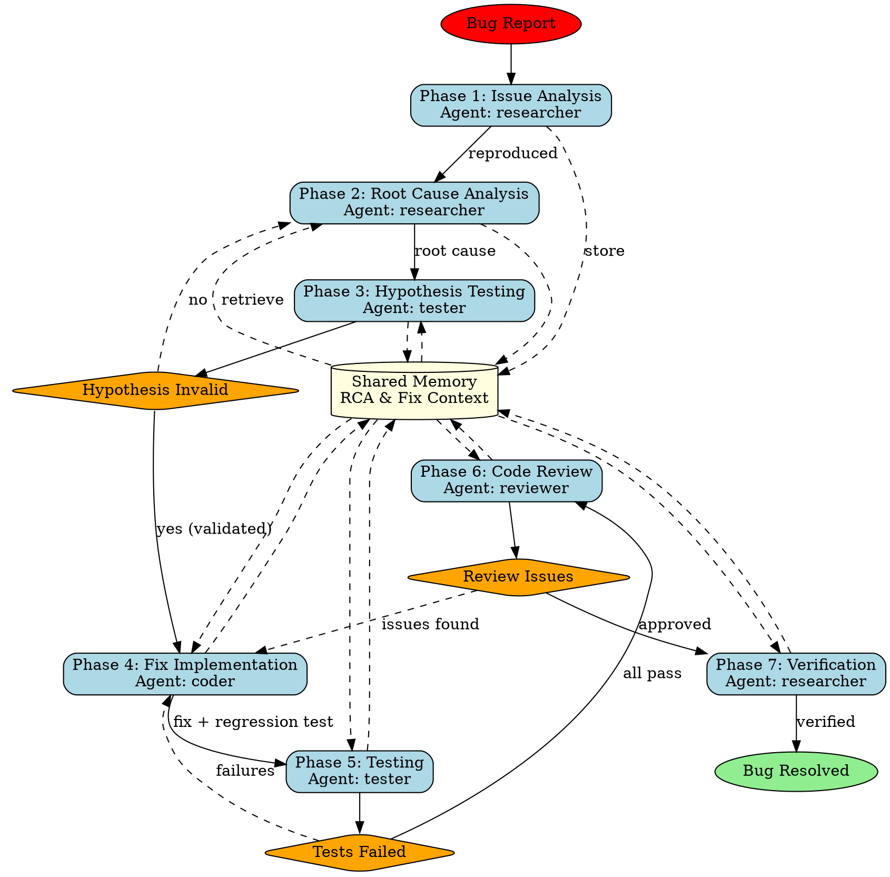

## Assigned Agents

### Primary Agent
- **researcher (RCA specialist)** - Best match for root cause analysis (RCA). Expert in systematic bug investigation using 5 Whys technique, git blame analysis, debugging tools, and hypothesis formation. Leads initial issue analysis, reproduction, deep RCA (Phase 1-2), and final verification (Phase 7).

### Secondary Agents
- **coder (fix implementer)** - Phase 4: Implements bug fix addressing validated root cause with minimal code changes
- **tester (validation specialist)** - Phase 3 & 5: Hypothesis validation and comprehensive test suite execution
- **reviewer (quality assurance)** - Phase 6: Code review, security scan, performance impact analysis
- **performance-analyzer** - Phase 6: Performance monitoring and regression detection

### Fallback Agents
- **code-analyzer** - Alternative for code analysis if researcher needs support
- **production-validator** - Alternative for production verification if reviewer unavailable
- **backend-dev** - Alternative implementation if coder unavailable

### Coordination Pattern
**Pattern**: Hierarchical RCA Workflow (7 phases with validation loops)
**Topology**: Hierarchical coordination with hypothesis-driven development
**Memory Namespace**: `swarm/bug-fix/*` (issue-report, rca-findings, fix-implementation, test-validation, verification)

**Agent Collaboration**:
1. **RCA Investigation**: Researcher performs deep root cause analysis before any fix
2. **Hypothesis Validation**: Tester validates hypothesis before coder implements fix
3. **Feedback Loops**: If hypothesis fails → return to researcher; if tests fail → return to coder
4. **Byzantine Pattern**: Optional 6-validator consensus for critical bugs
5. **Production Verification**: Final researcher verification in production-like environment
6. **Post-Mortem**: Documentation and knowledge base updates

**Utilization**: Critical debugging skill using 5 specialized agents with validation gates. Ensures systematic bug resolution without regressions.

---

## Trigger Conditions

Use this skill when:
- User reports a complex bug requiring investigation
- Production issue needs systematic root cause analysis
- Intermittent bug that's hard to reproduce
- Bug affecting multiple components or services
- Critical issue requiring validated fix
- Bug with unclear root cause
- Need comprehensive testing before deployment

## Skill Overview

This skill provides systematic bug fixing through a 7-phase workflow: issue analysis, root cause analysis (RCA), hypothesis testing, fix implementation, comprehensive validation, regression testing, and verification. Multi-agent coordination ensures thorough investigation and safe resolution.

## 7-Phase Skill-Forge Methodology

### Phase 1: Issue Analysis & Reproduction

**Objective**: Understand and reproduce the reported bug

**Agent**: `researcher` (RCA specialist)

**Activities**:
- Gather bug report details and symptoms
- Collect logs, stack traces, error messages
- Identify affected versions and environments
- Create reproduction steps and test case
- Document expected vs actual behavior
- Store issue analysis in memory

**Memory Keys**:
- `swarm/bug-fix/issue-report/description`
- `swarm/bug-fix/issue-report/symptoms`
- `swarm/bug-fix/issue-report/reproduction-steps`
- `swarm/bug-fix/issue-report/environment`
- `swarm/bug-fix/issue-report/severity`

**Script**:
```bash
npx claude-flow@alpha hooks pre-task --description "Bug analysis and reproduction"
npx claude-flow@alpha hooks session-restore --session-id "bug-fix-${BUG_ID}"
# Analyze bug report
npx claude-flow@alpha memory store "swarm/bug-fix/issue-report/description" "$BUG_DESCRIPTION"
npx claude-flow@alpha memory store "swarm/bug-fix/issue-report/reproduction-steps" "$REPRO_STEPS"
# Attempt reproduction
npm test -- --testNamePattern="$BUG_TEST_CASE"
npx claude-flow@alpha hooks notify --message "Bug reproduced: $REPRO_STATUS"
```

### Phase 2: Root Cause Analysis (RCA)

**Objective**: Identify the underlying cause of the bug through systematic investigation

**Agent**: `researcher` (RCA specialist)

**Activities**:
- Analyze code paths and execution flow
- Review recent changes and commits (git blame)
- Examine logs and debugging information
- Use debugging tools and profilers
- Apply 5 Whys technique for deep analysis
- Create hypothesis about root cause
- Document RCA findings with evidence

**Memory Keys**:
- `swarm/bug-fix/rca-findings/root-cause`
- `swarm/bug-fix/rca-findings/affected-components`
- `swarm/bug-fix/rca-findings/hypothesis`
- `swarm/bug-fix/rca-findings/evidence`
- `swarm/bug-fix/rca-findings/related-issues`

**Script**:
```bash
npx claude-flow@alpha hooks pre-task --description "Root cause analysis"
REPRO_STEPS=$(npx claude-flow@alpha memory retrieve "swarm/bug-fix/issue-report/reproduction-steps")
# Analyze code
git log --oneline --since="30 days ago" -- "$AFFECTED_FILE"
git blame "$AFFECTED_FILE" | grep -A 5 -B 5 "$ERROR_LINE"
# Debugging
node --inspect-brk "$AFFECTED_FILE"
# RCA documentation
npx claude-flow@alpha memory store "swarm/bug-fix/rca-findings/root-cause" "$ROOT_CAUSE"
npx claude-flow@alpha memory store "swarm/bug-fix/rca-findings/hypothesis" "$HYPOTHESIS"
npx claude-flow@alpha hooks notify --message "RCA complete: $ROOT_CAUSE"
```

### Phase 3: Hypothesis Testing & Validation

**Objective**: Test hypothesis and validate understanding before implementing fix

**Agent**: `tester`

**Activities**:
- Create test cases to validate hypothesis
- Design experiments to confirm root cause
- Test edge cases and boundary conditions
- Verify hypothesis matches observed behavior
- Document test results
- Coordinate with researcher if hypothesis incorrect

**Memory Keys**:
- `swarm/bug-fix/rca-findings/hypothesis-tests`
- `swarm/bug-fix/rca-findings/test-results`
- `swarm/bug-fix/rca-findings/validated`

**Script**:
```bash
npx claude-flow@alpha hooks pre-task --description "Hypothesis validation"
HYPOTHESIS=$(npx claude-flow@alpha memory retrieve "swarm/bug-fix/rca-findings/hypothesis")
ROOT_CAUSE=$(npx claude-flow@alpha memory retrieve "swarm/bug-fix/rca-findings/root-cause")
# Create hypothesis tests
cat > tests/bug-fix/hypothesis-test.js << 'EOF'
describe('Hypothesis validation', () => {
  test('validates root cause: ${ROOT_CAUSE}', () => {
    // Test hypothesis
  });
});
EOF
npm test -- tests/bug-fix/hypothesis-test.js
npx claude-flow@alpha memory store "swarm/bug-fix/rca-findings/validated" "$VALIDATION_RESULT"
npx claude-flow@alpha hooks notify --message "Hypothesis validated: $VALIDATION_RESULT"
```

### Phase 4: Fix Implementation

**Objective**: Implement bug fix based on validated root cause

**Agent**: `coder` (fix implementer)

**Activities**:
- Retrieve validated root cause from memory
- Design fix that addresses root cause
- Implement fix with minimal code changes
- Add defensive programming and error handling
- Include logging for future debugging
- Write regression test for this specific bug
- Store fix implementation in memory

**Memory Keys**:
- `swarm/bug-fix/fix-implementation/approach`
- `swarm/bug-fix/fix-implementation/code-changes`
- `swarm/bug-fix/fix-implementation/files-modified`
- `swarm/bug-fix/fix-implementation/regression-test`

**Script**:
```bash
npx claude-flow@alpha hooks pre-task --description "Bug fix implementation"
ROOT_CAUSE=$(npx claude-flow@alpha memory retrieve "swarm/bug-fix/rca-findings/root-cause")
VALIDATED=$(npx claude-flow@alpha memory retrieve "swarm/bug-fix/rca-findings/validated")
# Implement fix
npx claude-flow@alpha hooks post-edit --file "$FIXED_FILE" --memory-key "swarm/bug-fix/fix-implementation/code-changes"
# Create regression test
cat > tests/bug-fix/regression-${BUG_ID}.test.js << 'EOF'
describe('Bug ${BUG_ID} regression test', () => {
  test('ensures bug does not reoccur', () => {
    // Regression test
  });
});
EOF
npm test -- tests/bug-fix/regression-${BUG_ID}.test.js
npx claude-flow@alpha memory store "swarm/bug-fix/fix-implementation/approach" "$FIX_APPROACH"
npx claude-flow@alpha hooks notify --message "Fix implemented: $FIX_APPROACH"
```

### Phase 5: Comprehensive Testing & Validation

**Objective**: Verify fix resolves issue without introducing regressions

**Agent**: `tester` (validation specialist)

**Activities**:
- Run full test suite (unit, integration, E2E)
- Execute new regression test
- Test edge cases and boundary conditions
- Verify original bug reproduction no longer occurs
- Test in multiple environments if applicable
- Measure code coverage
- Store test results in memory

**Memory Keys**:
- `swarm/bug-fix/test-validation/test-suite-results`
- `swarm/bug-fix/test-validation/regression-test-passed`
- `swarm/bug-fix/test-validation/coverage`
- `swarm/bug-fix/test-validation/environments-tested`

**Script**:
```bash
npx claude-flow@alpha hooks pre-task --description "Comprehensive test validation"
FIX_FILES=$(npx claude-flow@alpha memory retrieve "swarm/bug-fix/fix-implementation/files-modified")
# Run all tests
npm test -- --coverage --maxWorkers=4
# Run regression test specifically
npm test -- tests/bug-fix/regression-${BUG_ID}.test.js
# Test in multiple environments
NODE_ENV=development npm test
NODE_ENV=production npm test
# Store results
npx claude-flow@alpha memory store "swarm/bug-fix/test-validation/test-suite-results" "$TEST_RESULTS"
npx claude-flow@alpha memory store "swarm/bug-fix/test-validation/regression-test-passed" "true"
npx claude-flow@alpha hooks notify --message "All tests passed: $TEST_RESULTS"
```

### Phase 6: Code Review & Quality Assurance

**Objective**: Ensure fix quality and no side effects introduced

**Agent**: `reviewer` (quality assurance)

**Activities**:
- Review fix implementation for quality
- Verify fix addresses root cause correctly
- Check for potential side effects
- Validate error handling and edge cases
- Security review of changes
- Performance impact analysis
- Ensure code follows project standards
- Store review findings in memory

**Memory Keys**:
- `swarm/bug-fix/verification/review-findings`
- `swarm/bug-fix/verification/quality-score`
- `swarm/bug-fix/verification/security-check`
- `swarm/bug-fix/verification/approved`

**Script**:
```bash
npx claude-flow@alpha hooks pre-task --description "Code review and QA"
FIX_CHANGES=$(npx claude-flow@alpha memory retrieve "swarm/bug-fix/fix-implementation/code-changes")
TEST_RESULTS=$(npx claude-flow@alpha memory retrieve "swarm/bug-fix/test-validation/test-suite-results")
# Code review
npx eslint --format json "$FIXED_FILE" > review-report.json
# Security scan
npm audit --json > security-scan.json
# Performance impact
npx clinic doctor -- node "$FIXED_FILE"
npx claude-flow@alpha memory store "swarm/bug-fix/verification/quality-score" "$QUALITY_SCORE"
npx claude-flow@alpha memory store "swarm/bug-fix/verification/approved" "true"
npx claude-flow@alpha hooks notify --message "Review complete: approved with quality score $QUALITY_SCORE"
```

### Phase 7: Verification & Documentation

**Objective**: Final verification and comprehensive documentation

**Agent**: `researcher` (RCA specialist)

**Activities**:
- Verify bug resolved in production-like environment
- Test with original reproduction steps
- Document fix details and root cause
- Update issue tracker with resolution
- Create knowledge base entry
- Generate post-mortem if critical bug
- Export session metrics and timeline

**Memory Keys**:
- `swarm/bug-fix/verification/production-verified`
- `swarm/bug-fix/verification/documentation`
- `swarm/bug-fix/verification/post-mortem`
- `swarm/bug-fix/verification/completed`

**Script**:
```bash
npx claude-flow@alpha hooks pre-task --description "Final verification and documentation"
REPRO_STEPS=$(npx claude-flow@alpha memory retrieve "swarm/bug-fix/issue-report/reproduction-steps")
ROOT_CAUSE=$(npx claude-flow@alpha memory retrieve "swarm/bug-fix/rca-findings/root-cause")
FIX_APPROACH=$(npx claude-flow@alpha memory retrieve "swarm/bug-fix/fix-implementation/approach")
# Production-like verification
NODE_ENV=production npm start &
sleep 5
# Run original reproduction steps
curl -X POST "$API_ENDPOINT" -d "$TEST_DATA"
# Documentation
cat > docs/bug-fixes/bug-${BUG_ID}.md << 'EOF'
# Bug Fix: ${BUG_ID}

## Root Cause
${ROOT_CAUSE}

## Fix Approach
${FIX_APPROACH}

## Verification
${VERIFICATION_RESULTS}
EOF
npx claude-flow@alpha memory store "swarm/bug-fix/verification/production-verified" "true"
npx claude-flow@alpha hooks session-end --export-metrics true
npx claude-flow@alpha hooks notify --message "Bug fix complete and verified"
```

## Complete Workflow Orchestration

### Execution Pattern (Single Message)

```javascript
// Initialize hierarchical swarm
mcp__claude-flow__swarm_init { topology: "hierarchical", maxAgents: 5, strategy: "specialized" }

// Spawn all agents concurrently
Task("RCA Researcher", `
  1. Analyze bug report: ${BUG_DESCRIPTION}
  2. Reproduce bug with provided steps
  3. Perform deep root cause analysis (5 Whys)
  4. Use git blame, logs, debugging tools
  5. Store RCA findings: swarm/bug-fix/rca-findings/*
  6. Coordinate with tester for hypothesis validation
  7. Final verification and documentation
`, "researcher")

Task("Fix Implementer", `
  1. Wait for validated root cause from memory
  2. Design minimal fix addressing root cause
  3. Implement fix with error handling
  4. Create regression test for this bug
  5. Store implementation: swarm/bug-fix/fix-implementation/*
  6. Run hooks after changes
`, "coder")

Task("Validation Tester", `
  1. Create hypothesis validation tests
  2. Test researcher's hypothesis before fix
  3. After fix: run comprehensive test suite
  4. Execute regression test for this bug
  5. Test in multiple environments
  6. Store results: swarm/bug-fix/test-validation/*
  7. Alert team of any test failures
`, "tester")

Task("Quality Reviewer", `
  1. Wait for fix implementation and test results
  2. Review fix for quality and correctness
  3. Check for side effects and regressions
  4. Security scan and performance analysis
  5. Store review: swarm/bug-fix/verification/*
  6. Approve or request changes
`, "reviewer")

Task("Performance Analyzer", `
  1. Monitor performance impact of fix
  2. Compare before/after metrics
  3. Identify any performance regressions
  4. Store analysis in memory
  5. Alert if performance degraded
`, "performance-analyzer")

// Batch todos
TodoWrite { todos: [
  {content: "Analyze and reproduce reported bug", status: "in_progress", activeForm: "Analyzing bug"},
  {content: "Perform root cause analysis (RCA)", status: "pending", activeForm: "Performing RCA"},
  {content: "Validate hypothesis with tests", status: "pending", activeForm: "Validating hypothesis"},
  {content: "Implement bug fix", status: "pending", activeForm: "Implementing fix"},
  {content: "Create regression test", status: "pending", activeForm: "Creating regression test"},
  {content: "Run comprehensive test suite", status: "pending", activeForm: "Running tests"},
  {content: "Code review and quality assurance", status: "pending", activeForm: "Reviewing fix"},
  {content: "Verify fix in production-like environment", status: "pending", activeForm: "Verifying fix"},
  {content: "Document root cause and fix", status: "pending", activeForm: "Documenting fix"}
]}
```

## Success Criteria

- [ ] Bug successfully reproduced with clear steps
- [ ] Root cause identified with supporting evidence
- [ ] Hypothesis validated before fix implementation
- [ ] Fix implemented addressing root cause
- [ ] Regression test created for this specific bug
- [ ] All tests passing (unit, integration, E2E)
- [ ] Code review approved with quality score ≥80
- [ ] No security vulnerabilities introduced
- [ ] Performance impact acceptable (≤5% regression)
- [ ] Bug verified resolved in production-like environment
- [ ] Comprehensive documentation completed

## Memory Coordination Patterns

### Sequential Investigation Flow

```
researcher (RCA) → tester (hypothesis validation)
    ↓                           ↓
    ↓→ shared memory ←↓
    ↓                           ↓
coder (fix) → tester (validation)
    ↓                           ↓
reviewer (QA) → researcher (verification)
```

### Memory Keys Structure

```
swarm/bug-fix/
├── issue-report/
│   ├── description
│   ├── symptoms
│   ├── reproduction-steps
│   ├── environment
│   └── severity
├── rca-findings/
│   ├── root-cause
│   ├── affected-components
│   ├── hypothesis
│   ├── evidence
│   ├── related-issues
│   ├── hypothesis-tests
│   ├── test-results
│   └── validated
├── fix-implementation/
│   ├── approach
│   ├── code-changes
│   ├── files-modified
│   └── regression-test
├── test-validation/
│   ├── test-suite-results
│   ├── regression-test-passed
│   ├── coverage
│   └── environments-tested
└── verification/
    ├── review-findings
    ├── quality-score
    ├── security-check
    ├── approved
    ├── production-verified
    ├── documentation
    ├── post-mortem
    └── completed
```

## Process Flow Diagram



## RCA Techniques

### 5 Whys Analysis

```
Bug: API returns 500 error intermittently

Why 1: Why does API return 500?
→ Database connection timeout

Why 2: Why does database connection timeout?
→ Connection pool exhausted

Why 3: Why is connection pool exhausted?
→ Connections not being released

Why 4: Why are connections not released?
→ Error handling doesn't call connection.release()

Why 5: Why doesn't error handling release connection?
→ Missing finally block in database query wrapper

ROOT CAUSE: Database query wrapper missing finally block
```

### Debugging Tools

- **Node.js**: `node --inspect-brk`, Chrome DevTools
- **Logging**: `winston`, `pino`, `debug` module
- **Profiling**: `clinic.js`, `node --prof`
- **Memory**: `heapdump`, `node --heap-prof`
- **Tracing**: `opentelemetry`, distributed tracing

## File Organization

```
tests/bug-fix/
├── hypothesis-test.js        # Hypothesis validation
├── regression-${BUG_ID}.test.js  # Bug-specific regression test
└── reproduction.test.js      # Original reproduction steps

docs/bug-fixes/
├── bug-${BUG_ID}.md         # Fix documentation
└── post-mortem-${BUG_ID}.md # Post-mortem (if critical)

src/
└── [fixed-files]             # Modified source files
```

## Usage Examples

### Example 1: Intermittent API 500 Error

```bash
# User report
"Our API randomly returns 500 errors under high load"

# Workflow:
# 1. Reproduce with load testing
# 2. RCA identifies database connection pool exhaustion
# 3. Hypothesis: missing connection.release() in error path
# 4. Validate hypothesis with tests
# 5. Fix: add finally block to release connections
# 6. Create regression test with load simulation
# 7. Verify under load conditions
```

### Example 2: Memory Leak in Production

```bash
# User report
"Application memory usage grows until restart required"

# Workflow:
# 1. Capture heap dumps from production
# 2. RCA using heap analysis tools
# 3. Identify event listeners not being removed
# 4. Hypothesis: missing cleanup in component unmount
# 5. Implement fix with proper cleanup
# 6. Monitor memory usage over time
# 7. Document memory management best practices
```

### Example 3: Data Corruption Bug

```bash
# User report
"User data occasionally gets overwritten with wrong values"

# Workflow:
# 1. Analyze logs to find corruption pattern
# 2. RCA reveals race condition in concurrent updates
# 3. Hypothesis: missing transaction isolation
# 4. Implement optimistic locking fix
# 5. Create concurrency tests
# 6. Verify no corruption under load
```

## Best Practices

1. **Always reproduce first** - Don't fix without reproduction
2. **Deep RCA** - Find root cause, not just symptoms
3. **Validate hypothesis** - Test understanding before fixing
4. **Minimal changes** - Fix only what's needed
5. **Regression tests** - Prevent bug recurrence
6. **Comprehensive testing** - Test all affected paths
7. **Document thoroughly** - Help future debugging
8. **Production verification** - Test in realistic environment

## Troubleshooting

**Cannot reproduce bug**:
- Gather more information from reporter
- Check environment differences
- Try load/stress testing
- Examine production logs and metrics

**Fix causes test failures**:
- Review failed tests with tester
- Check if fix addresses actual root cause
- Verify no unintended side effects
- May need to revise hypothesis

**Performance regression after fix**:
- Performance analyzer provides metrics
- Consider alternative fix approach
- Optimize hot paths
- Add caching if appropriate

---

*This skill provides systematic bug fixing with root cause analysis, ensuring bugs are truly resolved without introducing regressions.*

---

## !! SKILL COMPLETION VERIFICATION (MANDATORY) !!

**After invoking this skill, you MUST complete ALL items below before proceeding:**

### Completion Checklist

- [ ] **Agent Spawning**: Did you spawn at least 1 agent via Task()?
  - Example: `Task("Agent Name", "Task description", "agent-type-from-registry")`

- [ ] **Agent Registry Validation**: Is your agent from the registry?
  - Registry location: `claude-code-plugins/ruv-sparc-three-loop-system/agents/`
  - Valid categories: delivery, foundry, operations, orchestration, platforms, quality, research, security, specialists, tooling
  - NOT valid: Made-up agent names

- [ ] **TodoWrite Called**: Did you call TodoWrite with 5+ todos?
  - Example: `TodoWrite({ todos: [8-10 items covering all work] })`

- [ ] **Work Delegation**: Did you delegate to agents (not do work yourself)?
  - CORRECT: Agents do the implementation via Task()
  - WRONG: You write the code directly after reading skill

### Correct Pattern After Skill Invocation

```javascript
// After Skill("<skill-name>") is invoked:
[Single Message - ALL in parallel]:
  Task("Agent 1", "Description of task 1...", "agent-type-1")
  Task("Agent 2", "Description of task 2...", "agent-type-2")
  Task("Agent 3", "Description of task 3...", "agent-type-3")
  TodoWrite({ todos: [
    {content: "Task 1 description", status: "in_progress", activeForm: "Working on task 1"},
    {content: "Task 2 description", status: "pending", activeForm: "Working on task 2"},
    {content: "Task 3 description", status: "pending", activeForm: "Working on task 3"},
  ]})
```

### Wrong Pattern (DO NOT DO THIS)

```javascript
// WRONG - Reading skill and then doing work yourself:
Skill("<skill-name>")
// Then you write all the code yourself without Task() calls
// This defeats the purpose of the skill system!
```

**The skill is NOT complete until all checklist items are checked.**

---

**Remember the pattern: Skill() -> Task() -> TodoWrite() - ALWAYS**