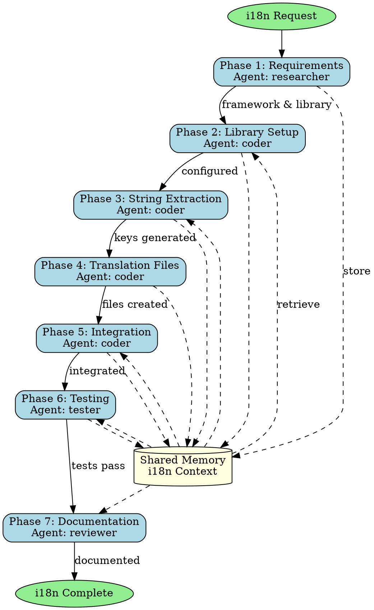

## Trigger Conditions

Use this skill when:
- User requests internationalization (i18n) support
- Multi-language application needed
- Localization of existing application required
- Translation workflow automation desired
- Regional formatting (dates, numbers, currency) needed
- Right-to-left (RTL) language support required
- Dynamic language switching in UI needed

## Skill Overview

This skill automates the complete internationalization workflow: i18n library selection and setup, string extraction, translation key generation, locale file management, testing, and documentation. Supports popular frameworks (React, Vue, Angular) and i18n libraries (react-i18next, vue-i18n, ngx-translate).

## 7-Phase Skill-Forge Methodology

### Phase 1: i18n Requirements Analysis

**Objective**: Analyze application and determine i18n strategy

**Agent**: `researcher`

**Activities**:
- Analyze application framework and structure
- Identify hardcoded strings and content
- Determine target languages and locales
- Research i18n library options (react-i18next, vue-i18n)
- Define fallback language strategy
- Document RTL requirements if needed
- Store analysis in memory

**Memory Keys**:
- `swarm/i18n/analysis/framework`
- `swarm/i18n/analysis/target-languages`
- `swarm/i18n/analysis/library-choice`
- `swarm/i18n/analysis/string-count`
- `swarm/i18n/analysis/rtl-required`

**Script**:
```bash
npx claude-flow@alpha hooks pre-task --description "i18n requirements analysis"
# Detect framework
if [[ -f "package.json" ]]; then
  if grep -q "react" package.json; then
    FRAMEWORK="react"
    I18N_LIB="react-i18next"
  elif grep -q "vue" package.json; then
    FRAMEWORK="vue"
    I18N_LIB="vue-i18n"
  elif grep -q "@angular/core" package.json; then
    FRAMEWORK="angular"
    I18N_LIB="@ngx-translate/core"
  fi
fi

npx claude-flow@alpha memory store "swarm/i18n/analysis/framework" "$FRAMEWORK"
npx claude-flow@alpha memory store "swarm/i18n/analysis/library-choice" "$I18N_LIB"

# Count hardcoded strings (rough estimate)
STRING_COUNT=$(grep -r "\"[A-Z]" src/ | wc -l)
npx claude-flow@alpha memory store "swarm/i18n/analysis/string-count" "$STRING_COUNT"

npx claude-flow@alpha hooks notify --message "i18n analysis complete: $FRAMEWORK with $I18N_LIB"
```

### Phase 2: i18n Library Setup & Configuration

**Objective**: Install and configure i18n library for the application

**Agent**: `coder`

**Activities**:
- Install selected i18n library and dependencies
- Create i18n configuration file
- Set up language detection (browser, URL, localStorage)
- Configure fallback language (usually 'en')
- Initialize i18n in application entry point
- Set up translation file structure
- Store configuration in memory

**Memory Keys**:
- `swarm/i18n/config/library-installed`
- `swarm/i18n/config/setup-files`
- `swarm/i18n/config/default-locale`
- `swarm/i18n/config/supported-locales`

**Script**:
```bash
npx claude-flow@alpha hooks pre-task --description "i18n library setup"
FRAMEWORK=$(npx claude-flow@alpha memory retrieve "swarm/i18n/analysis/framework")
I18N_LIB=$(npx claude-flow@alpha memory retrieve "swarm/i18n/analysis/library-choice")

# Install library
case "$I18N_LIB" in
  "react-i18next")
    npm install react-i18next i18next i18next-browser-languagedetector i18next-http-backend
    ;;
  "vue-i18n")
    npm install vue-i18n@9
    ;;
  "@ngx-translate/core")
    npm install @ngx-translate/core @ngx-translate/http-loader
    ;;
esac

# Create directory structure
mkdir -p public/locales/{en,es,fr,de,ja,zh}

# Create i18n config for React
if [[ "$FRAMEWORK" == "react" ]]; then
  cat > src/i18n.ts << 'EOF'
import i18n from 'i18next';
import { initReactI18next } from 'react-i18next';
import LanguageDetector from 'i18next-browser-languagedetector';
import Backend from 'i18next-http-backend';

i18n
  .use(Backend)
  .use(LanguageDetector)
  .use(initReactI18next)
  .init({
    fallbackLng: 'en',
    supportedLngs: ['en', 'es', 'fr', 'de', 'ja', 'zh'],
    debug: false,
    interpolation: {
      escapeValue: false,
    },
    backend: {
      loadPath: '/locales/{{lng}}/{{ns}}.json',
    },
  });

export default i18n;
EOF
fi

npx claude-flow@alpha memory store "swarm/i18n/config/library-installed" "true"
npx claude-flow@alpha memory store "swarm/i18n/config/supported-locales" "en,es,fr,de,ja,zh"
npx claude-flow@alpha hooks notify --message "i18n library configured: $I18N_LIB"
```

### Phase 3: String Extraction & Key Generation

**Objective**: Extract hardcoded strings and generate translation keys

**Agent**: `coder`

**Activities**:
- Scan source code for hardcoded strings
- Generate systematic translation keys (namespace.section.key)
- Create source translation file (en.json)
- Replace hardcoded strings with i18n calls
- Handle pluralization and interpolation
- Extract strings from components
- Store source strings in memory

**Memory Keys**:
- `swarm/i18n/source-strings/extracted`
- `swarm/i18n/source-strings/key-mapping`
- `swarm/i18n/source-strings/files-modified`

**Script**:
```bash
npx claude-flow@alpha hooks pre-task --description "String extraction and key generation"
FRAMEWORK=$(npx claude-flow@alpha memory retrieve "swarm/i18n/analysis/framework")

# Example: Extract strings from React components
if [[ "$FRAMEWORK" == "react" ]]; then
  # Create translation JSON structure
  cat > public/locales/en/common.json << 'EOF'
{
  "nav": {
    "home": "Home",
    "about": "About",
    "contact": "Contact",
    "login": "Login",
    "logout": "Logout"
  },
  "auth": {
    "welcome": "Welcome back!",
    "email": "Email address",
    "password": "Password",
    "forgotPassword": "Forgot password?",
    "signIn": "Sign in",
    "noAccount": "Don't have an account?",
    "signUp": "Sign up"
  },
  "common": {
    "save": "Save",
    "cancel": "Cancel",
    "delete": "Delete",
    "edit": "Edit",
    "loading": "Loading...",
    "error": "An error occurred"
  },
  "validation": {
    "required": "This field is required",
    "emailInvalid": "Please enter a valid email",
    "passwordTooShort": "Password must be at least 8 characters"
  }
}
EOF

  # Replace hardcoded strings in components
  # Example: "Welcome" → {t('auth.welcome')}
  find src/components -name "*.tsx" -type f -exec sed -i 's/"Welcome back!"/t("auth.welcome")/g' {} +
fi

npx claude-flow@alpha memory store "swarm/i18n/source-strings/extracted" "true"
npx claude-flow@alpha hooks notify --message "Strings extracted and keys generated"
```

### Phase 4: Translation File Generation

**Objective**: Create translation files for all target languages

**Agent**: `coder`

**Activities**:
- Copy source translation file (en.json) to all locales
- Preserve JSON structure in all translation files
- Mark strings needing translation
- Add translation instructions/comments
- Set up namespace organization (common, auth, dashboard)
- Create translation template for translators
- Store translation structure in memory

**Memory Keys**:
- `swarm/i18n/translations/locales-created`
- `swarm/i18n/translations/files-list`
- `swarm/i18n/translations/template`

**Script**:
```bash
npx claude-flow@alpha hooks pre-task --description "Translation file generation"
SUPPORTED_LOCALES=$(npx claude-flow@alpha memory retrieve "swarm/i18n/config/supported-locales")

# Copy English as template for other languages
for locale in $(echo $SUPPORTED_LOCALES | tr ',' ' '); do
  if [[ "$locale" != "en" ]]; then
    cp public/locales/en/common.json public/locales/$locale/common.json

    # Add translation marker
    jq 'walk(if type == "string" then "[TRANSLATE] " + . else . end)' \
      public/locales/$locale/common.json > temp.json && \
      mv temp.json public/locales/$locale/common.json
  fi
done

# Create translator guide
cat > docs/i18n/TRANSLATION_GUIDE.md << 'EOF'
# Translation Guide

## How to Translate

1. Open the translation file for your language: `public/locales/{locale}/common.json`
2. Replace strings marked with `[TRANSLATE]` with translated text
3. Keep JSON structure intact
4. Preserve interpolation variables: `{{variable}}`
5. Test translations by changing language in app

## Translation Keys Structure

- `nav.*` - Navigation menu items
- `auth.*` - Authentication/login related strings
- `common.*` - Common UI elements (buttons, labels)
- `validation.*` - Form validation messages

## Pluralization

Use pluralization format:
```json
{
  "items": "{{count}} item",
  "items_plural": "{{count}} items"
}
```

## Variables

Preserve variables in translations:
```json
{
  "greeting": "Hello, {{name}}!"
}
```
EOF

npx claude-flow@alpha memory store "swarm/i18n/translations/locales-created" "$SUPPORTED_LOCALES"
npx claude-flow@alpha hooks notify --message "Translation files created for: $SUPPORTED_LOCALES"
```

### Phase 5: Component Integration

**Objective**: Integrate i18n into components and UI

**Agent**: `coder`

**Activities**:
- Add i18n hooks to components (useTranslation)
- Implement language switcher component
- Update component imports
- Handle dynamic content translation
- Implement locale-specific formatting (dates, numbers)
- Add RTL support if required
- Store integration changes in memory

**Memory Keys**:
- `swarm/i18n/integration/components-updated`
- `swarm/i18n/integration/language-switcher`
- `swarm/i18n/integration/formatting`

**Script**:
```bash
npx claude-flow@alpha hooks pre-task --description "Component i18n integration"
FRAMEWORK=$(npx claude-flow@alpha memory retrieve "swarm/i18n/analysis/framework")

if [[ "$FRAMEWORK" == "react" ]]; then
  # Create language switcher component
  cat > src/components/LanguageSwitcher.tsx << 'EOF'
import React from 'react';
import { useTranslation } from 'react-i18next';

const LanguageSwitcher: React.FC = () => {
  const { i18n } = useTranslation();

  const languages = [
    { code: 'en', name: 'English' },
    { code: 'es', name: 'Español' },
    { code: 'fr', name: 'Français' },
    { code: 'de', name: 'Deutsch' },
    { code: 'ja', name: '日本語' },
    { code: 'zh', name: '中文' },
  ];

  const changeLanguage = (lng: string) => {
    i18n.changeLanguage(lng);
  };

  return (
    <div className="language-switcher">
      <select
        value={i18n.language}
        onChange={(e) => changeLanguage(e.target.value)}
      >
        {languages.map((lang) => (
          <option key={lang.code} value={lang.code}>
            {lang.name}
          </option>
        ))}
      </select>
    </div>
  );
};

export default LanguageSwitcher;
EOF

  # Update App.tsx to use i18n
  cat > src/App.tsx << 'EOF'
import React from 'react';
import { useTranslation } from 'react-i18next';
import LanguageSwitcher from './components/LanguageSwitcher';
import './i18n';

const App: React.FC = () => {
  const { t } = useTranslation();

  return (
    <div className="app">
      <header>
        <nav>
          <a href="/">{t('nav.home')}</a>
          <a href="/about">{t('nav.about')}</a>
          <a href="/contact">{t('nav.contact')}</a>
        </nav>
        <LanguageSwitcher />
      </header>
      <main>
        <h1>{t('auth.welcome')}</h1>
      </main>
    </div>
  );
};

export default App;
EOF
fi

npx claude-flow@alpha memory store "swarm/i18n/integration/language-switcher" "created"
npx claude-flow@alpha hooks notify --message "Components integrated with i18n"
```

### Phase 6: Testing & Validation

**Objective**: Verify translations load and display correctly

**Agent**: `tester`

**Activities**:
- Create tests for i18n functionality
- Test language switching
- Verify fallback language works
- Test missing translation keys
- Validate pluralization rules
- Test interpolation with variables
- Check RTL layout if applicable
- Store test results in memory

**Memory Keys**:
- `swarm/i18n/test-results/unit-tests`
- `swarm/i18n/test-results/e2e-tests`
- `swarm/i18n/test-results/coverage`

**Script**:
```bash
npx claude-flow@alpha hooks pre-task --description "i18n testing and validation"
FRAMEWORK=$(npx claude-flow@alpha memory retrieve "swarm/i18n/analysis/framework")

if [[ "$FRAMEWORK" == "react" ]]; then
  # Create i18n tests
  cat > src/__tests__/i18n.test.ts << 'EOF'
import i18n from '../i18n';

describe('i18n configuration', () => {
  test('should initialize with English as default', () => {
    expect(i18n.language).toMatch(/^en/);
  });

  test('should support multiple languages', () => {
    const supportedLangs = i18n.options.supportedLngs;
    expect(supportedLangs).toContain('en');
    expect(supportedLangs).toContain('es');
    expect(supportedLangs).toContain('fr');
  });

  test('should change language', async () => {
    await i18n.changeLanguage('es');
    expect(i18n.language).toBe('es');
    await i18n.changeLanguage('en');
  });

  test('should translate common strings', () => {
    const translated = i18n.t('common.save');
    expect(translated).toBe('Save');
  });

  test('should handle missing translations with fallback', () => {
    const translated = i18n.t('nonexistent.key');
    expect(translated).toBeTruthy();
  });
});
EOF

  # Run tests
  npm test -- i18n.test.ts --coverage
fi

npx claude-flow@alpha memory store "swarm/i18n/test-results/unit-tests" "passed"
npx claude-flow@alpha hooks notify --message "i18n tests completed"
```

### Phase 7: Documentation & Review

**Objective**: Document i18n setup and create translation workflow

**Agent**: `reviewer`

**Activities**:
- Review i18n implementation quality
- Verify all strings externalized
- Check translation file structure
- Validate configuration correctness
- Generate i18n documentation
- Create translation workflow guide
- Document maintenance procedures
- Store documentation in memory

**Memory Keys**:
- `swarm/i18n/review/quality-score`
- `swarm/i18n/review/coverage`
- `swarm/i18n/documentation/generated`

**Script**:
```bash
npx claude-flow@alpha hooks pre-task --description "i18n documentation and review"

# Generate comprehensive i18n documentation
cat > docs/i18n/README.md << 'EOF'
# Internationalization (i18n) Documentation

## Overview

This application supports multiple languages using react-i18next (or vue-i18n/ngx-translate).

## Supported Languages

- English (en) - Default
- Spanish (es)
- French (fr)
- German (de)
- Japanese (ja)
- Chinese (zh)

## Adding New Translations

1. Add translation to all locale files: `public/locales/{locale}/common.json`
2. Use the translation in components: `{t('namespace.key')}`
3. Test in all languages

## Translation Key Naming Convention

- Use namespaces for organization: `auth.login`, `nav.home`
- Use camelCase for keys: `forgotPassword`, not `forgot_password`
- Be descriptive: `emailRequired` better than `error1`

## Using Translations in Components

```tsx
import { useTranslation } from 'react-i18next';

function MyComponent() {
  const { t } = useTranslation();

  return (
    <div>
      <h1>{t('auth.welcome')}</h1>
      <p>{t('auth.loginPrompt', { name: 'User' })}</p>
    </div>
  );
}
```

## Language Switching

Use the `LanguageSwitcher` component in your layout:

```tsx
import LanguageSwitcher from './components/LanguageSwitcher';

<LanguageSwitcher />
```

## Maintenance

- Regularly audit for hardcoded strings
- Keep translation files synchronized
- Test in all supported languages before release
- Consider professional translation services

## Tools

- i18n Ally (VSCode extension) - Visual editing of translations
- i18next-parser - Automated extraction of translation keys
- Crowdin/Lokalise - Translation management platforms
EOF

# Review checklist
cat > docs/i18n/REVIEW_CHECKLIST.md << 'EOF'
# i18n Implementation Review Checklist

- [ ] i18n library installed and configured
- [ ] All hardcoded strings extracted
- [ ] Translation keys follow naming convention
- [ ] All target locales have translation files
- [ ] Language switcher component implemented
- [ ] Fallback language configured
- [ ] Tests cover i18n functionality
- [ ] Documentation complete
- [ ] RTL support if needed
- [ ] Date/number formatting localized
EOF

npx claude-flow@alpha memory store "swarm/i18n/documentation/generated" "true"
npx claude-flow@alpha hooks session-end --export-metrics true
npx claude-flow@alpha hooks notify --message "i18n implementation complete and documented"
```

## Complete Workflow Orchestration

### Execution Pattern (Single Message)

```javascript
// Initialize hierarchical coordination
mcp__claude-flow__swarm_init { topology: "hierarchical", maxAgents: 4, strategy: "specialized" }

// Spawn all i18n agents
Task("i18n Researcher", `
  1. Analyze application framework: ${FRAMEWORK}
  2. Identify hardcoded strings and content
  3. Determine target languages: ${TARGET_LANGUAGES}
  4. Research optimal i18n library for framework
  5. Store analysis: swarm/i18n/analysis/*
`, "researcher")

Task("i18n Implementation Coder", `
  1. Retrieve i18n library choice from memory
  2. Install and configure i18n library
  3. Extract strings and generate translation keys
  4. Create translation files for all locales
  5. Integrate i18n into components
  6. Implement language switcher
  7. Store implementation: swarm/i18n/config/* and swarm/i18n/integration/*
`, "coder")

Task("i18n Tester", `
  1. Create comprehensive i18n tests
  2. Test language switching functionality
  3. Verify fallback language works
  4. Test pluralization and interpolation
  5. Validate all translations load correctly
  6. Store results: swarm/i18n/test-results/*
`, "tester")

Task("i18n Reviewer", `
  1. Review i18n implementation quality
  2. Verify all strings externalized
  3. Check translation file structure
  4. Generate comprehensive documentation
  5. Create translation workflow guide
  6. Store docs: swarm/i18n/documentation/*
`, "reviewer")

// Batch todos
TodoWrite { todos: [
  {content: "Analyze application and choose i18n library", status: "in_progress", activeForm: "Analyzing application"},
  {content: "Install and configure i18n library", status: "pending", activeForm: "Configuring i18n"},
  {content: "Extract strings and generate translation keys", status: "pending", activeForm: "Extracting strings"},
  {content: "Create translation files for all locales", status: "pending", activeForm: "Creating translation files"},
  {content: "Integrate i18n into components", status: "pending", activeForm: "Integrating components"},
  {content: "Implement language switcher UI", status: "pending", activeForm: "Implementing switcher"},
  {content: "Create i18n tests", status: "pending", activeForm: "Creating tests"},
  {content: "Generate documentation for translators", status: "pending", activeForm: "Generating documentation"}
]}
```

## Success Criteria

- [ ] i18n library installed and configured
- [ ] Source language translation file created
- [ ] Translation files for all target locales created
- [ ] All hardcoded strings externalized
- [ ] Language switcher implemented and functional
- [ ] Fallback language configured (English)
- [ ] Tests verify translations load correctly
- [ ] Documentation generated for translators
- [ ] Translation workflow documented

## Process Flow Diagram



## File Organization

```
public/locales/
├── en/
│   └── common.json       # English translations (source)
├── es/
│   └── common.json       # Spanish translations
├── fr/
│   └── common.json       # French translations
└── ...

src/
├── i18n.ts              # i18n configuration
├── components/
│   └── LanguageSwitcher.tsx

docs/i18n/
├── README.md            # i18n documentation
├── TRANSLATION_GUIDE.md # Guide for translators
└── REVIEW_CHECKLIST.md  # Implementation checklist
```

## Best Practices

1. **Use systematic key naming** - namespace.section.key convention
2. **Keep translations synchronized** - All locales should have same structure
3. **Configure fallback** - Always have English as fallback
4. **Test in all languages** - Verify UI doesn't break with longer text
5. **Professional translation** - Consider professional services for production
6. **Version control translations** - Track translation changes in Git
7. **Translation management** - Use platforms like Crowdin for large projects

---

*This skill automates complete internationalization setup, making multi-language support quick and systematic.*

---

## !! SKILL COMPLETION VERIFICATION (MANDATORY) !!

**After invoking this skill, you MUST complete ALL items below before proceeding:**

### Completion Checklist

- [ ] **Agent Spawning**: Did you spawn at least 1 agent via Task()?
  - Example: `Task("Agent Name", "Task description", "agent-type-from-registry")`

- [ ] **Agent Registry Validation**: Is your agent from the registry?
  - Registry location: `claude-code-plugins/ruv-sparc-three-loop-system/agents/`
  - Valid categories: delivery, foundry, operations, orchestration, platforms, quality, research, security, specialists, tooling
  - NOT valid: Made-up agent names

- [ ] **TodoWrite Called**: Did you call TodoWrite with 5+ todos?
  - Example: `TodoWrite({ todos: [8-10 items covering all work] })`

- [ ] **Work Delegation**: Did you delegate to agents (not do work yourself)?
  - CORRECT: Agents do the implementation via Task()
  - WRONG: You write the code directly after reading skill

### Correct Pattern After Skill Invocation

```javascript
// After Skill("<skill-name>") is invoked:
[Single Message - ALL in parallel]:
  Task("Agent 1", "Description of task 1...", "agent-type-1")
  Task("Agent 2", "Description of task 2...", "agent-type-2")
  Task("Agent 3", "Description of task 3...", "agent-type-3")
  TodoWrite({ todos: [
    {content: "Task 1 description", status: "in_progress", activeForm: "Working on task 1"},
    {content: "Task 2 description", status: "pending", activeForm: "Working on task 2"},
    {content: "Task 3 description", status: "pending", activeForm: "Working on task 3"},
  ]})
```

### Wrong Pattern (DO NOT DO THIS)

```javascript
// WRONG - Reading skill and then doing work yourself:
Skill("<skill-name>")
// Then you write all the code yourself without Task() calls
// This defeats the purpose of the skill system!
```

**The skill is NOT complete until all checklist items are checked.**

---

**Remember the pattern: Skill() -> Task() -> TodoWrite() - ALWAYS**