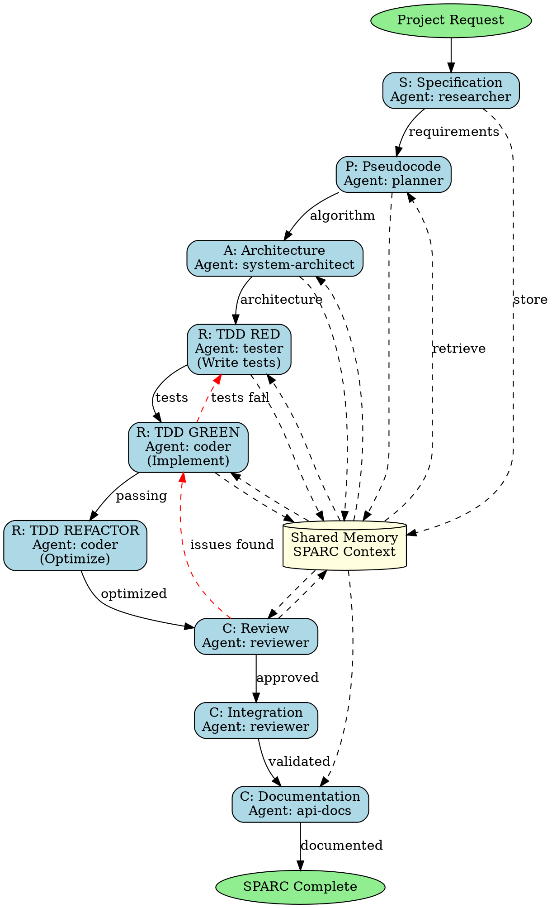

## Trigger Conditions

Use this skill when:
- User requests SPARC methodology application
- Systematic development workflow needed
- Test-driven development (TDD) approach required
- Complex feature requiring phased approach
- Architecture-first development desired
- Quality gates and validation at each phase needed
- Comprehensive documentation required
- Multi-agent coordinated development

## Skill Overview

SPARC is a systematic development methodology with 5 phases: Specification (requirements), Pseudocode (algorithm design), Architecture (system design), Refinement (TDD implementation), and Completion (integration & documentation). This skill orchestrates all phases with specialized agents coordinating through hierarchical topology and shared memory.

## SPARC Methodology Overview

**S** - Specification: Capture requirements and define success criteria
**P** - Pseudocode: Design algorithm and logic flow
**A** - Architecture: Design system structure and components
**R** - Refinement: Implement through TDD with iterative improvement
**C** - Completion: Integration, validation, and documentation

## 7-Phase Skill-Forge Methodology

### Phase 1: Specification (Requirements Analysis)

**Objective**: Capture comprehensive requirements and define success criteria

**Agent**: `researcher` (specification specialist)

**Activities**:
- Gather and analyze user requirements
- Define functional and non-functional requirements
- Identify constraints and dependencies
- Define acceptance criteria and test scenarios
- Document edge cases and error conditions
- Create requirements specification document
- Store specification in memory

**Memory Keys**:
- `swarm/sparc/specification/requirements`
- `swarm/sparc/specification/acceptance-criteria`
- `swarm/sparc/specification/constraints`
- `swarm/sparc/specification/edge-cases`

**Script**:
```bash
npx claude-flow@alpha hooks pre-task --description "SPARC Phase 1: Specification"
npx claude-flow@alpha hooks session-restore --session-id "sparc-${PROJECT_ID}"

# Capture requirements
cat > docs/sparc/01-specification.md << 'EOF'
# SPARC Phase 1: Specification

## Project: ${PROJECT_NAME}

### Functional Requirements
1. [FR1] User authentication with email/password
2. [FR2] JWT token-based session management
3. [FR3] Password reset via email
4. [FR4] Role-based access control (RBAC)

### Non-Functional Requirements
1. [NFR1] Response time < 200ms for auth endpoints
2. [NFR2] Support 1000 concurrent users
3. [NFR3] 99.9% uptime SLA

### Constraints
- Must use existing PostgreSQL database
- Must integrate with existing email service
- Must follow OWASP security guidelines

### Acceptance Criteria
- User can register with email/password
- User can login and receive JWT token
- User can reset password via email
- Admin can assign roles to users
- Protected endpoints require valid JWT

### Edge Cases
- Invalid email format
- Weak password
- Expired JWT token
- Concurrent login attempts
- Rate limiting for failed attempts

### Success Metrics
- All acceptance criteria met
- Security scan passes
- Performance benchmarks met
- Test coverage ≥ 90%
EOF

npx claude-flow@alpha memory store "swarm/sparc/specification/requirements" "$(cat docs/sparc/01-specification.md)"
npx claude-flow@alpha hooks notify --message "SPARC Specification phase complete"
```

### Phase 2: Pseudocode (Algorithm Design)

**Objective**: Design algorithm and logic flow without implementation details

**Agent**: `planner` (pseudocode designer)

**Activities**:
- Retrieve specification from memory
- Design high-level algorithm and logic flow
- Break down into step-by-step procedures
- Define data structures and interfaces
- Document control flow and decision points
- Create pseudocode for core functionality
- Store pseudocode in memory

**Memory Keys**:
- `swarm/sparc/pseudocode/algorithms`
- `swarm/sparc/pseudocode/data-structures`
- `swarm/sparc/pseudocode/control-flow`

**Script**:
```bash
npx claude-flow@alpha hooks pre-task --description "SPARC Phase 2: Pseudocode"
SPECIFICATION=$(npx claude-flow@alpha memory retrieve "swarm/sparc/specification/requirements")

# Create pseudocode
cat > docs/sparc/02-pseudocode.md << 'EOF'
# SPARC Phase 2: Pseudocode

## User Registration Algorithm

```
FUNCTION registerUser(email, password):
  // Validation
  IF NOT isValidEmail(email):
    RETURN error("Invalid email format")

  IF NOT isStrongPassword(password):
    RETURN error("Password too weak")

  // Check existence
  IF userExists(email):
    RETURN error("User already exists")

  // Create user
  hashedPassword = hashPassword(password)
  user = createUser(email, hashedPassword)

  // Send verification email
  verificationToken = generateToken()
  sendVerificationEmail(email, verificationToken)

  RETURN success(user)
END FUNCTION
```

## Login Algorithm

```
FUNCTION loginUser(email, password):
  // Find user
  user = findUserByEmail(email)
  IF NOT user:
    RETURN error("Invalid credentials")

  // Verify password
  IF NOT verifyPassword(password, user.hashedPassword):
    incrementFailedAttempts(user)
    IF user.failedAttempts >= 5:
      lockAccount(user)
    RETURN error("Invalid credentials")

  // Check account status
  IF user.locked:
    RETURN error("Account locked")

  IF NOT user.verified:
    RETURN error("Email not verified")

  // Generate JWT
  token = generateJWT({
    userId: user.id,
    email: user.email,
    roles: user.roles
  })

  resetFailedAttempts(user)
  RETURN success({ user, token })
END FUNCTION
```

## Data Structures

```
User {
  id: UUID
  email: String
  hashedPassword: String
  verified: Boolean
  locked: Boolean
  failedAttempts: Integer
  roles: Array<String>
  createdAt: DateTime
  updatedAt: DateTime
}

JWT Payload {
  userId: UUID
  email: String
  roles: Array<String>
  exp: Timestamp
  iat: Timestamp
}
```
EOF

npx claude-flow@alpha memory store "swarm/sparc/pseudocode/algorithms" "$(cat docs/sparc/02-pseudocode.md)"
npx claude-flow@alpha hooks notify --message "SPARC Pseudocode phase complete"
```

### Phase 3: Architecture (System Design)

**Objective**: Design system architecture, components, and technical approach

**Agent**: `system-architect`

**Activities**:
- Retrieve pseudocode from memory
- Design system architecture and layers
- Define API endpoints and contracts
- Design database schema
- Specify technology stack
- Create architectural diagrams
- Document design decisions
- Store architecture in memory

**Memory Keys**:
- `swarm/sparc/architecture/design`
- `swarm/sparc/architecture/api-contracts`
- `swarm/sparc/architecture/database-schema`
- `swarm/sparc/architecture/tech-stack`

**Script**:
```bash
npx claude-flow@alpha hooks pre-task --description "SPARC Phase 3: Architecture"
PSEUDOCODE=$(npx claude-flow@alpha memory retrieve "swarm/sparc/pseudocode/algorithms")

# Create architecture document
cat > docs/sparc/03-architecture.md << 'EOF'
# SPARC Phase 3: Architecture

## System Architecture

### Layers
1. **API Layer**: Express.js REST API
2. **Service Layer**: Business logic and validation
3. **Data Layer**: PostgreSQL with Prisma ORM
4. **Authentication**: JWT with bcrypt password hashing

### Technology Stack
- **Runtime**: Node.js 18+
- **Framework**: Express.js 4.x
- **Database**: PostgreSQL 14+
- **ORM**: Prisma
- **Authentication**: jsonwebtoken, bcrypt
- **Validation**: Zod
- **Testing**: Jest, Supertest
- **Documentation**: OpenAPI/Swagger

## API Endpoints

### Authentication Endpoints

```
POST /api/auth/register
Request: { email: string, password: string }
Response: { user: User, message: string }

POST /api/auth/login
Request: { email: string, password: string }
Response: { user: User, token: string }

POST /api/auth/verify-email
Request: { token: string }
Response: { message: string }

POST /api/auth/forgot-password
Request: { email: string }
Response: { message: string }

POST /api/auth/reset-password
Request: { token: string, newPassword: string }
Response: { message: string }

GET /api/auth/me
Headers: { Authorization: "Bearer <token>" }
Response: { user: User }
```

## Database Schema

```prisma
model User {
  id              String   @id @default(uuid())
  email           String   @unique
  hashedPassword  String
  verified        Boolean  @default(false)
  locked          Boolean  @default(false)
  failedAttempts  Int      @default(0)
  roles           String[]
  createdAt       DateTime @default(now())
  updatedAt       DateTime @updatedAt

  tokens          Token[]
}

model Token {
  id        String   @id @default(uuid())
  type      String   // 'verification' | 'reset'
  token     String   @unique
  expiresAt DateTime
  used      Boolean  @default(false)
  userId    String
  user      User     @relation(fields: [userId], references: [id])
  createdAt DateTime @default(now())
}
```

## Security Considerations
- Passwords hashed with bcrypt (cost factor 12)
- JWT tokens expire in 1 hour
- Refresh tokens expire in 7 days
- Rate limiting: 5 requests/minute per IP
- Account lockout after 5 failed attempts
- Email verification required before login
- HTTPS only in production
EOF

npx claude-flow@alpha memory store "swarm/sparc/architecture/design" "$(cat docs/sparc/03-architecture.md)"
npx claude-flow@alpha hooks notify --message "SPARC Architecture phase complete"
```

### Phase 4: Refinement (TDD Implementation)

**Objective**: Implement through test-driven development with iterative refinement

**Agents**: `tester` (writes tests first), `coder` (implements to pass tests)

**Activities**:
- **Tester**: Write failing tests based on specification
- **Coder**: Implement code to pass tests
- Red-Green-Refactor cycle
- Iterative improvement and optimization
- Code review and quality checks
- Store implementation in memory

**Memory Keys**:
- `swarm/sparc/refinement/tests`
- `swarm/sparc/refinement/implementation`
- `swarm/sparc/refinement/test-results`
- `swarm/sparc/refinement/coverage`

**Script (Tester)**:
```bash
npx claude-flow@alpha hooks pre-task --description "SPARC Phase 4: Refinement (Tests)"
ARCHITECTURE=$(npx claude-flow@alpha memory retrieve "swarm/sparc/architecture/design")

# Write tests first (TDD)
cat > src/__tests__/auth.test.ts << 'EOF'
import request from 'supertest';
import app from '../app';
import { prisma } from '../db';

describe('SPARC TDD: User Authentication', () => {
  beforeEach(async () => {
    await prisma.user.deleteMany();
  });

  describe('POST /api/auth/register', () => {
    test('should register user with valid credentials', async () => {
      const response = await request(app)
        .post('/api/auth/register')
        .send({
          email: 'test@example.com',
          password: 'SecurePass123!'
        });

      expect(response.status).toBe(201);
      expect(response.body.user).toHaveProperty('id');
      expect(response.body.user.email).toBe('test@example.com');
      expect(response.body.user).not.toHaveProperty('hashedPassword');
    });

    test('should reject invalid email format', async () => {
      const response = await request(app)
        .post('/api/auth/register')
        .send({
          email: 'invalid-email',
          password: 'SecurePass123!'
        });

      expect(response.status).toBe(400);
      expect(response.body.error).toContain('Invalid email');
    });

    test('should reject weak password', async () => {
      const response = await request(app)
        .post('/api/auth/register')
        .send({
          email: 'test@example.com',
          password: 'weak'
        });

      expect(response.status).toBe(400);
      expect(response.body.error).toContain('Password too weak');
    });

    test('should reject duplicate email', async () => {
      await request(app)
        .post('/api/auth/register')
        .send({
          email: 'test@example.com',
          password: 'SecurePass123!'
        });

      const response = await request(app)
        .post('/api/auth/register')
        .send({
          email: 'test@example.com',
          password: 'AnotherPass456!'
        });

      expect(response.status).toBe(409);
      expect(response.body.error).toContain('already exists');
    });
  });

  describe('POST /api/auth/login', () => {
    test('should login with valid credentials and return JWT', async () => {
      // Register first
      await request(app)
        .post('/api/auth/register')
        .send({
          email: 'test@example.com',
          password: 'SecurePass123!'
        });

      // Mark as verified
      await prisma.user.update({
        where: { email: 'test@example.com' },
        data: { verified: true }
      });

      // Login
      const response = await request(app)
        .post('/api/auth/login')
        .send({
          email: 'test@example.com',
          password: 'SecurePass123!'
        });

      expect(response.status).toBe(200);
      expect(response.body).toHaveProperty('token');
      expect(response.body.token).toMatch(/^eyJ/); // JWT format
    });

    test('should reject invalid credentials', async () => {
      const response = await request(app)
        .post('/api/auth/login')
        .send({
          email: 'nonexistent@example.com',
          password: 'WrongPass123!'
        });

      expect(response.status).toBe(401);
      expect(response.body.error).toContain('Invalid credentials');
    });

    test('should lock account after 5 failed attempts', async () => {
      // Register user
      await request(app)
        .post('/api/auth/register')
        .send({
          email: 'test@example.com',
          password: 'SecurePass123!'
        });

      // 5 failed attempts
      for (let i = 0; i < 5; i++) {
        await request(app)
          .post('/api/auth/login')
          .send({
            email: 'test@example.com',
            password: 'WrongPassword'
          });
      }

      // 6th attempt should return account locked
      const response = await request(app)
        .post('/api/auth/login')
        .send({
          email: 'test@example.com',
          password: 'SecurePass123!'
        });

      expect(response.status).toBe(423);
      expect(response.body.error).toContain('locked');
    });
  });
});
EOF

# Run tests (should fail initially)
npm test -- auth.test.ts

npx claude-flow@alpha memory store "swarm/sparc/refinement/tests" "$(cat src/__tests__/auth.test.ts)"
npx claude-flow@alpha hooks notify --message "TDD tests written (RED phase)"
```

**Script (Coder)**:
```bash
npx claude-flow@alpha hooks pre-task --description "SPARC Phase 4: Refinement (Implementation)"
TESTS=$(npx claude-flow@alpha memory retrieve "swarm/sparc/refinement/tests")
ARCHITECTURE=$(npx claude-flow@alpha memory retrieve "swarm/sparc/architecture/design")

# Implement to pass tests (GREEN phase)
cat > src/services/auth.service.ts << 'EOF'
import bcrypt from 'bcrypt';
import jwt from 'jsonwebtoken';
import { prisma } from '../db';
import { z } from 'zod';

const emailSchema = z.string().email();
const passwordSchema = z.string().min(8).regex(/^(?=.*[A-Z])(?=.*[a-z])(?=.*\d)(?=.*[@$!%*?&])/);

export class AuthService {
  async register(email: string, password: string) {
    // Validate email
    if (!emailSchema.safeParse(email).success) {
      throw new Error('Invalid email format');
    }

    // Validate password
    if (!passwordSchema.safeParse(password).success) {
      throw new Error('Password too weak. Must be 8+ chars with uppercase, lowercase, number, and special char');
    }

    // Check if user exists
    const existingUser = await prisma.user.findUnique({ where: { email } });
    if (existingUser) {
      throw new Error('User already exists');
    }

    // Hash password
    const hashedPassword = await bcrypt.hash(password, 12);

    // Create user
    const user = await prisma.user.create({
      data: {
        email,
        hashedPassword,
        roles: ['user']
      }
    });

    // Remove sensitive data
    const { hashedPassword: _, ...userWithoutPassword } = user;

    return userWithoutPassword;
  }

  async login(email: string, password: string) {
    // Find user
    const user = await prisma.user.findUnique({ where: { email } });
    if (!user) {
      throw new Error('Invalid credentials');
    }

    // Verify password
    const validPassword = await bcrypt.compare(password, user.hashedPassword);
    if (!validPassword) {
      // Increment failed attempts
      await prisma.user.update({
        where: { id: user.id },
        data: { failedAttempts: user.failedAttempts + 1 }
      });

      // Lock after 5 attempts
      if (user.failedAttempts + 1 >= 5) {
        await prisma.user.update({
          where: { id: user.id },
          data: { locked: true }
        });
        throw new Error('Account locked due to multiple failed attempts');
      }

      throw new Error('Invalid credentials');
    }

    // Check account status
    if (user.locked) {
      throw new Error('Account locked');
    }

    if (!user.verified) {
      throw new Error('Email not verified');
    }

    // Reset failed attempts
    await prisma.user.update({
      where: { id: user.id },
      data: { failedAttempts: 0 }
    });

    // Generate JWT
    const token = jwt.sign(
      {
        userId: user.id,
        email: user.email,
        roles: user.roles
      },
      process.env.JWT_SECRET!,
      { expiresIn: '1h' }
    );

    const { hashedPassword: _, ...userWithoutPassword } = user;

    return { user: userWithoutPassword, token };
  }
}
EOF

# Run tests (should pass now - GREEN phase)
npm test -- auth.test.ts --coverage

npx claude-flow@alpha memory store "swarm/sparc/refinement/implementation" "$(cat src/services/auth.service.ts)"
npx claude-flow@alpha hooks notify --message "TDD implementation complete (GREEN phase)"
```

### Phase 5: Completion (Integration & Validation)

**Objective**: Integrate all components, validate, and generate documentation

**Agents**: `reviewer`, `api-docs`

**Activities**:
- Code review of implementation
- Integration testing
- Performance validation
- Security audit
- API documentation generation
- User guide creation
- Deployment readiness check
- Store completion artifacts

**Memory Keys**:
- `swarm/sparc/completion/review-results`
- `swarm/sparc/completion/integration-tests`
- `swarm/sparc/completion/documentation`
- `swarm/sparc/completion/deployment-ready`

**Script (Reviewer)**:
```bash
npx claude-flow@alpha hooks pre-task --description "SPARC Phase 5: Completion (Review)"
IMPLEMENTATION=$(npx claude-flow@alpha memory retrieve "swarm/sparc/refinement/implementation")
TEST_RESULTS=$(npx claude-flow@alpha memory retrieve "swarm/sparc/refinement/test-results")

# Code review
npx eslint src/ --format json > code-review.json
npm audit --json > security-audit.json

# Integration tests
npm test -- --testPathPattern=integration --coverage

# Performance testing
npx clinic doctor -- node src/server.js &
sleep 5
npx autocannon -c 100 -d 30 http://localhost:3000/api/auth/login

npx claude-flow@alpha memory store "swarm/sparc/completion/review-results" "Code quality: passed, Security: no critical issues"
npx claude-flow@alpha hooks notify --message "SPARC review and validation complete"
```

**Script (Documentation)**:
```bash
npx claude-flow@alpha hooks pre-task --description "SPARC Phase 5: Documentation"

# Generate API documentation
cat > docs/sparc/05-completion-api-docs.md << 'EOF'
# SPARC Phase 5: API Documentation

## Authentication API

### Register User
**Endpoint**: `POST /api/auth/register`

**Request Body**:
```json
{
  "email": "user@example.com",
  "password": "SecurePass123!"
}
```

**Response** (201 Created):
```json
{
  "user": {
    "id": "uuid",
    "email": "user@example.com",
    "verified": false,
    "roles": ["user"],
    "createdAt": "2024-01-01T00:00:00.000Z"
  },
  "message": "User registered successfully. Please verify your email."
}
```

**Error Responses**:
- 400: Invalid email or weak password
- 409: User already exists

### Login
**Endpoint**: `POST /api/auth/login`

**Request Body**:
```json
{
  "email": "user@example.com",
  "password": "SecurePass123!"
}
```

**Response** (200 OK):
```json
{
  "user": {
    "id": "uuid",
    "email": "user@example.com",
    "roles": ["user"]
  },
  "token": "eyJhbGciOiJIUzI1NiIsInR5cCI6IkpXVCJ9..."
}
```

**Error Responses**:
- 401: Invalid credentials
- 423: Account locked
- 403: Email not verified

## Usage Example

```typescript
// Register
const registerResponse = await fetch('/api/auth/register', {
  method: 'POST',
  headers: { 'Content-Type': 'application/json' },
  body: JSON.stringify({
    email: 'user@example.com',
    password: 'SecurePass123!'
  })
});

// Login
const loginResponse = await fetch('/api/auth/login', {
  method: 'POST',
  headers: { 'Content-Type': 'application/json' },
  body: JSON.stringify({
    email: 'user@example.com',
    password: 'SecurePass123!'
  })
});

const { token } = await loginResponse.json();

// Authenticated request
const protectedResponse = await fetch('/api/protected', {
  headers: {
    'Authorization': `Bearer ${token}`
  }
});
```
EOF

npx claude-flow@alpha memory store "swarm/sparc/completion/documentation" "$(cat docs/sparc/05-completion-api-docs.md)"
npx claude-flow@alpha hooks session-end --export-metrics true
npx claude-flow@alpha hooks notify --message "SPARC methodology complete - all phases finished"
```

### Phase 6: Quality Gates & Validation

**Objective**: Ensure quality standards met at each phase

**Agent**: `reviewer`

**Activities**:
- Validate specification completeness
- Review pseudocode logic correctness
- Verify architecture soundness
- Check implementation quality
- Validate test coverage ≥ 90%
- Security vulnerability scan
- Performance benchmarking
- Store validation results

### Phase 7: Continuous Improvement

**Objective**: Learn from SPARC execution and optimize future workflows

**Agent**: `smart-agent`

**Activities**:
- Capture successful patterns
- Train neural models on SPARC outcomes
- Optimize phase transitions
- Improve quality gates
- Document lessons learned
- Store optimizations

## Complete Workflow Orchestration

### Execution Pattern (Single Message)

```javascript
// Initialize hierarchical SPARC coordination
mcp__claude-flow__swarm_init { topology: "hierarchical", maxAgents: 7, strategy: "specialized" }

// Spawn all SPARC phase agents
Task("Specification Researcher", `
  1. Capture comprehensive requirements: ${PROJECT_DESCRIPTION}
  2. Define functional and non-functional requirements
  3. Document constraints and dependencies
  4. Create acceptance criteria and test scenarios
  5. Store specification: swarm/sparc/specification/*
  6. Notify pseudocode agent when ready
`, "researcher")

Task("Pseudocode Planner", `
  1. Wait for specification from memory
  2. Design algorithm and logic flow (pseudocode)
  3. Break down into step-by-step procedures
  4. Define data structures and interfaces
  5. Store pseudocode: swarm/sparc/pseudocode/*
  6. Notify architecture agent
`, "planner")

Task("System Architect", `
  1. Wait for pseudocode from memory
  2. Design system architecture and layers
  3. Define API endpoints and database schema
  4. Specify technology stack
  5. Create architectural diagrams
  6. Store architecture: swarm/sparc/architecture/*
  7. Notify TDD agents
`, "system-architect")

Task("TDD Tester", `
  1. Wait for architecture from memory
  2. Write failing tests based on specification (RED)
  3. Cover all acceptance criteria
  4. Edge cases and error scenarios
  5. Store tests: swarm/sparc/refinement/tests
  6. Notify coder when tests ready
`, "tester")

Task("TDD Coder", `
  1. Wait for tests from memory
  2. Implement code to pass tests (GREEN)
  3. Follow architecture design from memory
  4. Refactor for quality (REFACTOR)
  5. Store implementation: swarm/sparc/refinement/implementation
  6. Run tests and store results
  7. Notify reviewer when complete
`, "coder")

Task("Quality Reviewer", `
  1. Wait for implementation and test results
  2. Code review for quality and security
  3. Integration testing
  4. Performance validation
  5. Store review: swarm/sparc/completion/review-results
  6. Approve or request changes
`, "reviewer")

Task("Documentation Generator", `
  1. Wait for approved implementation
  2. Generate API documentation
  3. Create user guides and examples
  4. Document deployment procedures
  5. Store docs: swarm/sparc/completion/documentation
`, "api-docs")

// Batch SPARC todos
TodoWrite { todos: [
  {content: "S: Capture requirements specification", status: "in_progress", activeForm: "Writing specification"},
  {content: "P: Design pseudocode algorithm", status: "pending", activeForm: "Designing pseudocode"},
  {content: "A: Design system architecture", status: "pending", activeForm: "Designing architecture"},
  {content: "R: Write failing tests (TDD RED)", status: "pending", activeForm: "Writing tests"},
  {content: "R: Implement to pass tests (TDD GREEN)", status: "pending", activeForm: "Implementing code"},
  {content: "R: Refactor for quality", status: "pending", activeForm: "Refactoring code"},
  {content: "C: Code review and security scan", status: "pending", activeForm: "Reviewing code"},
  {content: "C: Integration testing", status: "pending", activeForm: "Integration testing"},
  {content: "C: Generate documentation", status: "pending", activeForm: "Generating documentation"},
  {content: "C: Deployment readiness check", status: "pending", activeForm: "Checking deployment"}
]}
```

## Success Criteria

- [ ] **Specification**: Requirements fully documented and validated
- [ ] **Pseudocode**: Algorithm designed with clear logic flow
- [ ] **Architecture**: System design complete with diagrams
- [ ] **Refinement**: TDD implementation with ≥90% coverage
- [ ] **Refinement**: All tests passing (unit, integration, E2E)
- [ ] **Completion**: Code review passed with no critical issues
- [ ] **Completion**: Security scan passed
- [ ] **Completion**: Performance benchmarks met
- [ ] **Completion**: API documentation generated
- [ ] **Completion**: Deployment ready

## Process Flow Diagram



## File Organization

```
docs/sparc/
├── 01-specification.md      # Phase 1: Requirements
├── 02-pseudocode.md         # Phase 2: Algorithm design
├── 03-architecture.md       # Phase 3: System design
├── 04-refinement-tdd.md     # Phase 4: TDD implementation
└── 05-completion-api-docs.md # Phase 5: Documentation

src/
├── services/                # Implementation
├── __tests__/              # TDD tests
└── ...
```

## Best Practices

1. **Never skip phases** - Each phase builds on previous
2. **Memory coordination** - Always use shared memory between phases
3. **TDD strictly** - Write tests before implementation
4. **Quality gates** - Validate completeness at each phase
5. **Documentation first** - Spec and architecture before code
6. **Iterative refinement** - Multiple TDD cycles for quality
7. **Comprehensive testing** - Unit, integration, E2E tests

---

*This skill provides complete SPARC methodology orchestration for systematic, high-quality development with test-driven approach.*

---

## !! SKILL COMPLETION VERIFICATION (MANDATORY) !!

**After invoking this skill, you MUST complete ALL items below before proceeding:**

### Completion Checklist

- [ ] **Agent Spawning**: Did you spawn at least 1 agent via Task()?
  - Example: `Task("Agent Name", "Task description", "agent-type-from-registry")`

- [ ] **Agent Registry Validation**: Is your agent from the registry?
  - Registry location: `claude-code-plugins/ruv-sparc-three-loop-system/agents/`
  - Valid categories: delivery, foundry, operations, orchestration, platforms, quality, research, security, specialists, tooling
  - NOT valid: Made-up agent names

- [ ] **TodoWrite Called**: Did you call TodoWrite with 5+ todos?
  - Example: `TodoWrite({ todos: [8-10 items covering all work] })`

- [ ] **Work Delegation**: Did you delegate to agents (not do work yourself)?
  - CORRECT: Agents do the implementation via Task()
  - WRONG: You write the code directly after reading skill

### Correct Pattern After Skill Invocation

```javascript
// After Skill("<skill-name>") is invoked:
[Single Message - ALL in parallel]:
  Task("Agent 1", "Description of task 1...", "agent-type-1")
  Task("Agent 2", "Description of task 2...", "agent-type-2")
  Task("Agent 3", "Description of task 3...", "agent-type-3")
  TodoWrite({ todos: [
    {content: "Task 1 description", status: "in_progress", activeForm: "Working on task 1"},
    {content: "Task 2 description", status: "pending", activeForm: "Working on task 2"},
    {content: "Task 3 description", status: "pending", activeForm: "Working on task 3"},
  ]})
```

### Wrong Pattern (DO NOT DO THIS)

```javascript
// WRONG - Reading skill and then doing work yourself:
Skill("<skill-name>")
// Then you write all the code yourself without Task() calls
// This defeats the purpose of the skill system!
```

**The skill is NOT complete until all checklist items are checked.**

---

**Remember the pattern: Skill() -> Task() -> TodoWrite() - ALWAYS**