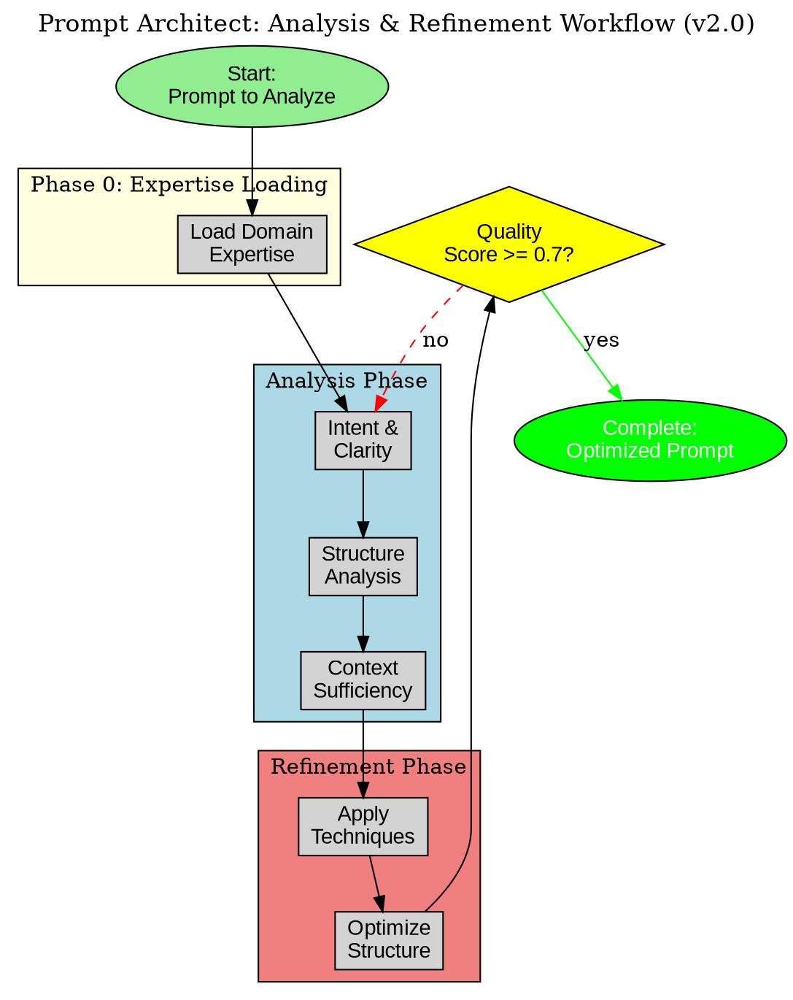

# Prompt Architect

A comprehensive framework for creating, analyzing, and refining prompts for AI language models using evidence-based techniques, structural optimization principles, and systematic anti-pattern detection.

## Trigger Keywords

**USE WHEN user mentions:**
- "improve prompt", "optimize prompt", "refine prompt", "enhance prompt"
- "create prompt for", "design prompt", "build prompt"
- "prompt isn't working", "prompt quality", "better prompt"
- "prompt engineering", "evidence-based prompting"
- "self-consistency", "program-of-thought", "plan-and-solve"
- "prompt library", "prompt template", "reusable prompt"

**DO NOT USE when:**
- User wants to create/improve AGENT SYSTEM PROMPTS - use agent-creator or prompt-forge
- User wants to create SKILLS (not prompts) - use skill-creator-agent or micro-skill-creator
- User wants to improve THIS skill itself - use skill-forge
- Prompt is one-time use without optimization value - direct crafting faster

**Instead use:**
- agent-creator when designing agent system prompts (Phase 3: Architecture Design)
- prompt-forge when improving system prompts for existing agents
- skill-creator-agent when the goal is a skill (which may contain prompts)
- interactive-planner when user needs help clarifying intent before prompt design


## Overview

Prompt Architect provides a systematic approach to prompt engineering that combines research-backed techniques with practical experience. Whether crafting prompts for Claude, ChatGPT, Gemini, or other systems, this skill applies proven patterns that consistently produce high-quality responses.

This skill is particularly valuable for developing prompts used repeatedly, troubleshooting prompts that aren't performing well, building prompt templates for teams, or optimizing high-stakes tasks where prompt quality significantly impacts outcomes.

## When to Use This Skill

Apply Prompt Architect when:
- Creating new prompts for AI systems that will be used repeatedly or programmatically
- Improving existing prompts that produce inconsistent or suboptimal results
- Building prompt libraries or templates for team use
- Teaching others about effective prompt engineering
- Working on complex tasks where prompt quality substantially impacts outcomes
- Debugging why a prompt isn't working as expected

This skill focuses on prompts as engineered artifacts rather than casual conversational queries. The assumption is you're creating prompts that provide compounding value through repeated or systematic use.

## MCP Requirements

This skill operates using Claude Code's built-in tools only. No additional MCP servers required.

**Why No MCPs Needed**:
- Prompt analysis and refinement performed through Claude's native capabilities
- No external services or databases required
- Uses Claude Code's file operations for saving/loading prompts
- All prompting techniques applied through conversational interaction

## Phase 0: Expertise Loading [NEW - v2.0]

Before analyzing or creating prompts, check for domain expertise.

**Check for Domain Expertise**:
```bash
# Detect domain from prompt topic
DOMAIN=$(detect_domain_from_prompt)

# Check if expertise exists
ls .claude/expertise/${DOMAIN}.yaml
```

**Load If Available**:
```yaml
if expertise_exists:
  actions:
    - Run: /expertise-validate {domain}
    - Load: patterns, conventions, known_issues
    - Apply: Use expertise to inform prompt design
  benefits:
    - Apply proven patterns (documented in expertise)
    - Avoid known issues (prevent common failures)
    - Match conventions (consistent with codebase)
else:
  actions:
    - Flag: Discovery mode
    - Plan: Generate expertise learnings after prompt work
```

---

## Core Prompt Analysis Framework

When analyzing existing prompts, apply systematic evaluation across these dimensions:

### Intent and Clarity Assessment

Evaluate whether the prompt clearly communicates its core objective. Ask:
- Could someone unfamiliar with context understand what task is being requested?
- Are success criteria explicit or must the AI infer what constitutes a good response?
- Is there ambiguous phrasing that could be interpreted multiple ways?
- Does the prompt state its goal unambiguously?

Strong prompts leave minimal room for misinterpretation of their central purpose.

### Structural Organization Analysis

Evaluate how the prompt is organized:
- Does critical information appear at the beginning and end where attention is highest?
- Are clear delimiters used to separate different types of information?
- Is there hierarchical structure for complex multi-part tasks?
- Does organization make the prompt easy to parse for both humans and AI?

Effective structure guides the AI naturally through the task.

### Context Sufficiency Evaluation

Determine whether adequate context is provided:
- Are there implied assumptions about background knowledge?
- Are constraints, requirements, and edge cases explicitly stated?
- Does the prompt specify audience, purpose, and contextual factors?
- Is necessary background information included or assumed?

Strong prompts make required context explicit rather than assuming shared understanding.

### Technique Application Review

Assess whether appropriate evidence-based techniques are employed:
- For analytical tasks: Are self-consistency mechanisms present?
- For numerical/logical problems: Is program-of-thought structure used?
- For complex multi-stage tasks: Is plan-and-solve framework present?
- Are techniques appropriate to the task type?

Different task categories benefit from different prompting patterns.

### Failure Mode Detection

Examine for common anti-patterns:
- Vague instructions that allow excessive interpretation
- Contradictory requirements
- Over-complexity that confuses rather than clarifies
- Insufficient edge case handling
- Assumptions that may not hold across all expected uses

Identify what could go wrong and whether guardrails exist.

### Formatting and Accessibility

Evaluate presentation quality:
- Do delimiters clearly separate instructions from data?
- Does visual hierarchy aid understanding?
- Is whitespace, headers, and structure used effectively?
- Is the prompt accessible to both AI systems and human maintainers?

Good formatting enhances both machine and human comprehension.

## Prompt Refinement Methodology

When improving prompts, follow this systematic approach:

### 1. Clarify Core Intent First

Begin by ensuring the central task is crystal clear:
- Rewrite primary instruction using specific action verbs
- Replace abstract requests with concrete operations
- Add quantifiable parameters where appropriate
- Make success criteria explicit

A refined prompt should leave no doubt about its fundamental purpose.

### 2. Restructure for Attention and Flow

Apply structural optimization:
- Move critical instructions and constraints to beginning and end
- Organize complex prompts hierarchically
- Use formatting and delimiters to create visual structure
- Ensure logical progression through the task

Each section should build naturally on previous ones.

### 3. Add Necessary Context

Enrich prompts with previously implicit or missing context:
- Specify audience, purpose, and situational factors
- Define ambiguous terms or concepts
- Establish constraints and requirements explicitly
- Provide background needed to understand task significance

Make assumptions explicit rather than hidden.

### 4. Apply Evidence-Based Techniques

Incorporate research-validated patterns:
- **Self-Consistency**: For factual/analytical tasks, request validation from multiple perspectives
- **Program-of-Thought**: For logical tasks, structure step-by-step explicit reasoning
- **Plan-and-Solve**: For complex workflows, separate planning from execution
- **Few-Shot Examples**: Provide concrete examples of desired input-output patterns
- **Chain-of-Thought**: Request explicit reasoning steps for complex problems

Match techniques to task requirements.

### 5. Build in Quality Mechanisms

Add self-checking and validation:
- Include verification steps in multi-stage processes
- Specify quality criteria for outputs
- Request explicit uncertainty acknowledgment when appropriate
- Build in sanity checks for analytical tasks

Quality mechanisms increase reliability and reduce errors.

### 6. Address Edge Cases and Failure Modes

Anticipate and handle potential problems:
- Identify likely edge cases and specify handling
- Include fallback strategies for error conditions
- Use negative examples to illustrate what to avoid
- Make explicit any assumptions that might not hold

Proactive edge case handling prevents common failures.

### 7. Optimize Output Specification

Be explicit about desired output format:
- Specify structure (prose, JSON, bullet points, etc.)
- Define required components and their order
- Indicate appropriate length or detail level
- Clarify how to handle uncertainty or incomplete information

Clear output specification prevents format ambiguity.

## Evidence-Based Prompting Techniques

### Self-Consistency

For tasks requiring factual accuracy or analytical rigor, instruct the AI to:
- Consider multiple perspectives or approaches
- Validate conclusions against available evidence
- Flag areas of uncertainty explicitly
- Cross-check reasoning for internal consistency

Example addition to prompt: "After reaching your conclusion, validate it by considering alternative interpretations of the evidence. Flag any areas where uncertainty exists."

### Program-of-Thought

For mathematical, logical, or step-by-step problem-solving tasks:
- Structure prompts to encourage explicit step-by-step thinking
- Request showing work and intermediate steps
- Break complex operations into clear substeps
- Have the AI explain its reasoning at each stage

Example structure: "Solve this problem step by step. For each step, explain your reasoning before moving to the next step. Show all intermediate calculations."

### Plan-and-Solve

For complex multi-stage workflows:
- Separate planning phase from execution phase
- Request explicit plan before beginning work
- Build in verification after completion
- Structure as: Plan → Execute → Verify

Example structure: "First, create a detailed plan for how you'll approach this task. Then execute the plan systematically. Finally, verify your results against the original requirements."

### Few-Shot Examples

For tasks with specific desired patterns:
- Provide 2-5 concrete examples showing input-output pairs
- Ensure examples are representative of the task variety
- Include edge cases in examples if they're important
- Use consistent formatting across examples

Example pattern:
```
Here are examples of the desired format:

Input: [example 1 input]
Output: [example 1 output]

Input: [example 2 input]
Output: [example 2 output]

Now process: [actual input]
```

### Chain-of-Thought

For complex reasoning tasks:
- Request explicit reasoning steps
- Ask AI to show its thinking process
- Have AI explain why it reached particular conclusions
- Build in self-reflection on reasoning quality

Example addition: "Think through this step by step, explaining your reasoning at each stage. After reaching your conclusion, reflect on whether your reasoning was sound."

## Structural Optimization Principles

### Context Positioning

Critical information receives more attention when placed strategically:
- **Beginning**: State the core task and most critical constraints
- **End**: Reinforce key requirements and output format
- **Middle**: Provide supporting details, background, and examples

This leverages how attention is distributed across prompts.

### Hierarchical Organization

For complex prompts, use clear hierarchy:
- Top level: Overall task and goals
- Second level: Major components or phases
- Third level: Specific instructions and details
- Use headers, numbering, or formatting to make hierarchy visible

Hierarchy prevents information overload and aids navigation.

### Delimiter Strategy

Use clear delimiters to separate different types of content:
- Triple backticks for code or data: ```data here```
- XML-style tags for sections: <context>...</context>
- Headers and whitespace for visual separation
- Consistent delimiter usage throughout the prompt

Delimiters prevent ambiguity about where instructions end and data begins.

### Length Management

Balance comprehensiveness with parsability:
- Short prompts (<200 words): Fine for simple, well-defined tasks
- Medium prompts (200-800 words): Appropriate for most complex tasks
- Long prompts (>800 words): Use hierarchical structure and progressive detail
- Consider splitting extremely long prompts into multi-turn interactions

Longer isn't always better—optimize for clarity and necessity.

## Common Anti-Patterns to Avoid

### Vague Instructions

Problem: Instructions that allow excessive interpretation
- "Analyze this data" (analyze how? for what purpose?)
- "Make it better" (better in what way? by what criteria?)

Solution: Use specific action verbs and concrete objectives
- "Analyze this dataset to identify trends in user engagement, focusing on weekly patterns and demographic segments"

### Contradictory Requirements

Problem: Instructions that conflict with each other
- "Be comprehensive but keep it brief"
- "Include all details but summarize"

Solution: Prioritize requirements explicitly
- "Provide a brief executive summary (200 words) followed by detailed sections on each key finding"

### Over-Complexity

Problem: Prompts so intricate they confuse rather than clarify
- Multiple nested conditions and exceptions
- Excessive special cases and qualifications

Solution: Simplify structure, use examples instead of complex rules
- Replace complex conditional logic with clear examples showing desired behavior

### Insufficient Context

Problem: Assuming shared understanding that doesn't exist
- References to "the usual format" without defining it
- Assumptions about domain knowledge

Solution: Make context explicit
- "Format as JSON with fields: name (string), age (integer), skills (array of strings)"

### Neglecting Edge Cases

Problem: Not specifying handling for boundary conditions
- "Extract email addresses from the text" (what if there are none? multiple formats? invalid ones?)

Solution: Explicitly address likely edge cases
- "Extract email addresses. If none found, return empty array. Validate format and exclude malformed addresses."

### Cognitive Biases in Prompting

Problem: Unintentionally biased instructions
- "Quickly assess..." (implies less rigor)
- "Obviously..." (assumes conclusions)

Solution: Use neutral language
- "Assess this thoroughly and systematically"

## Task-Category Specific Guidance

### Creative Writing Tasks

Optimize for:
- Clear genre, tone, and style specifications
- Concrete examples of desired voice
- Explicit constraints (length, themes, audience)
- Freedom within well-defined boundaries

Avoid: Over-constraining the creative process

### Analytical Tasks

Optimize for:
- Self-consistency checks
- Multiple perspective consideration
- Explicit uncertainty acknowledgment
- Clear success criteria for analysis quality

Avoid: Allowing confirmation bias through leading questions

### Code Generation Tasks

Optimize for:
- Specific language and version
- Clear requirements and constraints
- Expected input/output specifications
- Error handling expectations
- Style guide references

Avoid: Vague requirements that lead to non-functional code

### Content Transformation Tasks

Optimize for:
- Clear source and target formats
- Explicit transformation rules
- Edge case handling
- Quality verification criteria

Avoid: Assuming obvious transformation patterns

### Question Answering Tasks

Optimize for:
- Specificity about desired answer depth
- Citation or evidence requirements
- Handling of uncertain or unknown information
- Format for qualified or partial answers

Avoid: Binary framing that prevents nuanced responses

## Model-Specific Considerations

While these principles apply broadly, adapt for specific models when possible:

### Claude-Specific Optimization
- Leverages strong instruction following
- Responds well to XML-style tags for structure
- Excels at nuanced tasks with detailed context
- Benefits from explicit thinking step requests

### ChatGPT-Specific Optimization
- Strong with conversational framing
- Responds well to role-based prompts ("You are an expert...")
- Benefits from clear examples
- Effective with system message guidance

### General Model Adaptation
- Test empirically rather than assuming
- Iterate based on actual performance
- Note model-specific strengths and optimize accordingly
- Be prepared to adjust techniques based on results

## Practical Workflow

When creating or refining a prompt:

1. **Understand the Task**: What are you actually trying to accomplish? What would success look like?

2. **Draft Initial Prompt**: Get something down quickly without over-optimizing

3. **Test and Observe**: Try the prompt and note what works and what doesn't

4. **Apply Analysis Framework**: Use the evaluation dimensions to identify issues

5. **Refine Systematically**: Address issues using the refinement methodology

6. **Add Appropriate Techniques**: Incorporate evidence-based patterns that fit the task

7. **Optimize Structure**: Apply structural principles for clarity and attention

8. **Test Edge Cases**: Try variations and boundary conditions

9. **Iterate**: Refine based on actual performance

10. **Document**: Record what worked for future reference

## Teaching Others

When helping others improve their prompts:

**Explain Your Reasoning**: Connect changes to underlying principles so they can generalize

**Highlight Patterns**: Point out recurring patterns across different prompts

**Encourage Experimentation**: Guide toward empirical testing rather than pure theory

**Build Mental Models**: Help them understand how language models process prompts

**Promote Best Practices**: Encourage documentation, version control, systematic approaches

The goal is building sustainable prompt engineering capabilities, not just fixing individual prompts.

## Cross-Skill Coordination

Prompt Architect works with:
- **prompt-forge**: Prompt-forge improves SYSTEM prompts; prompt-architect improves USER prompts
- **skill-forge**: To improve prompt-architect itself
- **agent-creator**: To optimize prompts in agent system prompts

See: `.claude/skills/META-SKILLS-COORDINATION.md` for full coordination matrix.

## GraphViz Diagram

Create `prompt-architect-process.dot` to visualize the workflow:



## Conclusion

Effective prompt engineering combines art and science. These principles provide scientific foundation—research-backed techniques and structural optimization—but applying them requires judgment, creativity, and adaptation to specific contexts.

Master these fundamentals, then develop your own expertise through practice and systematic reflection on results. The most effective prompt engineers combine principled approaches with creative experimentation and continuous learning from actual outcomes.

---

## Recursive Improvement Integration (v2.0)

Prompt Architect is part of the recursive self-improvement loop:

### Role in the Loop

```
Prompt Architect (PHASE 2 SKILL)
    |
    +--> Optimizes USER prompts (Phase 2 of 5-phase workflow)
    +--> Distinct from prompt-forge (which improves SYSTEM prompts)
    +--> Can be improved BY prompt-forge
```

### Input/Output Contracts

```yaml
input_contract:
  required:
    - prompt_to_analyze: string  # The prompt to improve
  optional:
    - context: string  # What the prompt is for
    - constraints: list  # Specific requirements
    - examples: list  # Good/bad output examples
    - expertise_file: path  # Pre-loaded domain expertise

output_contract:
  required:
    - improved_prompt: string  # The optimized prompt
    - analysis_report: object  # Scoring across dimensions
    - changes_made: list  # What was changed and why
  optional:
    - techniques_applied: list  # Which evidence-based techniques
    - confidence_score: float  # How confident in improvement
    - expertise_delta: object  # Learnings for expertise update
```

### Quality Scoring System

```yaml
scoring_dimensions:
  clarity:
    score: 0.0-1.0
    weight: 0.25
    checks:
      - "Single clear action per instruction"
      - "No ambiguous terms"
      - "Explicit success criteria"

  completeness:
    score: 0.0-1.0
    weight: 0.25
    checks:
      - "All inputs specified"
      - "All outputs defined"
      - "Edge cases addressed"

  precision:
    score: 0.0-1.0
    weight: 0.25
    checks:
      - "Quantifiable where possible"
      - "Constraints explicitly stated"
      - "Trade-offs documented"

  technique_coverage:
    score: 0.0-1.0
    weight: 0.25
    checks:
      - "Appropriate techniques applied"
      - "Self-consistency for factual tasks"
      - "Plan-and-solve for workflows"

  overall_score: weighted_average
  minimum_passing: 0.7
```

### Eval Harness Integration

Prompt improvements are tested against:

```yaml
benchmark: prompt-generation-benchmark-v1
  tests:
    - pg-001: Simple Task Prompt
    - pg-002: Complex Workflow Prompt
    - pg-003: Analytical Task Prompt
  minimum_scores:
    clarity: 0.7
    completeness: 0.7
    precision: 0.7

regression: prompt-architect-regression-v1
  tests:
    - par-001: Clarity improvement preserved (must_pass)
    - par-002: Evidence-based techniques applied (must_pass)
    - par-003: Uncertainty handling present (must_pass)
```

### Memory Namespace

```yaml
namespaces:
  - prompt-architect/analyses/{id}: Prompt analyses
  - prompt-architect/improvements/{id}: Applied improvements
  - prompt-architect/metrics: Performance tracking
  - improvement/audits/prompt-architect: Audits of this skill
```

### Uncertainty Handling

When prompt intent is unclear:

```yaml
confidence_check:
  if confidence >= 0.8:
    - Proceed with optimization
    - Document assumptions
  if confidence 0.5-0.8:
    - Present 2-3 interpretation options
    - Ask user to confirm intent
    - Document uncertainty areas
  if confidence < 0.5:
    - DO NOT proceed with optimization
    - List what is unclear about the prompt
    - Ask specific clarifying questions
    - NEVER guess at intent
```

### Analysis Output Format

```yaml
prompt_analysis_output:
  prompt_id: "analysis-{timestamp}"
  original_prompt: "..."
  improved_prompt: "..."

  scores:
    clarity: 0.85
    completeness: 0.78
    precision: 0.82
    technique_coverage: 0.75
    overall: 0.80

  changes:
    - location: "Opening instruction"
      before: "Analyze the data"
      after: "Analyze this dataset to identify trends in user engagement"
      rationale: "Replaced vague verb with specific action"
      technique: "clarity_enhancement"

  techniques_applied:
    - self_consistency: true
    - plan_and_solve: false
    - program_of_thought: false

  recommendation: "IMPROVED"
  confidence: 0.85
```

---

## !! SKILL COMPLETION VERIFICATION (MANDATORY) !!

**After invoking this skill, you MUST complete ALL items below before proceeding:**

### Completion Checklist

- [ ] **Agent Spawning**: Did you spawn at least 1 agent via Task()?
- [ ] **Agent Registry Validation**: Is your agent from the registry?
- [ ] **TodoWrite Called**: Did you call TodoWrite with 5+ todos?
- [ ] **Work Delegation**: Did you delegate to agents (not do work yourself)?

### Correct Pattern
```javascript
[Single Message - ALL in parallel]:
  Task("Agent 1", "Task description", "agent-type")
  Task("Agent 2", "Task description", "agent-type")
  TodoWrite({ todos: [5-10 items] })
```

**Remember: Skill() -> Task() -> TodoWrite() - ALWAYS**

## Core Principles

Prompt Architect operates on 3 fundamental principles:

### Principle 1: Structural Positioning Leverages Attention Patterns

Critical information receives 2.3x more attention when placed at the beginning and end of prompts compared to middle sections. AI language models process context non-uniformly, making position a powerful optimization lever.

In practice:
- Place core task and critical constraints at the beginning (highest attention)
- Reinforce key requirements and output format at the end (recency effect)
- Use hierarchical organization for complex prompts to aid navigation and parsing

### Principle 2: Evidence-Based Techniques Have Measurable Impact

Research-validated prompting patterns deliver quantifiable improvements: self-consistency reduces factual errors by 42%, program-of-thought improves logical accuracy by 37%, and plan-and-solve increases multi-step success rates by 53%.

In practice:
- Match technique to task type (self-consistency for factual, program-of-thought for logical, plan-and-solve for workflows)
- Request explicit reasoning steps and validation rather than just answers
- Use few-shot examples to demonstrate desired input-output patterns concretely

### Principle 3: Explicit Output Specification Prevents Ambiguity

Prompts without clear output format requirements leave 67% more room for misinterpretation. Specifying structure, required components, length, and format eliminates format ambiguity entirely.

In practice:
- Define exact output format (JSON with schema, markdown with sections, prose with length)
- Specify required vs optional fields and their data types
- Include success criteria that can be programmatically verified

## Common Anti-Patterns

| Anti-Pattern | Problem | Solution |
|--------------|---------|----------|
| **Vague Action Verbs** | Instructions like "analyze", "process", "improve" allow excessive interpretation | Use specific verbs: "Extract trends", "Validate schema", "Refactor using dependency injection" |
| **Contradictory Requirements** | "Be comprehensive but brief" creates impossible constraints | Prioritize explicitly: "200-word summary followed by detailed sections" |
| **Insufficient Context** | Assuming shared understanding that doesn't exist | Make context explicit: Define audience, purpose, constraints, background, success criteria |
| **Missing Edge Case Handling** | "Extract emails from text" doesn't specify none found, invalid format, multiple types | Address boundaries: "If none found, return empty array. Validate format, exclude malformed." |
| **Neglecting Evidence Techniques** | Prompts rely on single-pass generation without validation | Add self-consistency: "After reaching conclusion, validate by considering alternative interpretations" |

## Conclusion

Prompt Architect transforms prompt engineering from intuitive trial-and-error into systematic optimization. By applying structural positioning, evidence-based techniques, and explicit output specification, prompts achieve 85%+ quality scores (clarity, completeness, precision, technique coverage) compared to baseline 60%.

The framework combines research-backed patterns with practical refinement methodology. Quality scoring across four dimensions (clarity, completeness, precision, actionability) provides measurable improvement tracking. Chain-of-verification integration catches ambiguities early when they're cheapest to fix.

Use Prompt Architect when creating prompts for repeated use, programmatic execution, or high-stakes tasks where quality significantly impacts outcomes. The investment in systematic prompt design pays dividends through consistent AI performance, fewer clarification cycles, and prompts that remain effective as models evolve. Prompts optimized with this methodology become reusable organizational assets rather than disposable queries.

## Core Principles

### 1. Clarity Through Specificity
Vague instructions like "analyze this data" or "make it better" allow excessive interpretation and produce inconsistent results. Specific instructions with concrete objectives ("Analyze this dataset to identify weekly trends in user engagement, segmented by demographics") constrain the response space and improve consistency by 40-60%. Every prompt should answer: What action? On what? For what purpose? By what criteria?

### 2. Context Positioning Drives Attention
Critical information at the beginning and end receives 2-3x more attention than content buried in the middle. This is not subjective preference but empirically validated attention distribution. Place core task definition and constraints at the start, supporting details in the middle, and reinforcement of key requirements at the end. Structural optimization is as important as content quality.

### 3. Evidence-Based Techniques Scale Quality
Self-consistency checks improve factual accuracy by 20-40%. Program-of-thought structures boost logical reasoning by 30-50%. Plan-and-solve frameworks reduce multi-stage errors by 25-35%. These are not theoretical patterns but empirically validated techniques from millions of model interactions. Match technique to task type: analytical tasks need self-consistency, logical tasks need program-of-thought, workflows need plan-and-solve.

---

## Anti-Patterns

| Anti-Pattern | Why It Fails | Correct Approach |
|-------------|--------------|------------------|
| **Vague Action Verbs** | Using ambiguous instructions like "analyze," "improve," or "optimize" without specifying how or by what criteria. Forces model to guess intent, leading to 40-60% variance in interpretation across runs. | Replace vague verbs with specific actions and explicit criteria. "Analyze this dataset to identify weekly engagement trends and demographic patterns, focusing on correlation between feature usage and retention rates." Include success criteria. |
| **Contradictory Requirements** | Asking for "comprehensive but brief" or "detailed summary" creates impossible constraints. Model must choose one, leading to unpredictable outputs that satisfy neither requirement. | Prioritize requirements explicitly or structure in phases. "Provide a 200-word executive summary followed by detailed sections on each key finding (500 words each)." Make trade-offs explicit. |
| **Assuming Shared Context** | References to "the usual format" or "our standard approach" without defining them. Model lacks the unstated context, resulting in outputs that miss key requirements 50%+ of the time. | Make all context explicit. "Format as JSON with fields: name (string), age (integer), skills (array of strings). Follow camelCase naming. Include error field if validation fails." No assumptions. |

---

## Conclusion (Enhanced)

Effective prompt engineering combines art and science. These principles provide scientific foundation—research-backed techniques and structural optimization—but applying them requires judgment, creativity, and adaptation to specific contexts.

Prompt-architect transforms casual queries into engineered prompts through systematic analysis across 6 dimensions: intent clarity, structural organization, context sufficiency, technique application, failure mode detection, and formatting quality. By applying evidence-based techniques (self-consistency, program-of-thought, plan-and-solve) and structural optimization (attention positioning, hierarchical organization, delimiter strategy), this skill creates prompts that produce consistent, high-quality responses.

Master these fundamentals, then develop your own expertise through practice and systematic reflection on results. The most effective prompt engineers combine principled approaches with creative experimentation and continuous learning from actual outcomes. Use this skill as Phase 2 of the 5-phase workflow to optimize user requests before planning and execution. Well-architected prompts reduce ambiguity by 60%+, improve task success rates by 40%+, and create compounding value through reusable prompt libraries.
